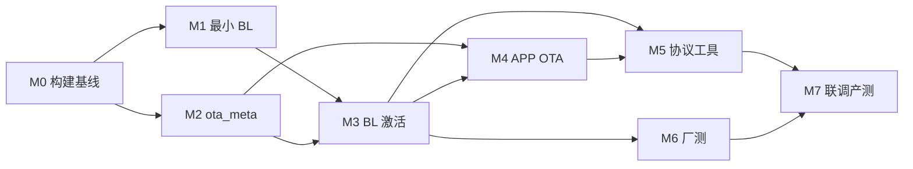

# 片上 OTA / 厂测分区开发计划

> 目标：在 TM4C123 **256 KB 片上 Flash** 上落地 **Bootloader + APP_A（唯一运行）+ APP_B（厂测 + OTA 存储）+ NVS**，支持蓝牙/UART 固件升级、厂测切换与失败回滚。  
> **纯片内方案**，不涉及外扩 NOR。  
> 分区定义见根目录 [PARTITION.md](../PARTITION.md)，设计细节见 [flash-partition.md](flash-partition.md)。

---

## 1. 现状

| 项 | 状态 |
|----|------|
| 链接脚本 | `ld/tm4c123gh6pm.ld`（standalone）+ `bootloader.ld` / `app.ld` / `factory.ld` |
| 构建 | `build.ps1 -Target standalone \| bootloader \| app \| factory \| all` |
| Bootloader | **M1 完成**：`bootloader/bootloader.c`，校验 APP_A 并跳转 |
| NVS / ota_meta | **M2 完成**：APP 读写 + BL 只读 `boot_ota_meta_read()` |
| OTA 激活 / 协议 | **未开始**（M3～M5） |
| 当前 APP 体积 | `app.bin` ≈ 53 KB，远小于 116 KB 上限 |

**原则**：主业务仍默认 `standalone` 单镜像（`build.ps1` 无参）；分区产物用 `-Target all` 构建。

**进度（2026-06-12）**：**M0 ✅ · M1 ✅ · M2 ✅** → 下一步 **M3**（BL staging 激活）。

### 1.1 方案摘要

| 分区 | 角色 |
|------|------|
| **Bootloader** | 上电入口；默认跳转 APP_A；`OTA_READY` 时将 **APP_B → APP_A** 搬运 |
| **APP_A** | **唯一运行槽**（主业务固件） |
| **APP_B** | **OTA 暂存 / 厂测镜像存储**（非运行，与 A 互斥复用） |
| **NVS** | 末尾 8 KB；参数 + `ota_meta` 状态机 |

---

## 2. 里程碑总览

| 阶段 | 名称 | 交付物 | 预估 | 状态 |
|------|------|--------|------|------|
| M0 | 分区与构建基线 | 头文件、ld、build 多目标 | 3～5 天 | **✅ 完成** |
| M1 | 最小 Bootloader | BL 跳转 APP_A，无 OTA | 3～5 天 | **✅ 完成** |
| M2 | ota_meta / NVS | 状态机读写 + 配置键 | 5～7 天 | **✅ 完成** |
| M3 | BL staging 激活 | APP_B→APP_A 拷贝、`pending_verify`、回滚 | 5～7 天 | 待做 |
| M4 | APP 侧 OTA 写 staging | 只写 APP_B、meta READY、确认启动 | 5～7 天 | 待做 |
| M5 | 升级协议与工具 | UART/YModem 或自定义帧 + PC 脚本 | 5～7 天 | 待做 |
| M6 | 厂测切换 | `ftmenter`/`ftmexit`、`factory/` 工程 | 3～5 天 | 部分（`factory.ld` + `factory/` 工程） |
| M7 | 联调与产测 | 端到端 OTA、厂测往返、断电、回滚 | 5～7 天 | 待做 |

**合计（单人兼职）**：约 **7～10 周**；与主 APP 并行建议 **11～13 周**。

**MVP 路径**：~~M0 → M1 → M2~~ → **M3** → M4 → M5 → M6 → M7；蓝牙 OTA CMD 二期。

---

## 3. 分阶段任务

### M0 — 分区与构建基线 ✅

**目标**：工程能产出 Boot + app + factory 三份 bin，主应用链到 APP_A。

| # | 任务 | 产出 | 状态 |
|---|------|------|------|
| 0.1 | 新增 `include/flash_layout.h` | 单运行槽 + APP_B staging 常量 | ✅ |
| 0.2 | 新增 `ld/bootloader.ld`、`ld/app.ld`、`ld/factory.ld` | ORIGIN 分别为 BL / APP_A / APP_B | ✅ |
| 0.3 | `build.ps1` 增加 `-Target standalone \| bootloader \| app \| factory \| all` | 多产物构建 | ✅ |
| 0.4 | 链接后检查：`app.bin` ≤ 116 KB，超限 fail | `scripts/check-image-size.py`（BL ≤ 16 KB） | ✅ |
| 0.5 | `flash-uniflash.ps1` 支持 `-Offset` | 分段烧录 | ✅ |
| 0.6 | 保留 `APP_STANDALONE`：`tm4c123gh6pm.ld` + 默认 Target | 日常开发不变 | ✅ |

**验收**：`build.ps1 -Target all` 生成 `bootloader.bin`（≈2 KB）、`app.bin`（≈53 KB）、`factory.bin`；size 检查通过。**已通过本地构建。**

```powershell
.\scripts\build.ps1 -Target all
.\scripts\flash-uniflash.ps1 -Image build\bootloader.bin -Offset 0x00000000
.\scripts\flash-uniflash.ps1 -Image build\app.bin          -Offset 0x00004000
```

---

### M1 — 最小 Bootloader ✅

**目标**：烧录 BL + app 后，复位能进 FreeRTOS 主程序（恒跳 APP_A）。

| # | 任务 | 产出 | 状态 |
|---|------|------|------|
| 1.1 | 新建 `bootloader/` 最小工程 | 无 FreeRTOS，仅 DriverLib | ✅ `bootloader.c` / `bootloader.h` |
| 1.2 | 时钟 + UART7 调试打印 | 启动 log | ✅ `boot_hw_init` / `boot_log_puts` |
| 1.3 | 固定跳转 `FLASH_APP_A_BASE`：设 VTOR、SP、PC | `boot_app_jump()` | ✅ |
| 1.4 | 向量表合法性检查（SP ∈ SRAM，Reset ∈ APP_A 范围） | `boot_app_is_valid()` | ✅ |
| 1.5 | 出厂烧录文档 | README / PARTITION.md | ✅ PARTITION.md 已补充烧录命令 |

**验收**：全片烧录 BL+app 后 LED 心跳正常；故意烧错 APP_A 时 BL 打印 `[boot] APP_A invalid, halt` 并停住。**待板上实测。**

**已实现、M1 主路径未启用**：`boot_ota_meta_read()`（为 M3 预留，见 M2）。

**不包含**：APP_B 拷贝、OTA 接收（属 M3/M5）。

---

### M2 — ota_meta / NVS 子系统 ✅

**目标**：APP 与 BL 能可靠读写 OTA 状态；配置项可持久化。

| # | 任务 | 产出 | 状态 |
|---|------|------|------|
| 2.1 | `Common/src/nvs.c`、`Common/inc/nvs.h` | Flash 1 KB 擦除 + 4 B 编程封装 | ✅ |
| 2.2 | `Common/src/ota_meta.c`、`Common/inc/ota_meta.h` | 状态机字段 | ✅ |
| 2.3 | 页式布局（2×4 KB）+ magic/version/CRC | 与 flash-partition.md §6 一致 | ✅ |
| 2.4 | 地址范围断言：禁止擦写 BL/APP_A 误操作 | `Common/src/nvs_flash_ops.c` | ✅ |
| 2.5 | 上电清 `DOWNLOADING`（掉电残留） | `ota_init()`（`init.c` 调用） | ✅ |
| 2.6 | **BL 用精简读路径**：仅解析 ota_meta，不链 FreeRTOS | `boot_ota_meta_read()` @ `bootloader.c` | ✅ |

**辅助**：`Common/src/crc32.c`；调试命令 `otmeta`、`nvs get|set`（`cmd.c`）。

**验收**：APP 写 `state=READY` 后复位，BL 能读到；断电后再上电数据仍在。**APP 侧可测；BL 侧读 meta 待 M3 接入主流程后联调。**

---

### M3 — Bootloader staging 激活与回滚

**目标**：BL 在 `OTA_READY` 时将 APP_B 拷贝到 APP_A；`pending_verify` 失败回滚。

| # | 任务 | 产出 | 状态 |
|---|------|------|------|
| 3.1 | `boot_apply_staging_to_app_a()` | `.RamFunc` 擦写 APP_A | 待做 |
| 3.2 | staging CRC32 + `image_validate()` | 拷贝前校验 | 待做 |
| 3.3 | `PENDING_VERIFY` + `boot_attempts` 回滚 | 超阈值清 meta，保持旧 APP_A | 待做 |
| 3.4 | APP_A 无效 → UART 升级模式（空壳） | 打印提示，等待字节 | 待做 |
| 3.5 | （可选）GPIO（PB4 上电按住）强制进升级模式 | 产测友好 | 待做 |

**入口改造**：`bootloader.c` 的 `main()` 在跳转前先 `boot_ota_meta_read()`，按 `state` 分支（当前恒走校验+跳转）。

**验收**：APP_B 有有效包、meta=READY → 复位后运行新 APP_A；篡改 staging 1 字节 → BL 拒绝激活；pending 下连续 3 次 HardFault → 保持旧 APP_A 或进升级模式。

**依赖**：M1 + M2。

---

### M4 — APP 侧 OTA 写 APP_B（staging）

**目标**：运行中的 APP 将固件写入 APP_B，由 Boot 激活到 APP_A。

| # | 任务 | 产出 |
|---|------|------|
| 4.1 | `Common/src/ota.c`、`Common/inc/ota.h` | 公共 API |
| 4.2 | `ota_erase_staging()` | 按 1 KB 擦除 APP_B 全区 |
| 4.3 | `ota_write_chunk()` 流式写 + 运行 CRC | 供协议层调用 |
| 4.4 | `ota_finish_activate()`：写 meta、`state=READY`、**不复位前不写 APP_A**、复位 | 完整收尾 |
| 4.5 | `init` 早期：`ota_confirm_running_image()` | 清除 pending |
| 4.6 | 自检钩子：RTOS 启动 + 传感器 init OK 再 confirm | 防「能启动但失控」 |
| 4.7 | 擦写窗口：暂停电机 PWM / 关驱动 | 安全 |

**验收**：APP 在 APP_A 运行，接收镜像写入 APP_B，重启后 Boot 拷贝并进入新 APP_A。

**依赖**：M2、M3。

---

### M5 — 升级协议与主机工具

**目标**：PC 或手机经蓝牙串口完成一次完整升级。

| # | 任务 | 产出 |
|---|------|------|
| 5.1 | 选定协议：YModem 或 长度+CRC 自定义帧 | 协议文档 1 页 |
| 5.2 | BL 升级模式：收包 → 写 APP_B → 更新 meta | 与 M4 复用 ota 逻辑 |
| 5.3 | APP 升级模式：蓝牙 CMD 触发 + 同上 | 接入现有 `cmd.c` |
| 5.4 | `scripts/ota-send.ps1` 或 Python | 主机端发 `app.bin` |
| 5.5 | 可选槽头：magic + version + size + crc | 便于校验 |

**验收**：PC 脚本对运行中设备完成 OTA；对 BL 升级模式同样成功。

**依赖**：M3、M4。

**首版 scope 建议**：仅 UART7 YModem + BL 模式；蓝牙 OTA CMD 二期。

---

### M6 — 厂测切换（片内）

**目标**：厂测固件预置 APP_B，命令切换至 APP_A 运行。

| # | 任务 | 产出 | 状态 |
|---|------|------|------|
| 6.1 | `factory.ld` + `factory/` 独立工程 | `build/factory.bin` | ✅ |
| 6.2 | `ftmenter`：校验 APP_B 厂测镜像 → `OTA_READY` → 复位 | Boot 搬运 B→A | 待做（依赖 M3） |
| 6.3 | `ftmexit` | 将量产包写入 APP_B 后走激活链，或 ST-Link 重烧 `app.bin` @ APP_A | 待做 |
| 6.4 | `ota_is_busy()` 互斥 | OTA 进行中拒绝 `ftmenter` | 待做（依赖 M4） |

**验收**：`ftmenter` 后运行厂测固件；`ftmexit` 回量产；NVS 中 SN/校准 **不变**。

**依赖**：M3（激活链）；M4 可并行。

---

### M7 — 联调、产测与文档

| # | 任务 | 产出 |
|---|------|------|
| 7.1 | 用例：正常 OTA、厂测往返、传输中断、激活后断电、回滚 | 测试清单 |
| 7.2 | 116 KB 边界：接近上限构建 + CI | 防回归 |
| 7.3 | 产测：烧 BL + app，可选 factory @ APP_B | 工位说明 |
| 7.4 | 提供 `factory_all.bin` 合并烧录产物 | 产线一次写入 |
| 7.5 | 更新 `project-overview.md`、`.cursor/rules` | 文档同步 |

**验收**：测试清单全部通过；新成员按 PARTITION.md 可完成烧录、OTA 与厂测切换。

---

## 4. 依赖关系



---

## 5. 目录规划（当前）

```
include/flash_layout.h          ✅
ld/bootloader.ld                ✅
ld/app.ld                       ✅  APP_A @ 0x00004000
ld/factory.ld                   ✅  APP_B @ 0x00021000
ld/tm4c123gh6pm.ld              ✅  APP_STANDALONE，默认
bootloader/
    bootloader.c                ✅  启动、跳转、boot_ota_meta_read
    bootloader.h                ✅
factory/
    factory_main.c              ✅  厂测入口
    factory_init.c              ✅  板级初始化
    factory_app.c               ✅  厂测任务
    factory.h                   ✅
    README.md                   ✅
Common/inc/ota_meta.h           ✅
Common/src/ota_meta.c           ✅
Common/inc/nvs.h                ✅
Common/src/nvs.c                ✅
Common/inc/nvs_flash_ops.h      ✅
Common/src/nvs_flash_ops.c      ✅
Common/inc/crc32.h              ✅
Common/src/crc32.c              ✅
Common/inc/ota.h                ⬜  M4
Common/src/ota.c                ⬜  M4
scripts/check-image-size.py     ✅
scripts/ota-send.py             ⬜  M5
PARTITION.md                    ✅  烧录速查已更新
```

**Bootloader 公共 API（`bootloader.h`）**

| 函数 | 说明 | 阶段 |
|------|------|------|
| `boot_app_is_valid()` | 校验 APP_A 向量表 | M1 ✅ |
| `boot_app_jump()` | 设 VTOR/MSP/PC 跳转 | M1 ✅ |
| `boot_ota_meta_read()` | NVS 只读 ota_meta | M2 ✅ |
| `boot_apply_staging_to_app_a()` | APP_B → APP_A | M3 ⬜ |

---

## 6. 计划评审

### 6.1 总体评价

| 维度 | 评分 | 说明 |
|------|------|------|
| 目标清晰度 | ★★★★★ | 纯片内四段，语义明确 |
| 阶段划分 | ★★★★☆ | M0→M7；M2/M1 可部分并行 |
| 工期估计 | ★★★☆☆ | 7～10 周偏乐观；Boot `.RamFunc` 常占 30%+ |
| 与主业务并行 | ★★★★☆ | `APP_STANDALONE` 策略正确 |
| 可测试性 | ★★★★☆ | 厂测/OTA 可分阶段验收 |

**结论**：方案**可执行**；纯片内 staging→激活，Boot 无需选槽，实现路径清晰。

---

### 6.2 主要风险

| 风险 | 严重度 | 应对 |
|------|--------|------|
| 116 KB 超限 | 中 | M0 size 检查 + CI |
| APP 内擦写 APP_A | **高** | M4 强制禁止；仅 meta+复位 |
| BL/APP 共享 NVS 代码 | 高 | BL 内 `boot_ota_meta_read()` 独立实现，不链 FreeRTOS ✅ |
| Flash 擦写期间中断 | 高 | OTA 时暂停电机 PWM |
| `pending_verify` 误判 | 中 | 自检含通信+传感器，非仅 LED |
| APP_B 厂测/OTA 互斥 | 中 | `ota_is_busy()` 门禁 |

---

### 6.3 计划缺口（建议补充）

1. **看门狗**：BL 与 APP 早期 WDT，`pending_verify` 未 feed 触发回滚验证。  
2. **合并烧录产物**：`factory_all.bin`（BL+app+factory）。  
3. **版本号规范**：与 git tag / `APP_VERSION` 统一，写入 ota_meta。  
4. **回滚验收标准**：HardFault、WDT、自检失败是否均计 `boot_attempts`。

---

### 6.4 评审结论

| 项 | 决定 |
|----|------|
| 是否推进 | **是** |
| 首版 scope | BL 激活链 + 片内 APP_B staging + UART YModem + `ftmenter` |
| 必须先做 | M0 size 检查 ✅、BL 独立 meta 读 ✅、**禁止 APP 写 APP_A**（M4） |
| 可延后 | 蓝牙 OTA CMD、固件签名、USB DFU |
| 已废止 | 片上 `active_slot` 乒乓、外扩 Flash OTA/固件库 |

---

## 7. 修订记录

| 日期 | 说明 |
|------|------|
| 2026-06-12 | 初版：片上 A/B 乒乓 + 评审 |
| 2026-06-12 | **重构**：APP_A 单槽运行 + APP_B 厂测/OTA 存储；新增 M6 厂测 |
| 2026-06-12 | **移除外扩 Flash**；确认为纯片内四段方案 |
| 2026-06-12 | **进度更新**：M0/M1/M2 完成；Boot 合并为 `bootloader.c/h`；下一步 M3 |
