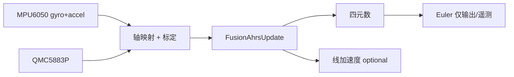

# 小车姿态解算方案调研与选型

> **状态（2026-07）**：已按 §5.1 **方案 A** 完成 Fusion 迁移。运行时代码见 `Common/src/attitude.c`、`third_party/Fusion/`。Mahony/Madgwick 仍保留在 `third_party/` 供对照，**不再参与链接**。

> 面向 **car-4wd / car-2wd** 地面小车的 IMU + 磁力计姿态/航向估计。  
> 硬件：MPU6050（I2C0 @ 0x69）+ QMC5883P（@ 0x2C），采样约 **50 Hz**（`app_tmr` 20 ms）。  
> 相关代码：`Common/src/attitude.c`、`third_party/Fusion/`。

---

## 1. 我们要解决什么问题

| 输出 | 用途 | 小车上的优先级 |
|------|------|----------------|
| **Roll / Pitch（倾斜）** | 坡道检测、翻车预警、可选的倾斜补偿 | 中 |
| **Yaw / Heading（航向）** | 定角转向、轨迹记录、与遥控/导航对齐 | **高** |
| 全 9-DOF 姿态 | 无人机、手持设备、大角度机动 | 低（地面小车多数时间近似水平） |

地面小车的典型工况：

- 长时间 **近似水平**（|roll|, |pitch| < 10~20°）
- 频繁 **加减速、急转** → 加速度计 **不能** 始终代表重力
- 金属底盘、电机、电池 → 磁力计 **硬/软铁** 干扰明显
- 需要 **跟手** 的 yaw（遥控转多少显示多少），停稳后 **不长期漂移**

因此：**把「倾斜估计」和「航向估计」分开设计**，往往比「一套通用 9-DOF AHRS 硬上」更适合小车。

---

## 2. 当前实现回顾

### 2.1 架构（截至本文档编写时）

```
每帧:
  陀螺去偏 → 模式判定(静止/旋转) → Mahony 纯陀螺积分
  若静止: accel 校正 roll/pitch + mag 慢融合 yaw
  若旋转且水平+yaw为主: accel 锁定 roll/pitch
输出:
  四元数 → 欧拉角 → ±180° 展开平滑 → int16 遥测
```

实现文件：`Common/src/attitude.c`（策略）+ `third_party/mahony/MahonyAHRS.c`（四元数/对齐）。

### 2.2 已遇到、已部分缓解的问题

| 现象 | 根因 | 当前缓解 |
|------|------|----------|
| 转 yaw 时先反冲再正向 | 静止态 mag **硬对齐** yaw，与陀螺对抗 | 改为 gyro 主导 + mag 慢融合 |
| ±180° 跳变 | 欧拉角包装 | 输出层最短路径 unwrap |
| 转 yaw 时 roll/pitch 跟着变 | 旋转态纯陀螺，gx/gy 零偏积分 | 水平+yaw 主导时 accel 锁 tilt |
| 三轴耦合 | 欧拉角数学特性 + 机体轴≠导航轴 | 仅部分场景锁定 |

### 2.3 仍不满意时的本质原因

当前方案属于 **「在 Mahony 上叠状态机 + 手工规则」**，而不是面向小车工况的 **统一融合模型**：

1. **静止 / 旋转硬切换**  
   阈值（0.4 °/s、0.7 °/s、10 帧）敏感，边界行为难调，易出现「一切换就抖一下」。

2. **加速度计用法不符合车辆动力学**  
   小车 **一加速** 合加速度就偏离 1 g；用 `|a|≈1g` 判静止、用 accel  snap roll/pitch 在 **运动/急停** 时都会错。  
   通用 AHRS 文献强调：需要 **加速度拒绝（acceleration rejection）** 或 **动态降低 accel 权重**，而不是简单 on/off。

3. **磁力计缺少标定与软/硬铁补偿**  
   仅做模长 EMA + 跳变门控，未做 **椭球拟合 / 硬铁偏移 / 软铁矩阵**。车上 yaw 会偏、会跳。

4. **传感器轴与车体轴未显式 remap**  
   MPU6050/QMC5883P 贴片方向与「车头/左/上」未在文档与代码中固定，物理上绕「一个轴」会在欧拉角里分到三轴。

5. **仍用 2009 版 Mahony/Madgwick 原始实现**  
   x-io 官方已维护 **Fusion** 库（Madgwick 博士论文 **第 7 章** 修订算法），含加速度/磁干扰拒绝、恢复机制、陀螺 bias 模块，更适合产品化。

6. **输出仍是欧拉角 int16**  
   融合应在 **四元数** 完成；欧拉角仅作显示。±180° 包装、万向节锁（|pitch|→90°）是表示问题，不是传感器问题。

---

## 3. 文献与工业界共识（小车/移动机器人）

### 3.1 算法层

| 方法 | 计算量 | 小车适用性 | 说明 |
|------|--------|------------|------|
| **互补滤波 / Mahony** | 低 | 中 | 移动机器人上常用；需 **Ki 做 gyro 零偏**；需 **运动态降权 accel** |
| **Madgwick（2009 原版）** | 低 | 中 | 单参数 β；无零偏积分；本仓库 `third_party/madgwick/` |
| **Fusion AHRS（Madgwick PhD Ch.7）** | 低~中 | **高** | 动态 gain、加速度/磁拒绝、recovery；[x-io Fusion](https://github.com/xioTechnologies/Fusion) |
| **EKF / UKF** | 高 | 中（资源允许时） | 移动机器人论文常比 Mahony 精度略高，但 TM4C123 @ 50 Hz 仍可行；调 Q/R 成本高 |
| **倾斜 + 航向解耦** | 低 | **很高** | 6-DOF 管 roll/pitch，mag（或 GPS/轮速）管 yaw；**最贴合小车** |

参考文献（建议阅读顺序）：

1. **Madgwick, S.** — [An efficient orientation filter for IMU and MARG sensor arrays (2010)](https://x-io.co.uk/downloads/madgwick_internal_report.pdf)  
   - 原版梯度下降 AHRS，本仓库 Madgwick/Mahony 来源。

2. **Madgwick, S.** — [PhD Thesis, Chapter 7 (revised AHRS)](https://x-io.co.uk/downloads/madgwick-phd-thesis.pdf)  
   - **Fusion 库** 实现基础；含加速度/磁干扰处理思路。

3. **Mahony, R. et al.** — [Nonlinear complementary filters on SO(3)](https://ieeexplore.ieee.org/document/4608934)  
   - Mahony 滤波理论；PI 反馈 + 四元数。

4. **Zhang et al.** — [Attitude Estimation of Portable Mobile Robot Based on Complementary Filter (2021)](https://doi.org/10.3390/mi12111373)  
   - **移动机器人** 场景；Mahony vs EKF：**精度接近、Mahony 算力更低**，适合嵌入式。

5. **ISITIA 2023** — [Comparative Analysis of Sensor Fusion for Miniature IMU](https://doi.org/10.1109/isitia59021.2023.10220994)  
   - 微型 IMU 上 Mahony / Madgwick / Kalman 对比；算力受限选 Mahony。

6. **x-io Technologies** — [Open source IMU and AHRS algorithms](https://x-io.co.uk/open-source-imu-and-ahrs-algorithms/)  
   - 官方维护入口；Madgwick → **Fusion** 演进说明。

7. **AHRS 工程实践** — [AHRS Explained: Sensor Fusion for Attitude & Heading](https://icnavigator.com/applications/avionics-mission-systems/ahrs-attitude-heading-reference/)  
   - **Tilt compensation**、磁干扰门控、条件融合权重；与小车实现直接相关。

### 3.2 小车特有手段（本仓库尚未用）

| 手段 | 作用 |
|------|------|
| **轮速编码器 + 运动学** | 直线/低滑移时 yaw 由 **ω = (v_r - v_l) / wheelbase** 积分，比 mag 稳 |
| **GPS 航向**（若扩展） | 户外绝对航向，mag 仅作慢校正 |
| **ZUPT（零速修正）** | 停车时强制 gyro 零偏更新 |
| **工厂/现场 mag 标定** | 8 字旋转采样本，求 hard/soft iron |

本仓库已有 **四路编码器**（`bsp_sw_qei`），长期建议：**IMU yaw + 轮速 yaw 互补**（见 §5.3）。

---

## 4. 推荐方案对比

### 方案 A — x-io **Fusion** 库（首选替换）

**来源**：[github.com/xioTechnologies/Fusion](https://github.com/xioTechnologies/Fusion)（MIT）

**核心能力**（README 摘要）：

- 基于 Madgwick **PhD 第 7 章** 修订 AHRS（**不是** 2009 开源 Madgwick 原版）
- **Acceleration rejection**：线加速度大时自动 **忽略 accel**，避免急加速时 tilt 被拉飞
- **Magnetic rejection**：磁干扰大时忽略 mag
- **Recovery**：长时间拒绝后自动恢复，防止只靠陀螺 drift
- **FusionBias**：静止段自动估 gyro offset，可存 NVS
- **FusionRemap**：24 种轴映射，解决贴片方向
- 输出：四元数、重力、**线加速度**（去重力后）

**默认参数起点**（Fusion README）：

| 参数 | 建议初值 |
|------|----------|
| `gain` | 0.5 |
| `gyroscopeRange` | 250（与 MPU6050 ±250°/s 一致） |
| `accelerationRejection` | 10° |
| `magneticRejection` | 10° |
| `recoveryTriggerPeriod` | 5 s × sampleRate |

**优点**：与现有 Mahony 同属「低算力融合」，但 **运动态鲁棒性** 明显好于手工状态机。  
**缺点**：需引入新 `third_party/Fusion/`、统一轴约定与标定流程；Flash/RAM 略增（仍适合 TM4C123）。



---

### 方案 B — **倾斜 / 航向解耦**（最适合「只要小车好用」）

不把 9-DOF 塞进一个滤波器，而是：

```
Roll/Pitch 通道（6-DOF）:
  gyro 积分 + accel 互补（或 Fusion IMU-only 模式）
  仅在 |a_lin| 小 或 |ω| 低 时加大 accel 权重

Yaw 通道（航向）:
  gyro_z 积分（经 tilt 补偿到水平面）
  + mag 倾斜补偿罗盘（慢校正）
  + 可选：轮速差分 yaw（运动态）
```

**Tilt-compensated compass**（磁力计航向标准公式，见 Fusion `FusionCompass` / 各 AHRS 资料）：

```
roll, pitch ← 来自 6-DOF
mx', my' ← 将 mag 投影到水平面
heading = atan2(-my', mx')
yaw ← 互补融合(gyro_integrated_yaw, heading)
```

**优点**：

- 绕 **竖直轴** 转时 roll/pitch **天然不跟 yaw 耦合**（用户期望）
- 加速时 **只关 accel 对 tilt 的校正**，不必整滤波器切换模式
- 调试直观：tilt 不好查 accel，yaw 不好查 mag/零偏

**缺点**：大 roll/pitch（翻车、爬坡 >30°）时 mag 补偿误差变大；需定义水平面约定。

**推荐**：若目标是 **遥控小车的航向 + 大致水平**，方案 B 往往比「全姿态 AHRS + 一堆 if」体验更好。

---

### 方案 C — 保留 Mahony/Madgwick，**连续增益**（不硬切换）

回到 Mahony **完整** `MahonyAHRSupdate`（带 Kp/Ki），但：

- `Kp_eff = Kp × w_motion`，运动越大 w 越小（接近纯陀螺）
- `Ki` 仅在 **近静止** 时启用（零偏估计）
- mag 仅在 **mag_error < 阈值** 时参与

**优点**：改动小于换 Fusion；去掉 `s_rotating` 状态机。  
**缺点**：仍缺 Fusion 的 rejection/recovery；调参难度中等。

---

### 方案 D — EKF（扩展卡尔曼）

状态：`[q0..q3, bgx, bgy, bgz]` 或含 accel bias。  
预测：陀螺；更新：accel（重力方向）、mag（磁场方向）。

**优点**：理论最优框架；可显式建模过程噪声。  
**缺点**：实现与调参成本高；TM4C123 上 50 Hz 可行但 **性价比低于 Fusion**（移动机器人论文亦指出 Mahony 精度接近 EKF）。

**建议**：除非要融合 GPS/轮速/多传感器，否则 **不作为第一选择**。

---

## 5. 对本项目的推荐路线

### 5.1 短期（1~2 周，明显改善体验）

| 步骤 | 内容 |
|------|------|
| 1 | 引入 **Fusion** 到 `third_party/Fusion/`，`attitude.c` 改为薄封装 |
| 2 | 定义 **IMU/MAG → 车体** 轴映射（写入 `.syscfg` 或 `attitude_board.h`，厂测可验证） |
| 3 | 厂测增加 **mag 8 字标定** 或至少 **hard iron 三轴 offset** 存 NVS |
| 4 | 遥测保留 `-180~180` int16，内部全程四元数；文档化 wrap 行为 |
| 5 | 删除或归档 `s_rotating` 硬切换逻辑 |

**预期**：急加速/急停时 tilt 不再乱跳；yaw 跟手；磁干扰时有 rejection。

### 5.2 中期（与底盘控制对齐）

| 步骤 | 内容 |
|------|------|
| 1 | 编码器测速稳定后，加 **轮速 yaw 观测**（低滑移时权重高） |
| 2 | 停车 **ZUPT** 更新 gyro bias（FusionBias 或自研） |
| 3 | 控制环只用 **yaw + roll/pitch 阈值**，不做大角度 acrobatics |

### 5.3 长期（若要做导航）

- GPS / 视觉航向融合
- 完整 EKF 或因子图（超出当前 MCU 舒适区时再考虑更强算力）

---

## 6. 标定与验证（必做，否则换算法也白搭）

### 6.1 陀螺仪

- 上电 **静止 2~5 s** 采平均 → NVS `imu_offset.gyro[]`（已有框架）
- 运行期：**FusionBias** 或静止门控慢更新
- 厂测：`factory` 命令输出 bias 是否收敛

### 6.2 加速度计

- 六面静置标定 scale/offset（可选，至少 Z 轴 ±1 g 对齐）
- 检查 MPU6050 量程：**±2 g** 对小车足够（急刹约 0.2~0.5 g 附加）

### 6.3 磁力计

- **必须**做 hard/soft iron（电机、螺丝、电池影响大）
- 标定后检查：水平旋转一周，|m| 与 heading 平滑度
- 厂测记录 `mag_trust` 与 rejection 计数（Fusion internal states）

### 6.4 验收测试用例

| # | 动作 | 通过标准（建议） |
|---|------|----------------|
| 1 | 平放静止 30 s | \|yaw 漂移\| < 2°/min（有 mag） |
| 2 | 平放绕竖直轴匀速转 360° | yaw 单调；roll/pitch < 3° 变化 |
| 3 | 急加速/急停（不动 yaw） | roll/pitch 瞬态 < 5°，1 s 内回稳 |
| 4 | 过 ±180° | 无 300°+ 视觉跳变 |
| 5 | 电机全速空转（磁干扰） | yaw 无持续单边漂移（rejection 生效） |

---

## 7. 方案选型小结

| 方案 | 推荐度 | 适用 |
|------|--------|------|
| **A. Fusion 库** | ★★★★★ | 希望 **最少自研、工业级 rejection**，替换当前 Mahony 状态机 |
| **B. Tilt + Heading 解耦** | ★★★★★ | 明确只要 **小车水平航向**；可与 Fusion 6-DOF + 自研 compass 组合 |
| C. Mahony 连续增益 | ★★★ | 小改；上限低于 Fusion |
| D. EKF | ★★ | 多传感器导航；当前阶段过重 |
| 当前实现（状态机 + 手工 align） | ★★ | 原型可用；**不适合作为量产方案** |

**综合建议**：

> **主路径**：`Fusion`（方案 A）  
> **若 yaw 仍不满意**：在 Fusion tilt 之上加 **方案 B** 的 tilt-compensated compass + 未来 **轮速 yaw**  
> **不要**：继续在 `attitude.c` 叠更多 `if (rotating)` 规则

---

## 8. 参考链接汇总

| 资源 | URL |
|------|-----|
| x-io Fusion（推荐库） | https://github.com/xioTechnologies/Fusion |
| x-io 算法总页 | https://x-io.co.uk/open-source-imu-and-ahrs-algorithms/ |
| Madgwick 2010 报告 PDF | https://x-io.co.uk/downloads/madgwick_internal_report.pdf |
| Madgwick PhD 论文 | https://x-io.co.uk/downloads/madgwick-phd-thesis.pdf |
| 移动机器人 Mahony 论文 | https://doi.org/10.3390/mi12111373 |
| IMU 融合算法对比 | https://doi.org/10.1109/isitia59021.2023.10220994 |
| AHRS 工程说明 | https://icnavigator.com/applications/avionics-mission-systems/ahrs-attitude-heading-reference/ |
| 传感器融合综述（嵌入式） | https://www.mikroe.com/blog/sensor-fusion-embedded-systems |
| Fusion Python 回放 | https://pypi.org/project/imufusion/ |

---

## 9. 与本仓库文件关系

| 路径 | 说明 |
|------|------|
| `Common/src/attitude.c` | **Fusion AHRS + FusionBias 薄封装**（对外 API 不变） |
| `Common/inc/attitude.h` | API；`attitude_update_step` / `attitude_get_euler` |
| `third_party/Fusion/Fusion/` | x-io Fusion 库（MIT，见 `third_party/Fusion/README.md`） |
| `third_party/mahony/`、`third_party/madgwick/` | 2009 原版；**已不链接**，可对照或删除 |
| `factory/factory.c` | 厂测 att 命令；扩展标定与日志 |
| `docs/bluetooth-protocol.md` | 遥测 roll/pitch/yaw int16 格式 |
| `docs/peripheral-selection.md` | MPU6050 / QMC5883P 与标定说明 |

### 当前 Fusion 参数（`attitude.c`）

| 参数 | 值 |
|------|-----|
| Earth 约定 | `FusionConventionNwu` |
| gain | 0.5 |
| gyroscopeRange | 250 °/s |
| accelerationRejection | 10° |
| magneticRejection | 10° |
| recoveryTriggerPeriod | 5 s × sampleRate |
| FusionBias stationary | 3 °/s，3 s |
| 轴映射 | `PXPYPZ`（待实机确认后改 `ATTITUDE_*_REMAP`） |

---

## 10. 下一步行动

1. ~~**SPIKE**：Fusion 接入~~ ✅ 已完成  
2. **轴映射**：实机确认 PCB 上 IMU X/Y/Z 与「前/左/上」关系，修改 `attitude.c` 中 `ATTITUDE_IMU_REMAP` / `ATTITUDE_MAG_REMAP`  
3. **厂测 mag 标定**：最小 hard iron 3 向量 NVS  
4. **对比日志**：按 §6.4 验收（平放转 yaw、急加减速、±180°、磁干扰）  
5. **（后续）** 编码器 yaw 融合
