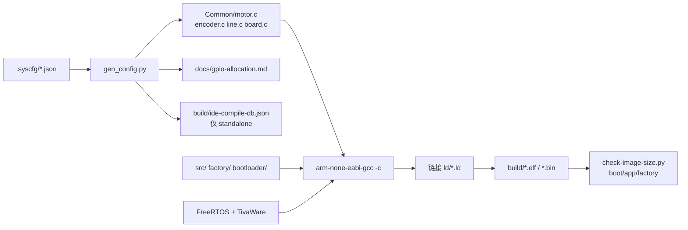

# 编译与构建指南

> 本文档是项目**编译、代码生成、烧录、脚本**的单一说明源。  
> 脚本内不写长说明；改流程时优先更新本文档。  
> 全项目命名规范见 `.cursor/rules/project-context.mdc` §命名规范。

---

## 1. 环境前提

| 组件 | 默认路径 | 说明 |
|------|----------|------|
| TivaWare C Series 2.2.0.295 | `D:\Ti\TivaWare_C_Series-2.2.0.295` | DriverLib、FreeRTOS、头文件 |
| ARM GNU Toolchain | `tools/bin/arm-none-eabi-gcc.exe` | 首次构建由 `install-toolchain.ps1` 自动下载 |
| UniFlash 9.2.0 | `D:\Ti\uniflash_9.2.0\dslite.bat` | 烧录（需 `TM4C123GH6PM.ccxml`） |

一次性安装：

```powershell
# TivaWare（需先从 TI 官网下载安装包）
.\scripts\install-tivaware.ps1 -InstallerPath D:\Downloads\SW-TM4C-2.2.0.295.exe

# 若 PowerShell 禁止执行脚本（可选；也可用 build.cmd 绕过）
.\scripts\setup-terminal.ps1
```

---

## 2. 日常命令

```powershell
.\build.cmd                              # 编译 standalone（默认）
.\build.cmd -Target app                    # 编译 APP_A 分区固件
.\build.cmd -Target all                    # Boot + APP_A + 厂测

.\flash.cmd                                # 烧录 standalone @ 0x0
.\flash.cmd -Target prod                   # Boot + APP_A
```

等价入口：`.\scripts\build.ps1`、`.\scripts\flash-uniflash.ps1`。  
IDE：**Ctrl+Shift+B** → standalone 编译（见 `.vscode/tasks.json`）。

---

## 3. 构建目标

| `-Target` | 链接脚本 | 产物 | Flash 用途 |
|-----------|----------|------|------------|
| `standalone`（默认） | `ld/tm4c123gh6pm.ld` | `build/tm4c123-project.elf/.bin` | 开发单镜像 @ `0x0` |
| `bootloader` | `ld/bootloader.ld` | `build/bootloader.bin` | Boot @ `0x0`（≤16 KB） |
| `app` | `ld/app.ld` | `build/app.bin` | 主固件 @ `0x4000`（≤116 KB） |
| `factory` | `ld/factory.ld` | `build/factory.bin` | 厂测 @ `0x21000`（≤116 KB） |
| `all` | 以上三者 | 三个 `.bin` | 产线/OTA 全套 |

分区地址与烧录偏移见 [PARTITION.md](../PARTITION.md)、[flash-partition.md](flash-partition.md)。

---

## 4. 构建流水线



**顺序**（`build.ps1` 内部）：

1. 需要应用/厂测时：运行 `gen_config.py`（从 `.syscfg` 生成板级 C 代码）
2. 按目标收集源文件列表，逐文件 `gcc -c`
3. `gcc` 链接 `ld/*.ld` → `build/<name>.elf`
4. `objcopy` → `.bin`；`bootloader` / `app` / `factory` 做体积检查

`bootloader` 目标**不**跑代码生成（无 FreeRTOS / 板级模块依赖）。

---

## 5. 板级配置与代码生成

配置源：`.syscfg/`（**勿手改**生成出的 `Common/src/{motor,encoder,line,board}.c`）。

| 文件 | 作用 |
|------|------|
| `project.json` | 清单：指向 board / gpio / modules |
| `board.json` | 系统时钟等 |
| `gpio.json` | 引脚分配 → GPIO 初始化 + [gpio-allocation.md](gpio-allocation.md) |
| `modules/motor.json` | PWM 定时器 |
| `modules/encoder.json` | 编码器捕获 |
| `modules/uart_bt.json` 等 | UART / I2C / ADC / SSI / DMA |

| 生成文件 | 说明 |
|----------|------|
| `Common/src/motor.c` | 电机 GPIO + PWM |
| `Common/src/encoder.c` | 编码器 GPIO + 捕获定时器 |
| `Common/src/line.c` | 循迹传感器 GPIO |
| `Common/src/board.c` | 板级外设 + `Board_Periph_Init()` |
| `Common/inc/gpio_pins.h` | 引脚宏 |

应用初始化（`src/init.c`）：

```c
Motor_Init();
Encoder_Init();
Line_Init();
Board_Periph_Init();
```

单独重新生成（调试配置，不必全量编译）：

```powershell
python .\scripts\gen_config.py
python .\scripts\gen_config.py --ide-db       # 额外更新 build/ide-compile-db.json
```

---

## 6. 各目标源文件

### standalone / app

- `src/`：`startup_*`、`main.c`、`init.c`、`app.c`、`freertos_hooks.c`、`syscalls.c`
- `Common/src/`：生成的 `motor/encoder/line/board` + `type/log/cmd/...` + `ota_meta` 等
- `cbb/ws2812b/ws2812b.c`
- TivaWare FreeRTOS：`tasks.c`、`queue.c`、`list.c`、`port.c`、`heap_4.c`

`app` 额外定义：`-DFLASH_APP_A_SLOT`。

### factory

- `factory/factory_main.c`、`factory_init.c`、`factory_app.c`
- 共享 `src/startup_*`、`freertos_hooks.c`、`syscalls.c` 及 Common 模块（同 app）

额外：`-DFLASH_FACTORY_SLOT`，include `factory/`。

### bootloader

- `bootloader/bootloader.c`
- `Common/src/crc32.c`

---

## 7. 编译选项摘要

| 项 | 值 |
|----|-----|
| CPU | Cortex-M4F，`hard` float |
| 标准 | C11 |
| 优化 | `-Os` |
| 宏 | `-DTM4C123GH6PM`、`-DPART_TM4C123GH6PM` |
| 包含 | `include/`、`Common/inc/`、`cbb/ws2812b/`、FreeRTOS、TivaWare |
| 链接库 | `libdriver.a`（TivaWare GCC） |

---

## 8. 脚本索引（`scripts/`）

| 脚本 | 职责 |
|------|------|
| `build.ps1` | 主编译入口 |
| `gen_config.py` | `.syscfg` → 板级 C 代码 / 引脚文档 / 可选 `build/ide-compile-db.json` |
| `flash-uniflash.ps1` | UniFlash 烧录 |
| `check-image-size.py` | 校验 `.bin` 不超过分区上限 |
| `install-toolchain.ps1` | 安装 `tools/` 工具链（build 自动调用） |
| `install-tivaware.ps1` | 部署 TivaWare |
| `setup-terminal.ps1` | 可选：放宽 PS 执行策略 |

根目录包装：`build.cmd`、`flash.cmd`（推荐，不受执行策略限制）。

---

## 9. 烧录

```powershell
.\flash.cmd -Target standalone   # tm4c123-project.bin @ 0x0
.\flash.cmd -Target prod         # bootloader + app
.\flash.cmd -Target app          # 仅 app（须已有 Boot）
.\flash.cmd -Target factory      # factory @ 0x21000
.\flash.cmd -Target all          # boot + app + factory
```

自定义：`.\scripts\flash-uniflash.ps1 -Image path\to.bin -Offset 0x...`

---

## 10. IDE 与 `build/ide-compile-db.json`

- **Ctrl+Shift+B**：`scripts/build.ps1`（standalone）
- standalone 构建时 `gen_config.py --ide-db` 生成 `build/ide-compile-db.json`（C/C++ 跳转数据库）
- **不要提交**（位于 `build/`，已被 `.gitignore` 忽略）
- VS Code 配置：`.vscode/c_cpp_properties.json` → `compileCommands` 指向该文件

---

## 11. 产物与 Git

| 路径 | 提交 |
|------|------|
| `build/` | 否 |
| `tools/`、`downloads/` | 否 |
| `build/ide-compile-db.json` | 否（在 `build/` 内） |
| `Common/src/{motor,encoder,line,board}.c` | 是（生成代码纳入版本库，由 CI/本地 gen 保持一致） |
| `docs/gpio-allocation.md` | 是（自动生成，与 `gpio.json` 同步） |

提交前建议：`.\build.cmd` 或 `.\build.cmd -Target all`。

---

## 12. 常见问题

| 现象 | 处理 |
|------|------|
| `arm-none-eabi-gcc not found` | 让 build 自动装工具链，或手动 `install-toolchain.ps1` |
| `FreeRTOS not found` | 安装 TivaWare 到默认路径 |
| `UniFlash dslite.bat not found` | 安装 UniFlash 或改 `flash-uniflash.ps1` 路径 |
| 无法运行 `.ps1` | 用 `build.cmd` / `flash.cmd` |
| 改引脚不生效 | 改 `.syscfg/gpio.json` 后重新编译 |
| `Image size check failed` | 固件超出分区；查 `build/*.map` |

---

## 相关文档

| 文档 | 内容 |
|------|------|
| [gpio-allocation.md](gpio-allocation.md) | 引脚表（自动生成） |
| [flash-partition.md](flash-partition.md) | 分区与链接细节 |
| [ab-ota-dev-plan.md](ab-ota-dev-plan.md) | OTA 开发计划 |
| [README.md](../README.md) | 项目概览与快速上手 |
