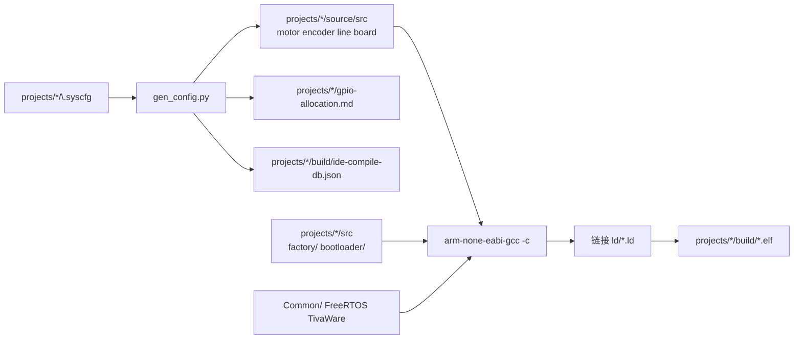

# 编译与构建指南

> 本文档是项目**编译、代码生成、烧录、脚本**的单一说明源。  
> 脚本内不写长说明；改流程时优先更新本文档。  
> 全项目命名规范见 `.cursor/rules/project-context.mdc` §命名规范。

---

## 1. 环境前提

| 组件 | 默认路径 | 说明 |
|------|----------|------|
| TivaWare C Series 2.2.0.295 | `D:\Ti\TivaWare_C_Series-2.2.0.295` | DriverLib、FreeRTOS、头文件 |
| ARM GNU Toolchain | `tools/bin/arm-none-eabi-gcc.exe` | 首次构建由 `install-toolchain.ps1` 自动下载 |
| UniFlash 9.2.0 | `D:\Ti\uniflash_9.2.0\dslite.bat` | 烧录（需 `TM4C123GH6PM.ccxml`） |

一次性安装：

```powershell
.\scripts\install-tivaware.ps1 -InstallerPath D:\Downloads\SW-TM4C-2.2.0.295.exe
.\scripts\setup-terminal.ps1   # 可选；也可用 build.cmd 绕过执行策略
```

---

## 2. 工程结构

仓库包含两个可独立编译的小车工程：

| 工程 | 路径 | 说明 |
|------|------|------|
| `car-4wd` | `projects/car-4wd/` | 四电机底盘 |
| `car-2wd` | `projects/car-2wd/` | 双电机底盘 |

每个工程目录：

| 子目录 | 内容 |
|--------|------|
| `.syscfg/` | 引脚与外设 JSON / SysConfig 源 |
| `board/` | 设备库（`gen_config.py` 生成 motor / encoder / line / board） |
| `main/` | 应用（main、app、startup、FreeRTOS） |
| `build/` | 编译产物（不提交） |

跨工程共享：`bsp_driver/`（MCU 薄封装）、`cbb/`（芯片驱动子模块）、`Common/`（log、start、device_profile、nvs、ota）、`include/`、`ld/`、`scripts/`、`bootloader/`、`factory/`。

---

## 3. 日常命令

```powershell
# 根目录（默认四轮 log-only）
.\build.cmd
.\build.cmd -Profile full
.\build.cmd -CarProject car-2wd -Profile full

# 进入工程目录
.\projects\car-4wd\build.cmd
.\projects\car-2wd\build.cmd

# 多目标
.\build.cmd -CarProject car-4wd -Target app -Profile full
.\build.cmd -CarProject car-4wd -Target all

# 烧录（J-Link）
.\flash-jlink.cmd
.\flash.cmd -Target standalone
```

等价入口：`.\scripts\build.ps1 -CarProject car-4wd`。  
IDE：**Ctrl+Shift+B** → 默认编译 `car-4wd`（见 `.vscode/tasks.json`）。

---

## 4. 构建目标

| `-Target` | 链接脚本 | 产物（示例 car-4wd） | Flash 用途 |
|-----------|----------|----------------------|------------|
| `standalone`（默认） | `ld/tm4c123gh6pm.ld` | `projects/car-4wd/build/car-4wd.elf/.bin` | 开发单镜像 @ `0x0` |
| `bootloader` | `ld/bootloader.ld` | `projects/car-4wd/build/bootloader.bin` | Boot @ `0x0`（≤16 KB） |
| `app` | `ld/app.ld` | `projects/car-4wd/build/app.bin` | 主固件 @ `0x4000`（≤116 KB） |
| `factory` | `ld/factory.ld` | `projects/car-4wd/build/factory.bin` | 厂测 @ `0x21000`（≤116 KB） |
| `all` | 以上三者 | 三个 `.bin` | 产线/OTA 全套 |

分区地址见 [PARTITION.md](../PARTITION.md)、[flash-partition.md](flash-partition.md)。

---

## 5. 构建流水线



**顺序**（`build.ps1` 内部）：

1. 应用/厂测目标：运行 `gen_config.py --car-project <car>`
2. 收集源文件，逐文件 `gcc -c`
3. 链接 → `projects/<car>/build/<car>.elf`
4. `objcopy` → `.bin`；`bootloader` / `app` / `factory` 做体积检查

`bootloader` 目标不跑板级代码生成。

---

## 6. 板级配置与代码生成

配置源：`projects/<car>/.syscfg/`（**勿手改** `projects/<car>/source/src/{motor,encoder,line,board}.c`）。

| 文件 | 作用 |
|------|------|
| `project.json` | 清单：board / gpio / modules |
| `board.json` | 系统时钟等 |
| `gpio.json` | 引脚分配 |
| `modules/*.json` | PWM、编码器、UART、I2C、ADC 等 |
| `tm4c123gh6pm*.syscfg` | SysConfig GUI 配置（与 JSON 对应） |

| 生成文件 | 说明 |
|----------|------|
| `source/src/motor.c` | 电机 GPIO + PWM |
| `source/src/encoder.c` | 编码器 QEI |
| `source/src/line.c` | 循迹 GPIO（模拟巡线由 ADC 在 board.c 配置） |
| `source/src/board.c` | UART / I2C / ADC / SSI 等 |
| `source/inc/gpio_pins.h` | 引脚宏 |

引脚设计说明：[syscfg-io-allocation.md](syscfg-io-allocation.md)。  
自动生成引脚表：`projects/<car>/gpio-allocation.md`。

应用初始化（`projects/<car>/src/init.c`）：

```c
Motor_Init();
Encoder_Init();
Line_Init();
Board_Periph_Init();
```

单独重新生成：

```powershell
python scripts/gen_config.py --car-project car-4wd
python scripts/gen_config.py --car-project car-2wd --ide-db
```

---

## 7. 各目标源文件

### standalone / app

- `projects/<car>/src/`：startup、main、init、app、freertos_hooks、syscalls
- `projects/<car>/source/src/`：生成的板级模块
- `Common/src/`：log、cmd、battery、nvs、ota_meta 等
- `cbb/ws2812b/ws2812b.c`
- TivaWare FreeRTOS

`app` 额外：`-DFLASH_APP_A_SLOT`。

### factory

- `factory/factory_*.c`
- 共享 `projects/<car>/src/startup_*`、`freertos_hooks.c`、`syscalls.c` 及板级/Common 模块

### bootloader

- `bootloader/bootloader.c`
- `Common/src/crc32.c`

---

## 8. 编译选项摘要

| 项 | 值 |
|----|-----|
| CPU | Cortex-M4F，`hard` float |
| 标准 | C11，`-Os` |
| 宏 | `-DTM4C123GH6PM`、`-DPART_TM4C123GH6PM` |
| 包含 | `include/`、`Common/inc/`、`projects/<car>/source/inc/`、FreeRTOS、TivaWare |
| 链接库 | `libdriver.a` |

---

## 9. 脚本索引

| 脚本 | 职责 |
|------|------|
| `build.ps1` | 主编译（`-CarProject car-4wd\|car-2wd`） |
| `gen_config.py` | `.syscfg` → 设备库 / `gpio-allocation.md` |
| `flash-uniflash.ps1` | UniFlash 烧录 |
| `flash-jlink.ps1` | J-Link 烧录 |
| `check-image-size.py` | 分区体积检查 |

根目录：`build.cmd`、`flash.cmd`。

---

## 10. 烧录

```powershell
.\flash.cmd -Target standalone   # 默认 car-4wd 的 .bin @ 0x0
```

烧录前确认 `flash-*.ps1` 中的镜像路径指向 `projects/<car>/build/`。

---

## 11. IDE

- **Ctrl+Shift+B**：编译 `car-4wd`
- standalone 构建生成 `projects/car-4wd/build/ide-compile-db.json`（不提交）

---

## 12. 产物与 Git

| 路径 | 提交 |
|------|------|
| `projects/*/build/` | 否 |
| `tools/`、`downloads/` | 否 |
| `projects/*/source/src/{motor,encoder,line,board}.c` | 是（与 gen 保持一致） |
| `projects/*/gpio-allocation.md` | 是（自动生成） |

---

## 13. 常见问题

| 现象 | 处理 |
|------|------|
| `arm-none-eabi-gcc not found` | 让 build 自动装工具链 |
| `FreeRTOS not found` | 安装 TivaWare |
| 改引脚不生效 | 改 `projects/<car>/.syscfg/` 后重新编译 |
| 编译了错误的车型 | 检查 `-CarProject` 参数 |

---

## 相关文档

| 文档 | 内容 |
|------|------|
| [syscfg-io-allocation.md](syscfg-io-allocation.md) | 双车型引脚设计说明 |
| [resource-allocation.md](resource-allocation.md) | 定时器/DMA/中断规划 |
| [flash-partition.md](flash-partition.md) | Flash 分区 |
| [ab-ota-dev-plan.md](ab-ota-dev-plan.md) | OTA 开发计划 |
