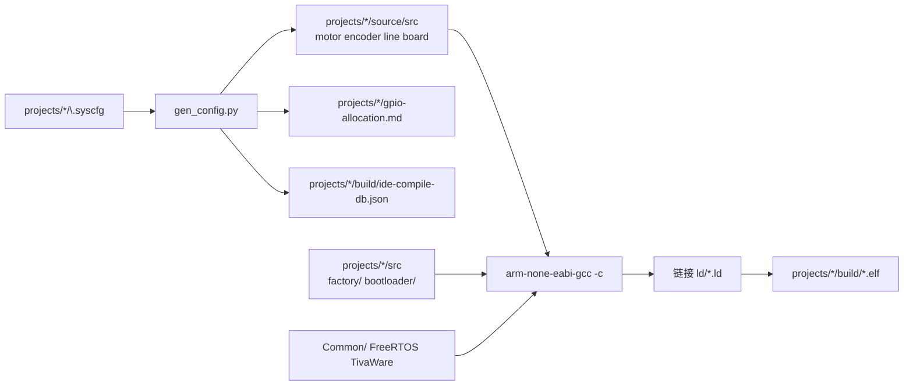

# 编译与构建指南

> 本文档是项目**编译、代码生成、烧录、脚本**的单一说明源。  
> 脚本内不写长说明；改流程时优先更新本文档。  
> 全项目命名规范见 `.cursor/rules/project-context.mdc` §命名规范。

---

## 1. 环境前提

| 组件 | 默认路径 | 说明 |
|------|----------|------|
| TivaWare C Series 2.2.0.295 | `sdk/TivaWare_C_Series-2.2.0.295` | 首次构建自动安装（不提交 Git） |
| ARM GNU Toolchain | `tools/bin/arm-none-eabi-gcc.exe` | 首次构建由 `install-toolchain.ps1` 自动下载 |
| UniFlash 9.2.0 | `D:\Ti\uniflash_9.2.0\dslite.bat` | 烧录（需 `TM4C123GH6PM.ccxml`） |

### 系统时钟（全项目统一）

| 项 | 配置 |
|----|------|
| 主晶振 | **8 MHz** |
| PLL | `SYSDIV_2_5` → **80 MHz** 系统时钟 |
| 代码 | `bsp_sysctl.c` / `bootloader.c` / `device_profile` 均为 `XTAL_8MHZ` |

> LaunchPad（EK-TM4C123GXL）板载 **16 MHz** 晶振；本仓库按自定义 PCB **8 MHz** 配置，勿混用。

首次构建时 `build.ps1` 会依次确保工具链与 TivaWare SDK 就绪。SDK 安装顺序：

1. 已存在于 `sdk/TivaWare_C_Series-2.2.0.295`
2. 从本机旧路径 `D:\Ti\TivaWare_C_Series-2.2.0.295` 复制
3. 从 `downloads/SW-TM4C-2.2.0.295.exe` 解压

若无法自动安装，从 [TI 官网](https://www.ti.com/tool/SW-TM4C) 下载后执行：

```powershell
.\scripts\install-tivaware.ps1 -InstallerPath D:\Downloads\SW-TM4C-2.2.0.295.exe
.\scripts\setup-terminal.ps1   # 可选；也可用 build.cmd 绕过执行策略
```

---

## 2. 工程结构

仓库包含两个可独立编译的小车工程：

| 工程 | 路径 | 说明 |
|------|------|------|
| `car-4wd` | `projects/car-4wd/` | 四电机底盘 |
| `car-2wd` | `projects/car-2wd/` | 双电机底盘 |

每个工程目录：

| 子目录 | 内容 |
|--------|------|
| `.syscfg/` | 引脚与外设 JSON / SysConfig 源 |
| `board/` | 设备库（`gen_config.py` 生成 motor / encoder / line / board） |
| `main/` | 应用（main、app、startup、FreeRTOS） |
| `build/` | 编译产物（不提交） |

跨工程共享：`bsp_driver/`（MCU 薄封装）、`cbb/`（芯片驱动子模块）、`Common/`（log、start、device_profile、nvs、ota）、`include/`、`ld/`、`scripts/`、`bootloader/`、`factory/`。

---

## 3. 日常命令

### 3.1 WSL（推荐入口）

在 `projects/` 下（产品 = `factory` | `car-4wd` | `car-2wd`）：

```bash
cd projects
./build.sh detect
./build.sh factory                 # 厂测 APP_B
./build.sh car-4wd                 # debug → elf/hex/bin
./build.sh car-2wd rebuild
./build.sh car-4wd release 0.1.0   # LOG_ENABLE=0 + release/ 打包
IMAGE_TARGET=app ./build.sh car-4wd

./flash.sh car-4wd app             # 量产 APP_A（缺镜像时自动编 app，默认带日志）
./flash.sh car-4wd full            # Boot+APP+厂测合并 HEX（缺则自动编 all）
./flash.sh factory                 # 厂测 @ 0x21000
./flash.sh car-4wd                 # J-Link standalone
```

`build.sh` / `flash.sh` 经 `powershell.exe` 调用 Windows 侧 `scripts/build.ps1`、`scripts/flash-jlink.ps1`（工具链与 J-Link 在 Windows）。更细说明见 [build-pipeline.md](build-pipeline.md)。

### 3.2 Windows

```powershell
# 根目录（默认 car-4wd）
.\build.cmd
.\build.cmd -CarProject car-2wd
.\build.cmd -CarProject car-4wd -Target app
.\build.cmd -CarProject car-4wd -Action release -FwVersion 0.1.0

# 烧录（J-Link）
.\flash-jlink.cmd
.\flash.cmd -Target standalone
```

等价入口：`.\scripts\build.ps1 -CarProject car-4wd`。  
IDE：**Ctrl+Shift+B** → 默认编译 `car-4wd`（见 `.vscode/tasks.json`）。

---

## 4. 构建目标与产物

| `-Target` / `IMAGE_TARGET` | 链接脚本 | 产物（示例 car-4wd） | Flash 用途 |
|-----------|----------|----------------------|------------|
| `standalone`（默认） | `ld/tm4c123gh6pm.ld` | `projects/car-4wd/build/car-4wd.{elf,hex,bin}` | 开发单镜像 @ `0x0` |
| `bootloader` | `ld/bootloader.ld` | `.../bootloader.{elf,hex,bin}` | Boot @ `0x0`（≤16 KB） |
| `app` | `ld/app.ld` | `.../app.{elf,hex,bin}` | 主固件 @ `0x4000`（≤116 KB） |
| `factory` | `ld/factory.ld` | `.../factory.{elf,hex,bin}` | 厂测 @ `0x21000`（≤116 KB） |
| `all` | Boot + APP_A + 厂测 APP_B | 三个镜像 +（release 时）`<car>-full.{hex,bin}` 合并包 | 产线全套 |

### 编译期宏（`build.ps1` / `build.sh` 注入）

| 宏 | 含义 |
|----|------|
| `FW_VERSION_STR` | 版本字符串（debug：git tag / `0.0.0-dev`；release：指定或 git） |
| `FW_PRODUCT_NAME` | 产品目录名（`car-4wd` / `car-2wd`） |
| `FW_BUILD_DATE` / `FW_BUILD_TIME` | 构建时间戳 |
| `LOG_ENABLE` | `1` 开串口 `LOG_*`；`release` 强制 `0`（编译剔除） |
| `DEVICE_PRODUCT_ID` | `1`=四轮，`2`=两轮 |

### Release 打包

路径：`release/<ver>/`（gitignore）。**仅 bin + hex，不打包 elf**（调试用 elf 仍留在 `projects/*/build/`）。

| 文件 | 说明 |
|------|------|
| `bootloader.{bin,hex}` | 共享 Boot（短名） |
| `TM4C123GH6PM_<YYYYMMDD>_<car>_<ver>_unsigned.{bin,hex}` | 量产 APP_A |
| `TM4C123GH6PM_<YYYYMMDD>_<car>_<ver>_unsigned_full.{bin,hex}` | Boot+APP+厂测三合一 |
| `TM4C123GH6PM_<YYYYMMDD>_factory.{bin,hex}` | 共享 APP_B（无版本后缀；`factory` / `car-4wd` release） |

例：`TM4C123GH6PM_20260722_car-2wd_0.2.0_unsigned_full.hex`、`TM4C123GH6PM_20260722_factory.bin`。

`FW_SIGNED=1` → 车型文件名 `_sign` 替代 `_unsigned`。两轮厂测在 `…_car-2wd_…_full` 内。

### 发布到 GitHub Tag / Release

版本与 **semver tag**（`vX.Y.Z`）对齐；本地打包后再推送 tag 并创建 GitHub Release（附件为 `release/<ver>/` 下的 elf/hex/bin）。

```bash
# WSL
cd projects
./build.sh all release 0.1.0
./publish.sh 0.1.0              # git tag v0.1.0 → push → gh release create
./publish.sh 0.1.0 --dry-run
./publish.sh 0.1.0 --build-first --draft
```

```powershell
.\build.cmd -CarProject car-4wd -Action release -FwVersion 0.1.0
.\build.cmd -CarProject car-2wd -Action release -FwVersion 0.1.0
.\publish-release.cmd 0.1.0
.\publish-release.cmd 0.1.0 -BuildFirst
.\publish-release.cmd 0.1.0 -DryRun
```

前置：

1. 待发布代码已提交（默认拒绝脏工作区；可用 `-AllowDirty` / `--allow-dirty`）
2. 已安装并登录 GitHub CLI：`gh auth login`（本机常见路径 `C:\Program Files\GitHub CLI\gh.exe`）
3. 有仓库 `contents:write` / release 权限（SSH remote `origin` 指向 `indexxue/TM4C123GH6PM`）

脚本：`scripts/publish-release.ps1`、`projects/publish.sh`。详见 [build-pipeline.md](build-pipeline.md)。

分区地址见 [PARTITION.md](../PARTITION.md)、[flash-partition.md](flash-partition.md)。

---

## 5. 构建流水线



**顺序**（`build.ps1` 内部）：

1. 应用/厂测目标：运行 `gen_config.py --car-project <car>`
2. 收集源文件，逐文件 `gcc -c`
3. 链接 → `projects/<car>/build/<car>.elf`
4. `objcopy` → `.bin` + `.hex`；`bootloader` / `app` / `factory` 做体积检查
5. `release`（车型）：合并 Boot+APP+厂测 → `<car>-full.{hex,bin}`，再打包到 `release/<ver>/`
6. `release`（factory 产品）：仅打包 APP_B，不合并

`bootloader` 目标不跑板级代码生成。

---

## 6. 板级配置与代码生成

配置源：`projects/<car>/.syscfg/`（**勿手改** `projects/<car>/source/src/{motor,encoder,line,board}.c`）。

| 文件 | 作用 |
|------|------|
| `project.json` | 清单：board / gpio / modules |
| `board.json` | 系统时钟等 |
| `gpio.json` | 引脚分配 |
| `modules/*.json` | PWM、编码器、UART、I2C、ADC 等 |
| `tm4c123gh6pm*.syscfg` | SysConfig GUI 配置（与 JSON 对应） |

| 生成文件 | 说明 |
|----------|------|
| `board/src/motor.c` | 电机 GPIO + PWM |
| `board/src/encoder.c` | 编码器 QEI |
| `board/src/line.c` | 循迹 GPIO（模拟巡线由 ADC 在 board.c 配置） |
| `board/src/board.c` | UART / I2C / ADC / SSI 等 |
| `board/inc/board.h` | 引脚宏、外设绑定、Motor/Encoder/Line/Board API |

引脚设计说明：[syscfg-io-allocation.md](syscfg-io-allocation.md)。  
自动生成引脚表：`projects/<car>/gpio-allocation.md`。

应用初始化（`Common/src/start.c` 的 `Start_Init()`，由 `projects/<car>/main/main.c` 调用）：

```c
Start_Init();   /* clock → Motor/Encoder/Line/Board_Periph → log */
App_Start();
```

单独重新生成：

```powershell
python scripts/gen_config.py --car-project car-4wd
python scripts/gen_config.py --car-project car-2wd --ide-db
```

---

## 7. 各目标源文件

### standalone / app

- `projects/<car>/src/`：startup、main、init、app、freertos_hooks、syscalls
- `projects/<car>/source/src/`：生成的板级模块
- `Common/src/`：log、cmd、battery、nvs 等
- `cbb/ws2812b/ws2812b.c`
- TivaWare FreeRTOS

`app` 额外：`-DFLASH_APP_A_SLOT`。

### factory

- `factory/{main,factory}.c`
- 共享 `projects/<car>/src/startup_*`、`freertos_hooks.c`、`syscalls.c` 及板级/Common 模块

### bootloader

- `bootloader/bootloader.c`
- `Common/src/crc32.c`

---

## 8. 编译选项摘要

| 项 | 值 |
|----|-----|
| CPU | Cortex-M4F，`hard` float |
| 标准 | C11，`-Os` |
| 宏 | `-DTM4C123GH6PM`、`-DPART_TM4C123GH6PM` |
| 包含 | `include/`、`Common/inc/`、`projects/<car>/source/inc/`、FreeRTOS、TivaWare |
| 链接库 | `libdriver.a` |

---

## 9. 脚本索引

| 脚本 | 职责 |
|------|------|
| `projects/build.sh` | WSL 编译入口（产品 / 版本 / release） |
| `projects/flash.sh` | WSL 烧录入口（调用 `flash-jlink.ps1`） |
| `projects/_common.sh` | 版本与 apt 共用逻辑 |
| `projects/publish.sh` | WSL：tag + GitHub Release 上传 |
| `build.ps1` | 主编译（`-CarProject` / `-Target` / `-Action`；车型 release 三合一合并） |
| `merge_flash_images.py` | Boot+APP_A+APP_B → 合并 HEX/BIN |
| `publish-release.ps1` | Windows：`vX.Y.Z` tag + `gh release create` |
| `gen_config.py` | `.syscfg` → 设备库 / `gpio-allocation.md` |
| `flash-uniflash.ps1` | UniFlash 烧录 |
| `flash-jlink.ps1` | J-Link 烧录 |
| `check-image-size.py` | 分区体积检查 |

根目录：`build.cmd`、`flash.cmd`、`publish-release.cmd`。

---

## 10. 烧录

**WSL（推荐）：**

```bash
cd projects
./flash.sh                         # 默认 car-4wd standalone
./flash.sh car-4wd full            # 三合一（需先 release 或 IMAGE_TARGET=all）
./flash.sh factory
./flash.sh car-4wd app
./flash.sh car-4wd bootloader --erase-all
./flash.sh car-4wd app --erase-apps
JLINK_SPEED=1000 ./flash.sh car-2wd
```

**Windows：**

```powershell
.\flash-jlink.cmd
.\flash-jlink.cmd -Target full -CarProject car-4wd
.\flash-jlink.cmd -Target factory
.\flash.cmd -Target standalone     # UniFlash
```

厂测镜像固定读 `projects/factory/build/`；车型镜像读 `projects/<car>/build/`（`full` → `<car>-full.hex`）。
缺对应产物时，`flash-jlink.ps1` 会先自动 `build` 该 Target（`full`→`all`，默认 `LOG_ENABLE=1`），再烧录——因此 `./build.sh car-4wd rebuild` 后再 `./flash.sh car-4wd app` 即可。

---

## 11. IDE

- **Ctrl+Shift+B**：编译 `car-4wd`
- standalone 构建生成 `projects/car-4wd/build/ide-compile-db.json`（不提交）

---

## 12. 产物与 Git

| 路径 | 提交 |
|------|------|
| `projects/*/build/` | 否 |
| `release/` | 否 |
| `tools/`、`downloads/`、`sdk/` | 否 |
| `projects/*/board/src/{motor,encoder,line,board}.c` | 是（与 gen 保持一致） |
| `projects/*/gpio-allocation.md` | 是（自动生成） |

---

## 13. 常见问题

| 现象 | 处理 |
|------|------|
| `arm-none-eabi-gcc not found` | 让 build 自动装工具链 |
| `FreeRTOS not found` / SDK 缺失 | 运行 `.\build.cmd` 自动安装，或手动 `.\scripts\install-tivaware.ps1` |
| 改引脚不生效 | 改 `projects/<car>/.syscfg/` 后重新编译 |
| 编译了错误的车型 | 检查 `-CarProject` 参数 |

---

## 相关文档

| 文档 | 内容 |
|------|------|
| [syscfg-io-allocation.md](syscfg-io-allocation.md) | 双车型引脚设计说明 |
| [resource-allocation.md](resource-allocation.md) | 定时器/DMA/中断规划 |
| [flash-partition.md](flash-partition.md) | Flash 分区 |
| [factory-partition-plan.md](factory-partition-plan.md) | 厂测分区切换 |
