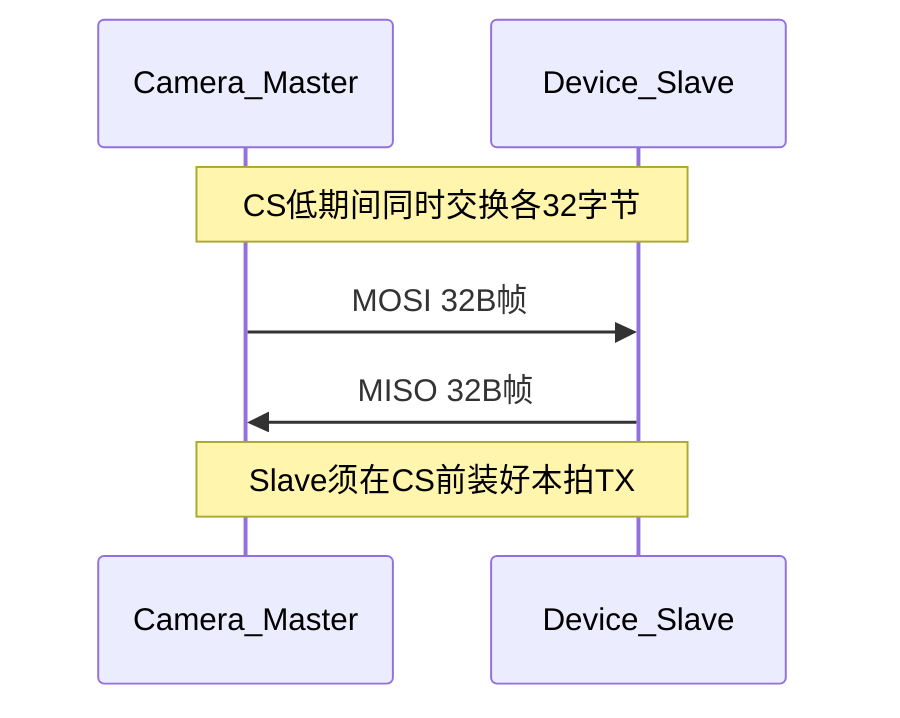

# Camera ↔ MCU SPI 通信协议（评审稿）

**版本**：1.2  
**日期**：2026-07-25  
**文档用途**：交付 **MCU / 小车主控** 侧评审与联调准备。  
**读者假设**：评审方 **无法访问** ESP32 工程仓库、源码、内部 README 或板级头文件。  
**因此**：凡对接所需的电气、时序、帧格式、命令表、保障与风险，**全部写在本文**；评审只需阅读并填写第 2 节确认表与第 11 节签字栏。

> **联调已确认（TM4C123 SSI Slave，固件 ≥0.3.1）**：连续 32 字节交换须使用 **SPI Mode1（CPOL=0, CPHA=1）**。  
> Mode0 下 CS 整帧拉低时，Slave MISO **只会移出首字节**，后续为浮空 `0xFF`。双方必须以 Mode1 为准。  
> L0 通路（`5A×32`/`A5×32`）与 L1 HEARTBEAT（双方 `link=OK`、`peer_role` 互认）已实测通过。

| 侧 | 角色 | 职责摘要 |
|----|------|----------|
| Camera 模组（ESP32-S3） | **SPI Master** | 周期性发起 32 字节全双工交换；上报检测/云台；执行 MCU 控制命令并 ACK |
| 小车 / 设备 MCU | **SPI Slave** | CS 前装好应答缓冲；解析 Master 帧；按需置位申请发送控制命令 |

---

## 1. 评审方须知（请先读）

1. **单一资料源**：联调前协议以本文版本号为准。ESP 工程内部路径、文件名仅出现在文末附录 A，**MCU 侧可忽略**。  
2. **评审目标**：确认能否按本文实现 Slave；标出不能接受的项并给出改写值。  
3. **评审通过后**：双方按同一帧格式 / CRC / 命令表编码；先 1 MHz 心跳打通，再开业务帧。  
4. **本文不包含**：JPEG/图像流、多从机、IRQ 握手脚（首版明确不做）。

---

## 2. MCU 侧需要准备的资料与交付物

下列内容请在评审回复或联调前准备齐全。缺任一项都会阻塞「确定通信」。

### 2.1 必须提供（阻塞项）

| # | 资料 | 说明 | 填写区 |
|---|------|------|--------|
| M1 | MCU 型号与封装 | 例如 STM32F103 / G431 / 其它 | |
| M2 | SPI **Slave** 外设能力 | 硬件 SPI 从机是否支持 **Mode1**、全双工、DMA；最大可靠 SCK | |
| M3 | MCU 侧 4 线引脚分配 | SCK / MOSI / MISO / CS 各接哪一脚；是否有外部上拉 | |
| M4 | IO 电平 | 必须为 **3.3 V** 逻辑；若 MCU 为 5 V，须说明电平转换方案 | |
| M5 | 接插件与线序定义 | 线缆针脚定义图或表格（与下表 3.1 对齐） | |
| M6 | 对本文物理层参数的接受/改写 | Mode、时钟上限、帧长、轮询周期（见第 11 节） | |
| M7 | 对消息/命令表的接受/删改 | 第 6 节；不需要的 `sub_cmd` 请划掉 | |
| M8 | 联调窗口与负责人 | 软硬件对接人、预计首次上电联调日期 | |

### 2.2 建议提供（降低联调风险）

| # | 资料 | 说明 |
|---|------|------|
| S1 | Slave 驱动伪代码或已有 SPI Slave 例程 | 标明「CS 下降前是否已装载 TX 缓冲」 |
| S2 | 主循环/中断模型 | 轮询装缓冲 vs SPI 中断；能否在 20 ms 内稳定应答 |
| S3 | 逻辑分析仪 / 示波器条件 | 能否抓 SCK+MOSI+MISO+CS 四通道 |
| S4 | 期望控制延迟 | 从置 `SLAVE_HAS_CMD` 到 ESP 执行完毕的可接受上限（ms） |
| S5 | 车辆侧对检测坐标的用法 | 只要中心点 / 只要最佳框 / 需要双框等 |

### 2.3 MCU 侧软件最低交付（联调里程碑）

| 里程碑 | MCU 应具备能力 |
|--------|----------------|
| L0 Echo | 任意收到的 32B 原样回发（或固定合法 HEARTBEAT），用于验 CRC/线序 |
| L1 Heartbeat | 按第 5/6 节组合法 `0x01` 帧，CRC 正确，`uptime_ms` 递增 |
| L2 解析上报 | 正确解析 `0x10` DETECT、`0x20` SERVO，串口打印关键字段 |
| L3 控制 | 能置 `SLAVE_HAS_CMD` 并发出 `0x30`；能核对 `0x31` CTRL_ACK |

### 2.4 Camera（ESP）侧将提供的对接条件（评审方可据此验收对方）

评审通过并固件实现后，Camera 侧保证提供：

- 固定 4 线 Master、**Mode1**、默认 1 MHz、20 ms 轮询发起交换  
- 合法帧：`magic` + `crc16` 正确；业务按优先级发送（见 5.5）  
- 对合法 `CTRL_CMD` 在后续拍返回 `CTRL_ACK`  
- 链路异常时在 HEARTBEAT/STATUS 中置错误标志，并继续探测（不断开物理层）

---

## 3. 电气与连接（自洽说明）

### 3.1 信号与接线（按信号名对接，勿按「GPIO 编号」猜线序）

| 信号名 | Camera（Master）方向 | MCU（Slave）方向 | 说明 |
|--------|----------------------|------------------|------|
| SCK  | 输出 | 输入 | 时钟，空闲为低（Mode1 / CPOL=0） |
| MOSI | 输出 | 输入 | Master → Slave 数据 |
| MISO | 输入 | 输出 | Slave → Master 数据 |
| CS   | 输出 | 输入 | **低有效**；一次 32B 交换内保持低 |
| GND  | — | — | **必须共地** |

**Camera 模组引出脚（供画线/接插件，MCU 不需要知道芯片内部编号含义以外的工程细节）**：

| 信号 | Camera 模组 GPIO 编号 |
|------|----------------------|
| SCK  | 21 |
| MOSI | 47 |
| MISO | 45 |
| CS   | 14 |

**本仓库 TM4C123（car-4wd / car-2wd）已锁定脚位**：

| 信号 | TM4C123 | 外设 |
|------|---------|------|
| SCK  | PA2 | `SSI0CLK` |
| CS   | PA3 | `SSI0FSS` |
| MOSI | PA4 | `SSI0RX`（Master→Slave） |
| MISO | PA5 | `SSI0TX`（Slave→Master） |

> 其它 MCU 请填自己的脚位到第 2.1 表 M3；双方用「信号名」对齐，不用假设同号 GPIO。

### 3.2 物理层参数（已确认锁定）

| 参数 | 推荐值 |
|------|--------|
| SPI Mode | **1**（CPOL=0，CPHA=1）— **锁定**；勿用 Mode0 |
| 位序 | MSB first |
| 字节序 | **小端（Little-Endian）** |
| 帧长 | **固定 32 字节**全双工（同时各收发 32B） |
| 时钟 | 联调 **1 MHz**；稳定后可协商升至 Slave 能力上限（建议不超过 8 MHz） |
| 电平 | **3.3 V** |
| 轮询周期 | Master 约 **20 ms** 发起一次交换（50 Hz） |
| 握手脚 | **无**（无 IRQ/READY）；仅靠轮询 |

### 3.3 CS 时序要求（Slave 必须满足）

| 阶段 | 要求 |
|------|------|
| CS 拉低前 | Slave **已装载**本拍要发出的 32B TX 缓冲 |
| CS 低 → 首时钟 | Master 保证 ≥ 1 µs（若 Slave 手册要求更长，请在评审中改写） |
| 传输中 | 连续移出 32×8 bit；全双工 |
| 末位 → CS 拉高 | ≥ 1 µs |
| 两次交换间隔 | CS 高保持 ≥ 10 µs |

**常见错误**：等收到完整 MOSI 后再组 MISO → 本拍 MISO 全是旧数据或 0xFF。正确做法是「上一拍算好的应答」在本拍时钟到来时移出。

---

## 4. 通信保障（契约：保证什么 / 不保证什么）

双方按本文实现时，约定如下「保障」与「非保障」。评审若不同意，必须改写本表。

### 4.1 保证（Shall）

| ID | 保障内容 |
|----|----------|
| G1 | 每拍交换长度恒为 32B；不足 payload 填 0 |
| G2 | 合法帧必含 `magic=0xA55A`（线上首两字节 `5A A5`）且 CRC 校验通过才处理 |
| G3 | CRC 算法双方一致：CRC-16/CCITT-FALSE（见 5.4 与附录 B） |
| G4 | 坏帧（magic/CRC/len 非法）**不执行**其中命令，仅计数 |
| G5 | Master 持续轮询；链路短暂误码后可自动恢复（无需人工复位总线） |
| G6 | 控制路径：MCU 通过 `SLAVE_HAS_CMD` + `CTRL_CMD` 投递；ESP 以 `CTRL_ACK`+`req_id` 回结果 |
| G7 | 检测坐标约定固定：原点画面左上，x 右、y 下；单位像素 |
| G8 | 角度量纲固定：`deg_x100`（例 180.00° → 18000）；脉宽单位 µs |

### 4.2 不保证（Shall not / Best effort）

| ID | 内容 | 应对 |
|----|------|------|
| N1 | **不保证**控制命令 exactly-once（断电/重发可能执行两次） | MCU 命令设计幂等；用 `req_id` 对账 |
| N2 | **不保证**检测每帧都发（可能被 HEARTBEAT/控制拉取插队） | MCU 以最新一帧为准；可缓存 |
| N3 | **不保证** >2 个检测框同帧送达 | 首版最多 2 框（优先高分） |
| N4 | **不保证**图像/JPEG 经 SPI 传输 | 不在范围内 |
| N5 | **不保证**无 IRQ 时 MCU→ESP 延迟低于一个轮询周期 | 最坏约 2～3 个周期才拉到命令并 ACK |
| N6 | **不保证** 1 MHz 以上时钟在任意线长下零误码 | 升钟前必须过误码率验收 |

### 4.3 链路存活判定（双方一致）

| 状态 | 条件 | 建议行为 |
|------|------|----------|
| LINK_OK | 近 1 s 内收到 ≥1 帧合法 magic+CRC | 正常业务 |
| LINK_DEGRADED | CRC 错连续累积但偶发成功 | 记录；可降时钟 |
| LINK_DOWN | 连续 ≥10 帧无合法 magic（或 MISO 恒 0xFF） | 置 `SLAVE_NOT_RESPONDING`；Master 继续探测；MCU 检查 CS 中断/缓冲装载 |

---

## 5. 链路层

### 5.1 交换模型



- 本拍双方同时发送；**本拍命令的处理结果**通常在后续拍以 `CTRL_ACK` 或业务帧返回。  
- 无「半包」：每拍边界即帧边界。

### 5.2 帧布局（32 字节）

| 偏移 | 长度 | 字段 | 说明 |
|------|------|------|------|
| 0 | 2 | `magic` | `0xA55A`，小端线上为 `5A A5` |
| 2 | 1 | `ver` | 首版 `0x01` |
| 3 | 1 | `seq` | 发送方序号，成功发送后 +1（回绕） |
| 4 | 1 | `msg_id` | 见第 6 节 |
| 5 | 1 | `flags` | 见 5.3 |
| 6 | 1 | `len` | payload 有效长度，0～22 |
| 7 | 1 | `rsv` | 写 0 |
| 8 | 22 | `payload` | 应用数据，余量填 0 |
| 30 | 2 | `crc16` | 小端；覆盖偏移 0～29 |

### 5.3 flags

| bit | 名 | 含义 |
|-----|-----|------|
| 0 | `ACK_REQ` | 请求对端后续给出明确 ACK |
| 1 | `SLAVE_HAS_CMD` | **仅 MISO（Slave→Master）**：从机有 `CTRL_CMD` 待拉取 |
| 2 | `NACK` | 否定语义（配合 ACK/STATUS） |
| 3 | `BUSY` | 忙，请稍后重试 |
| 4..7 | 保留 | 写 0 |

### 5.4 CRC（联调前必须双方算同一结果）

- 名称：CRC-16/CCITT-FALSE  
- 多项式 `0x1021`，初值 `0xFFFF`，输入/输出不反射，最终异或 `0x0000`  
- 覆盖：帧字节 `[0 .. 29]`（不含 CRC 字段）  

**标准自检**：对 ASCII `"123456789"` 九字节，CRC 必须为 **`0x29B1`**。任一方算不出此值，禁止上总线。

**协议帧自检向量**（HEARTBEAT，空 payload）：

```
偏移0..29 十六进制：
5A A5 01 00 01 00 00 00
00 00 00 00 00 00 00 00 00 00 00 00
00 00 00 00 00 00 00 00 00 00
CRC16 = 0x6EB9 → 帧末两字节（小端）：B9 6E
完整 32B 末尾应为 ... B9 6E
```

参考 C 实现见 **附录 B**。

### 5.5 轮询优先级（Master）

每 20 ms 最多发一帧，优先级从高到低：

1. 上拍 MISO 带 `SLAVE_HAS_CMD` → 本拍发 HEARTBEAT，便于 Slave 吐出 `CTRL_CMD`  
2. 有新检测结果 → `DETECT_RESULT`  
3. 舵机遥测到期（建议 10～20 Hz）→ `SERVO_TELEMETRY`  
4. 否则 → `HEARTBEAT`

### 5.6 Slave 发送策略

- 默认：`HEARTBEAT` 或 `STATUS`  
- 有控制意图：置 `SLAVE_HAS_CMD`，在 Master 下一拍拉取时发 `msg_id=0x30`  
- 收到并处理控制后：尽快在后续拍发 `CTRL_ACK`（`0x31`）

---

## 6. 应用消息字典

### 6.1 总表

| msg_id | 名称 | 方向 | 说明 |
|--------|------|------|------|
| `0x01` | HEARTBEAT | 双向 | 存活 |
| `0x02` | STATUS | 双向 | 状态与链路计数 |
| `0x10` | DETECT_RESULT | Camera→MCU | 检测框（最多 2） |
| `0x20` | SERVO_TELEMETRY | Camera→MCU | 云台角度/脉宽/限位 |
| `0x30` | CTRL_CMD | MCU→Camera | 控制 |
| `0x31` | CTRL_ACK | Camera→MCU | 控制结果 |

### 6.2 HEARTBEAT `0x01`（len=8）

| 偏移 | 类型 | 字段 |
|------|------|------|
| 0 | u32 | `uptime_ms` |
| 4 | u8  | `role`：1=Camera Master，2=MCU Slave |
| 5 | u8  | `proto_ver` |
| 6 | u16 | `err_flags`（见 6.7） |

### 6.3 STATUS `0x02`（len=12）

| 偏移 | 类型 | 字段 |
|------|------|------|
| 0 | u32 | `device_flags` |
| 4 | u16 | `crc_err_count` |
| 6 | u16 | `magic_err_count` |
| 8 | u16 | `last_nack_code` |
| 10 | u16 | `rsv` |

### 6.4 DETECT_RESULT `0x10`

坐标：**原点左上，x 向右，y 向下**，单位像素。  
中心：`cx = x + w/2`，`cy = y + h/2`（整数截断）。

| 偏移 | 类型 | 字段 |
|------|------|------|
| 0 | u16 | `frame_w` |
| 2 | u16 | `frame_h` |
| 4 | u8  | `count`（0～2） |
| 5 | u8  | `best_index`（最高分下标；无框=`0xFF`） |
| 6 | 8B | box[0] |
| 14 | 8B | box[1] |

box（8B）：`u16 x, y, w` + `u8 score_u8` + `u8 class_id`  
`score_u8` = 置信度×255 钳位；钢珠 `class_id=0`。

### 6.5 SERVO_TELEMETRY `0x20`（len=16）

| 偏移 | 类型 | 字段 |
|------|------|------|
| 0 | i16 | `pan_deg_x100` |
| 2 | i16 | `tilt_deg_x100` |
| 4 | u16 | `pan_pulse_us` |
| 6 | u16 | `tilt_pulse_us` |
| 8 | i16 | `pan_min_x100` |
| 10 | i16 | `pan_max_x100` |
| 12 | i16 | `tilt_min_x100` |
| 14 | i16 | `tilt_max_x100` |

云台语义（供控制理解，不依赖其它文档）：

- Pan / Tilt 两轴；角度量纲 0～360° 对应脉宽约 500～2500 µs，中位约 180°=1500 µs  
- 默认软限位示例：Pan 0～360，Tilt 60～300（约 240° 机械窗）  
- 通道号：`0`=Pan，`1`=Tilt  

### 6.6 CTRL_CMD `0x30` / CTRL_ACK `0x31`

CTRL_CMD 头：

| 偏移 | 类型 | 字段 |
|------|------|------|
| 0 | u8 | `sub_cmd` |
| 1 | u8 | `req_id` |
| 2 | u8 | `argc` |
| 3 | u8 | `rsv` |
| 4 | … | 参数 |

| sub_cmd | 名 | 参数 |
|---------|-----|------|
| `0x01` | DETECT_ENABLE | u8 on（0/1） |
| `0x02` | FOLLOW_ENABLE | u8 on（0/1）；若 Camera 暂未实现跟随，ACK=`UNSUPPORTED` |
| `0x10` | SERVO_SET_ANGLE | u8 ch + i16 deg_x100 |
| `0x11` | SERVO_NUDGE | u8 ch + i16 delta_x100 |
| `0x12` | SERVO_CENTER | 无参数 |
| `0x13` | SERVO_SET_LIMITS | 4×i16（pan_min/max, tilt_min/max，×100） |
| `0x14` | SERVO_RESET_LIMITS | 无参数 |
| `0x20` | SET_STREAM_MODE | u8 mode（预留，默认 0） |

CTRL_ACK：

| 偏移 | 类型 | 字段 |
|------|------|------|
| 0 | u8 | `sub_cmd` 回显 |
| 1 | u8 | `req_id` 回显 |
| 2 | u8 | `result`：0=OK，1=BAD_PARAM，2=BUSY，3=UNSUPPORTED，4=FAILED |
| 3 | u8 | `rsv` |
| 4 | u32 | `detail` 可选 |

超时建议：MCU 在约 **100 ms** 内未收到对应 `req_id` 的 ACK 则重发；命令应尽量幂等。

### 6.7 标志位

**err_flags（u16）**：bit0 `LINK_CRC_STORM`，bit1 `SLAVE_NOT_RESPONDING`，bit2 `DETECT_FAULT`，bit3 `SERVO_FAULT`，bit4 `CTRL_REJECTED_RECENT`。

**device_flags（u32，Camera 常用）**：bit0 `DETECT_READY`，bit1 `DETECT_RUNNING`，bit2 `FOLLOW_ENABLED`，bit3 `SERVO_READY`，bit4 `WIFI_UP`，bit5 `OTA_BUSY`。

---

## 7. 错误处理（双方共同规则）

| 场景 | 行为 |
|------|------|
| magic / CRC 错误 | 丢弃，不执行；计数 +1 |
| `len` > 22 | 丢弃 |
| 未知 msg_id / sub_cmd | 丢弃或 ACK=`UNSUPPORTED` |
| 连续无合法帧 | 判 LINK_DOWN（见 4.3）；继续探测 |
| CTRL 无 ACK | MCU 超时重发 |
| Camera 忙（如升级） | 置 `BUSY`；CTRL 回 `result=BUSY` |

---

## 8. 可能存在的问题（评审与联调重点）

### 8.1 电气 / 硬件

| 问题 | 现象 | 规避 |
|------|------|------|
| 未共地 | 随机误码、损坏 IO | 短粗地线优先连接 |
| MOSI/MISO 交叉 | 一方永远无合法 magic | 按信号名复核；先做 L0 Echo |
| 5 V 直连 3.3 V | 损坏 Camera IO | 电平转换或换 3.3 V MCU 脚 |
| 线过长 / 无阻尼 | 升钟后 CRC 暴涨 | 先 1 MHz；必要时串 22～100 Ω |
| CS 悬空或上拉缺失 | 假从机选中 | CS 按手册上下拉 |

### 8.2 时序 / 软件（Slave 侧最高发）

| 问题 | 现象 | 规避 |
|------|------|------|
| CS 前未装 TX 缓冲 | Master 读到 0xFF/旧帧 | CS 中断或主循环提前装载下一拍应答 |
| 用「收完再回」的半双工思维 | 控制永远慢一拍且易错 | 接受「本拍 TX = 上一拍算好的结果」 |
| CRC 多项式/初值不一致 | 互斥「全是 CRC 错」 | 先过 `"123456789"→0x29B1` 与附录向量 |
| 大小端搞反 | 角度/坐标错数量级 | 多字节字段统一小端；抓包核对 |
| 主循环过重导致装缓冲抖动 | 偶发错帧 | DMA + 双缓冲；SPI 中断高优先级 |
| 期望 IRQ 通知 | 设计依赖不存在的第 5 脚 | 首版只用 `SLAVE_HAS_CMD` 轮询拉取 |

### 8.3 业务语义

| 问题 | 说明 |
|------|------|
| 检测延迟 | 检测推理本身有耗时，SPI 再叠加轮询，控制环不要假设「视觉同步电机」 |
| 双框截断 | 多于 2 个目标时只送高分 2 个 |
| 跟随未实现 | `FOLLOW_ENABLE` 可能 ACK=`UNSUPPORTED`，需产品接受 |
| 控制重入 | 快重发可能导致舵机连续执行；用 `req_id` 与限速 |

### 8.4 Camera 侧已知工程约束（便于 MCU 理解对方风险，无需读仓库）

| 约束 | 影响 |
|------|------|
| Camera 板上另有一路 SPI 驱动 LCD | Master 软件须与 LCD 总线隔离；联调若 LCD 花屏需双方暂停升钟查负载 |
| 无 IRQ 脚预留 | MCU→Camera 命令延迟受 20 ms 轮询限制 |
| 首版固件在协议评审通过后才实现 | 评审阶段以本文为准，不以「已烧录行为」为准 |

---

## 9. 确定通信的验收阶梯（建议按序签字）

| 阶梯 | 通过标准 | 双方签字 |
|------|----------|----------|
| A. 资料齐套 | 第 2.1 阻塞项全部填写；第 11 节结论非「驳回」 | |
| B. CRC 一致 | 双方独立算出 `0x29B1` 与帧向量 `0x6EB9` | |
| C. 线序正确 | L0：Master 读到非全 0xFF，且至少 magic 正确或 Echo 成功 | |
| D. 心跳稳定 | 1 MHz，≥1 min，CRC 错率低于 0.1%（或双方约定阈值） | |
| E. 业务可读 | MCU 正确打印 DETECT / SERVO 关键字段抽样 | |
| F. 控制闭环 | `SERVO_CENTER` 或 `DETECT_ENABLE` 得 `CTRL_ACK=OK`，现象可见 | |
| G. 压力 | 50 Hz × 10 min 无死锁；拔插线后能自动恢复 LINK_OK | |

**未完成 A～D，不得进入业务联调。** 这是「确定通信」的最低保障门槛。

---

## 10. 联调检查清单（现场）

- [ ] GND 已接，电平均 3.3 V  
- [ ] SCK/MOSI/MISO/CS 按信号名一一对应（无交叉）  
- [ ] 双方 **Mode1**、MSB、32B、同一 CRC  
- [ ] 时钟 1 MHz  
- [ ] Slave 在 CS 前装载 TX  
- [ ] 已跑通阶梯 B、C、D  

功能抽检：

| 编号 | 操作 | 期望 |
|------|------|------|
| T1 | 仅心跳 | 双端 uptime 增加，CRC 正确 |
| T2 | 有检测目标 | MCU 收到 `0x10`，坐标合理 |
| T3 | 云台运动 | MCU 收到 `0x20` 角度变化 |
| T4 | MCU 发回中 | ACK=OK，云台回中 |
| T5 | 故意错 CRC | 不执行命令，计数增加 |
| T6 | 断 MISO 再恢复 | 先 LINK_DOWN，恢复后自动 LINK_OK |

---

## 11. MCU 评审确认表（请填写后回传）

| # | 项 | 本稿推荐 | 接受 Y/N | 改写值 / 备注 |
|---|-----|----------|----------|---------------|
| 1 | 角色 Camera=Master，MCU=Slave | 是 | | |
| 2 | 仅 4 线，无 IRQ | 是 | | |
| 3 | SPI Mode 1 | Mode 1（CPOL=0,CPHA=1） | Y | TM4C SSI Slave 连续 32B 必须；Mode0 仅出首字节 |
| 4 | MSB first | 是 | | |
| 5 | 小端 | 是 | | |
| 6 | 帧长 32 B | 32 | | |
| 7 | magic `0xA55A` | 是 | | |
| 8 | CRC-16/CCITT-FALSE | 是 | | |
| 9 | 联调时钟 1 MHz | 1 MHz | | |
| 10 | Slave 最大可靠时钟 | （请填） | | |
| 11 | 轮询周期 20 ms | 20 ms | | |
| 12 | DETECT 最多 2 框 | 2 | | |
| 13 | 角度 `deg_x100` | 是 | | |
| 14 | CTRL 子命令表（6.6） | 接受/删改 | | |
| 15 | `SLAVE_HAS_CMD` 拉取 | 是 | | |
| 16 | 第 4 节保障/非保障 | 接受/改写 | | |
| 17 | MCU 型号与 SPI Slave 脚位 | （请填） | | |

**评审结论**：□ 通过，按本文实施　□ 通过但需修订（请附修改条）　□ 驳回  

**MCU 评审人 / 日期**：________________  
**Camera 对接人 / 日期**：________________  

---

## 附录 A — ESP 工程内部说明（MCU 评审可忽略）

本附录仅供 Camera 固件开发排期，**不是** MCU 评审前置资料。

- 产品 SPI 总线在工程内映射为硬件 SPI3；LCD 占用另一路 SPI。  
- 实现前需扩展板级 SPI 驱动以支持双主机并存。  
- 建议模块：链路编解码（帧/CRC）+ camera 应用轮询任务对接检测与舵机。  
- 阶段：P0 总线 → P1 心跳 → P2 检测/云台上报 → P3 控制闭环 → P4 文档回写。  

---

## 附录 B — CRC 参考实现（可直接编译对照）

```c
#include <stdint.h>
#include <stddef.h>

/* CRC-16/CCITT-FALSE: poly 0x1021, init 0xFFFF, no refin/refout, xorout 0 */
uint16_t spi_link_crc16(const uint8_t *data, size_t len)
{
    uint16_t crc = 0xFFFFU;
    size_t i;
    int b;

    for (i = 0; i < len; i++) {
        crc ^= (uint16_t)data[i] << 8;
        for (b = 0; b < 8; b++) {
            if (crc & 0x8000U) {
                crc = (uint16_t)((crc << 1) ^ 0x1021U);
            } else {
                crc = (uint16_t)(crc << 1);
            }
        }
    }
    return crc;
}

/* 自检：spi_link_crc16("123456789", 9) == 0x29B1 */
/* 帧向量：见 5.4，前 30 字节 CRC == 0x6EB9 */
```

---

## 变更记录

| 日期 | 版本 | 说明 |
|------|------|------|
| 2026-07-25 | 1.0 | 初版协议草案 |
| 2026-07-25 | 1.1 | 面向 MCU 自洽：准备资料清单、通信保障、问题与验收阶梯；补齐 CRC 向量与参考代码；弱化仓库路径依赖 |
| 2026-07-25 | 1.2 | **物理层改 Mode1**：TM4C123 SSI Slave 实测 Mode0+整帧 CS 低仅吐首字节；L0/L1 HEARTBEAT 已在 Mode1/1MHz/32B 打通；补 TM4C 脚位表（PA2~PA5） |
