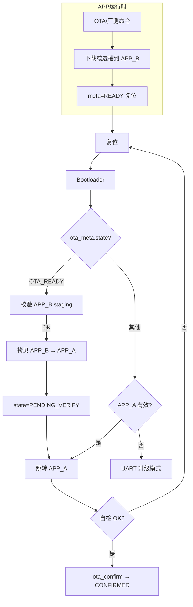

# TM4C123 内部 Flash 分区规划

> 芯片：**TM4C123GH6PM**，256 KB 片上 Flash @ `0x00000000`，32 KB SRAM。  
> **选定方案**：**Bootloader + APP_A（唯一运行）+ APP_B（厂测 + OTA 存储）+ NVS**，**纯片内 Flash**，不涉及外扩 NOR。  
> 片内只跑一份主固件；非运行区存 OTA 包与厂测镜像，由 Bootloader 将 APP_B 搬运至 APP_A 后启动。  
> 当前工程为单镜像全 Flash 链接（见 `ld/tm4c123gh6pm.ld`）；本文档为目标布局与实施参考。  
> **速查**：[PARTITION.md](../PARTITION.md) · **开发计划**：[ab-ota-dev-plan.md](ab-ota-dev-plan.md)

---

## 1. 设计目标

| 分区 | 用途 |
|------|------|
| **Bootloader** | 校验 APP_A、读 `ota_meta`、**APP_B → APP_A 激活**、失败回滚、UART 升级入口 |
| **APP_A** | **唯一运行槽** — 主业务固件（四轴控制、蓝牙、传感器等） |
| **APP_B** | **非运行存储区** — OTA 下载暂存 + 厂测固件存放（互斥复用同一物理区） |
| **NVS** | 键值配置 + **`ota_meta` 状态机**（非双槽 `active_slot` 乒乓） |

约束：

- 擦除粒度 **1 KB**（片上 Flash 最小擦除块）
- 写入粒度 **4 B**（字对齐）
- 分区起始 **4 KB 对齐**
- 复位向量在 `0x00000000` → Bootloader 固定占 Flash 起始
- **主应用上限 116 KB**；OTA/厂测镜像同样 ≤ 116 KB

---

## 2. 片上 Flash 总览（256 KB）

```
0x00000000 ┌─────────────────────────────┐
           │  Bootloader          16 KB  │  BL — 永不被 OTA 覆盖（须工具更新）
0x00004000 ├─────────────────────────────┤
           │  APP_A              116 KB  │  ★ 唯一运行槽（主固件）
0x00021000 ├─────────────────────────────┤
           │  APP_B              116 KB  │  厂测 + OTA 存储（非运行）
0x0003E000 ├─────────────────────────────┤
           │  NVS                  8 KB  │  参数 + ota_meta
0x00040000 └─────────────────────────────┘
```

**容量核对**：16 + 116 + 116 + 8 = **256 KB** ✓

> **说明**：物理地址与旧「双运行槽」方案相同，但 **语义已变更** — APP_B 不再是备用运行槽，而是**片内 OTA/厂测固库存储区**。

### 2.1 分区表

| 名称 | 起始地址 | 大小 | 结束地址（含） | 链接脚本 / 产物 |
|------|----------|------|----------------|-----------------|
| `bootloader` | `0x00000000` | 16 KB (`0x4000`) | `0x00003FFF` | `ld/bootloader.ld` → `build/bootloader.bin` |
| `app_a` | `0x00004000` | 116 KB (`0x1D000`) | `0x00020FFF` | `ld/app.ld` → `build/app.bin` |
| `app_b` | `0x00021000` | 116 KB (`0x1D000`) | `0x0003DFFF` | `ld/factory.ld`（厂测链址）或运行时作 staging |
| `nvs` | `0x0003E000` | 8 KB (`0x2000`) | `0x0003FFFF` | 运行时读写，**不参与** APP 链接 |

### 2.2 C 头文件常量（规划）

```c
#define FLASH_BL_BASE           0x00000000U
#define FLASH_BL_SIZE           0x00004000U

#define FLASH_APP_A_BASE        0x00004000U
#define FLASH_APP_A_SIZE        0x0001D000U
#define FLASH_APP_B_BASE        0x00021000U
#define FLASH_APP_B_SIZE        0x0001D000U

#define FLASH_STAGING_BASE      FLASH_APP_B_BASE
#define FLASH_STAGING_SIZE      FLASH_APP_B_SIZE
#define FLASH_OTA_IMAGE_MAX     FLASH_APP_A_SIZE

#define FLASH_NVS_BASE          0x0003E000U
#define FLASH_NVS_SIZE          0x00002000U

#define FLASH_RUN_SLOT_BASE     FLASH_APP_A_BASE
```

### 2.3 与旧「片上 A/B 乒乓」差异

| 项 | 旧方案（已废止） | 当前方案 |
|----|------------------|----------|
| APP_B 角色 | 第二运行槽，与 A 乒乓 | **OTA/厂测存储**，永不直接跳转 |
| Boot 跳转 | 按 `active_slot` 选 A 或 B | **恒跳 APP_A** |
| OTA 收尾 | 切 `active_slot` 复位 | 写 `ota_meta.state=READY` 复位，Boot 拷贝 B→A |
| NVS 核心字段 | `active_slot`、双槽 CRC | `ota_meta` 状态机 + 镜像 meta |
| 厂测 | 烧录独立槽并切换 | 镜像存 APP_B，`ftmenter` 走激活链 |

---

## 3. Bootloader 分区

### 3.1 职责

1. 初始化最小硬件（时钟、GPIO、UART7 调试 / UART0 蓝牙）
2. 读 NVS `ota_meta`：`state`、`image_size`、`image_crc32`、`boot_attempts`
3. 若 `state == OTA_READY`：校验 APP_B staging → **擦写 APP_A**（`.RamFunc` 在 SRAM 执行）→ `PENDING_VERIFY`
4. **常规启动**：`image_validate(APP_A)` → 设 `VTOR = 0x00004000` → 跳转
5. **回滚**：`PENDING_VERIFY` 且 `boot_attempts > 3` → 保持旧 APP_A（激活失败时未改写）或进入 UART 升级模式（二期可评估片内备份策略）
6. **升级模式**（两槽均无效 / GPIO 强制）：UART 收包 → 写 APP_B → 更新 meta → 复位

### 3.2 启动逻辑（伪代码）

```c
ota_meta_read(&meta);

if (meta.state == OTA_READY) {
    if (staging_crc32_ok() && image_validate(FLASH_STAGING_BASE + IMAGE_HDR_SIZE)) {
        boot_apply_staging_to_app_a();  /* APP_B → APP_A */
        meta.state = OTA_PENDING_VERIFY;
        ota_meta_write(&meta);
    } else {
        meta.state = OTA_IDLE;
        ota_meta_write(&meta);
    }
}

if (meta.state == OTA_PENDING_VERIFY && meta.boot_attempts > OTA_BOOT_ATTEMPT_MAX) {
    meta.state = OTA_IDLE;
    ota_meta_write(&meta);
    /* 旧 APP_A 仍在（激活前备份策略见二期） */
}

if (image_validate(FLASH_APP_A_BASE))
    jump_to_app(FLASH_APP_A_BASE);
else
    enter_uart_upgrade_mode();
```

### 3.3 为何必须由 Bootloader 写 APP_A

TM4C123 256 KB 为**单片 Flash**：Boot（`0x00000000`）与 APP_A（`0x00004000`）同属一片。

| 尝试 | 结果 |
|------|------|
| APP 在 APP_A 运行并擦写 APP_A | 取指失败 / HardFault → **死机** |
| 仅把擦写函数放 RAM | 中断与返回路径仍可能从 Flash 取指，**不可靠** |
| **Boot 运行 + 编程 APP_A 区** | Boot 不在被擦除范围 → **可行** |

**禁止**：APP 在 `ota_finish` 路径直接擦写 APP_A。

### 3.4 出厂烧录

1. `bootloader.bin` @ `0x00000000`
2. `app.bin` @ `0x00004000`（量产主固件）
3. `factory.bin` @ `0x00021000`（可选，厂测镜像预置）
4. NVS：首次启动或产测写入 `ota_meta` magic + `state=IDLE`

---

## 4. APP_A — 唯一运行槽

### 4.1 链接脚本（`ld/app.ld`）

```ld
MEMORY
{
    FLASH (rx)  : ORIGIN = 0x00004000, LENGTH = 116K
    SRAM  (rwx) : ORIGIN = 0x20000000, LENGTH = 32K
}
```

日常开发可保留 `APP_STANDALONE`（`ld/tm4c123gh6pm.ld`，ORIGIN=`0x00000000`）至 Boot 就绪。

### 4.2 运行中约束

- APP **只擦写 APP_B**（staging），**绝不**擦写 APP_A
- OTA 擦写期间关中断；暂停电机 PWM / 驱动输出
- 下载完成：`ota_meta.state = OTA_READY` → `NVIC_SystemReset()`
- 新固件首次运行成功后（RTOS + 传感器 OK）调用 `ota_confirm_running_image()` → `CONFIRMED`

---

## 5. APP_B — 厂测 + OTA 存储区

### 5.1 角色

APP_B **不参与链接运行**（厂测工程 `factory.ld` 仅用于生成待存储的 bin）。运行时该区域充当：

| 场景 | APP_B 内容 | 后续动作 |
|------|------------|----------|
| **OTA 升级** | 主机经 UART0/蓝牙下载的新固件 | Boot 校验后拷贝 → APP_A |
| **厂测** | 产线预烧 `factory.bin` 或命令写入的厂测镜像 | `ftmenter` → 同 OTA 激活链 |
| **空闲** | `0xFF` 或旧包残留 | Boot 忽略，直接启 APP_A |

同一时刻 **只存放一份** 完整镜像（OTA 包与厂测包互斥）。量产固件在 **APP_A** 运行；切换厂测前须将厂测镜像写入 **APP_B**。

### 5.2 槽头格式（可选）

镜像可从 APP_B+512 起存放，槽头 512 B：

| 偏移 | 字段 | 说明 |
|------|------|------|
| 0x00 | `magic` | `0x46574844`（"FWHD"） |
| 0x08 | `image_size` | payload 字节数 |
| 0x0C | `image_crc32` | payload CRC32 |
| 0x10 | `version[16]` | 版本串 |
| 0x20 | `header_crc32` | 槽头 CRC |

校验顺序：`header_crc32` → payload CRC → **`image_validate()`**。

### 5.3 厂测切换（`ftmenter` / `ftmexit`）

| 命令 | 行为 |
|------|------|
| `ftmenter` | 校验 APP_B 厂测镜像 → `ota_meta.state=OTA_READY` → 复位 → Boot 搬运 B→A |
| `ftmexit` | 将量产 `app.bin` 写入 APP_B（或产线重烧）后走同一激活链；或 ST-Link 直接重烧 APP_A |

**厂测往返**：APP_A 跑量产版；进厂测前 APP_B 须有有效厂测 bin；回量产同理。

---

## 6. NVS 与 ota_meta

### 6.1 物理参数

| 项 | 值 |
|----|-----|
| 基址 | `0x0003E000` |
| 大小 | 8 KB |
| 访问 | TivaWare `FlashErase` / `FlashProgram` |

页式结构（2 × 4 KB 轮换）。OTA 状态使用独立 `ota_meta` 结构，**取代** `active_slot` 乒乓。

### 6.2 ota_meta 核心字段

| 字段 | 说明 |
|------|------|
| `magic` / `struct_version` | 结构识别 |
| `state` | `IDLE` / `DOWNLOADING` / `READY` / `PENDING_VERIFY` / `CONFIRMED` / … |
| `image_size` / `image_crc32` | staging 镜像描述 |
| `version[16]` | 版本串 |
| `boot_attempts` | 待确认启动失败计数（超阈值放弃激活 / 回滚） |

### 6.3 应用配置键（与 OTA 同区）

| Namespace | 示例键 | 说明 |
|-----------|--------|------|
| `cfg` | PID、限速 | OTA/厂测切换 **不擦** |
| `cal` | 编码器/IMU 校准 | 同上 |
| `dev` | 蓝牙名 | 同上 |

### 6.4 API 规划

```c
int  ota_meta_read(ota_meta_t *out);
int  ota_meta_write(const ota_meta_t *in);
int  ota_start(uint32_t size, uint32_t crc32, const char *version);
int  ota_write_chunk(uint32_t offset, const void *data, uint32_t len);
int  ota_finish_activate(void);      /* meta=READY + 复位；不写 APP_A */
int  ota_confirm_running_image(void); /* 新 APP 自检通过后 */
int  ota_abort(void);
```

---

## 7. OTA / 厂测激活流程



### 7.1 典型 OTA 步骤（APP 侧）

1. `ota_start(size, crc32, version)` — 擦除 APP_B，meta=`DOWNLOADING`
2. 流式 `ota_write_chunk()` 写入 APP_B（+512 若有槽头）
3. `ota_finish_verify()` — staging CRC 校验
4. `ota_finish_activate()` — meta=`READY`，**不复位前不写 APP_A**，`NVIC_SystemReset()`
5. Boot 执行 APP_B → APP_A，跳转新应用
6. 新 APP `ota_confirm_running_image()`

---

## 8. 构建与烧录

```powershell
.\scripts\build.ps1 -Target bootloader
.\scripts\build.ps1 -Target app
.\scripts\build.ps1 -Target factory   # 可选，产物烧 @ APP_B

.\scripts\flash-uniflash.ps1 -Image build\bootloader.bin  -Offset 0x00000000
.\scripts\flash-uniflash.ps1 -Image build\app.bin          -Offset 0x00004000
```

**合并产物**（产线）：`factory_all.bin` = BL + app + 可选 factory @ APP_B。

---

## 9. 备选 / 变体

### 9.1 更大 Bootloader（32 KB + USB DFU）

| 分区 | 起始 | 大小 |
|------|------|------|
| Bootloader | `0x00000000` | 32 KB |
| APP_A | `0x00008000` | 108 KB |
| APP_B | `0x00023000` | 108 KB |
| NVS | `0x0003E000` | 8 KB |

### 9.2 已废止：片上 A/B 乒乓

旧方案中 `active_slot` 切换 APP_A/APP_B 运行槽 **不再采用**；文档与代码中相关字段仅作迁移兼容，新开发以 `ota_meta` 为准。

---

## 10. 风险与对策

| 风险 | 对策 |
|------|------|
| 主应用超 116 KB | 构建 size 检查；CI 超限失败 |
| APP 内擦写 APP_A | **禁止**；END 仅 meta+复位 |
| OTA 半写断电 | APP_A 未动；meta 掉电清 `DOWNLOADING` |
| 新固件能启动但失控 | `PENDING_VERIFY` + 自检 + `boot_attempts` 回滚 |
| 厂测与 OTA 争用 APP_B | `ota_is_busy()` 互斥；同一时刻只存一份镜像 |
| APP_B 与厂测烧录混淆 | `factory.ld` 链 `0x00021000`；产线脚本校验偏移 |

---

## 11. 实施 checklist

- [ ] `include/flash_layout.h` — 分区常量（单运行槽语义）
- [ ] `ld/bootloader.ld`、`ld/app.ld`、`ld/factory.ld`
- [ ] Bootloader：`boot_apply_staging_to_app_a()`、回滚、UART 升级
- [ ] `ota_meta.c/h` — 状态机（取代 `active_slot`）
- [ ] APP：`ota.c` — 只写 APP_B、meta、确认启动
- [ ] `build.ps1` — `bootloader` / `app` / `factory` 目标
- [ ] 链接后检查 `app.bin` ≤ 116 KB

---

## 12. 相关文档

| 文档 | 内容 |
|------|------|
| [ab-ota-dev-plan.md](ab-ota-dev-plan.md) | 分阶段开发计划 |
| [project-overview.md](project-overview.md) | 工程总览 |
| [PARTITION.md](../PARTITION.md) | 分区速查 |

---

## 13. 修订记录

| 日期 | 说明 |
|------|------|
| 2026-06-12 | 初版：单 APP + NVS |
| 2026-06-12 | 片上 A/B 乒乓：16 KB BL + 116 KB×2 + 8 KB NVS |
| 2026-06-12 | **改为 APP_A 单槽运行 + APP_B 厂测/OTA 存储**；废止运行槽乒乓 |
| 2026-06-12 | **移除外扩 Flash**；纯片内四段布局 |
