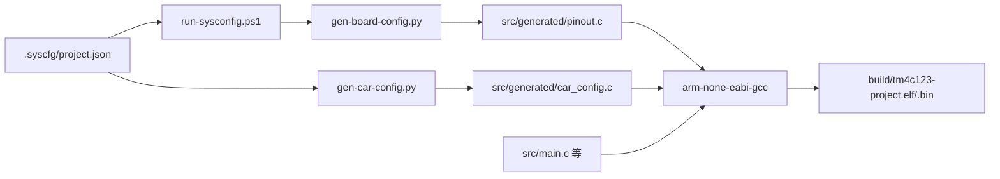

# TM4C123 四轴小车 — 项目概览（对话必读）

> 本文档供开发者与 AI 助手快速了解项目全貌。Cursor 中已通过 `.cursor/rules/project-context.mdc` 在每次对话自动注入精简版。

---

## 1. 项目定位

| 项 | 说明 |
|----|------|
| 芯片 | TM4C123GH6PM，ARM Cortex-M4F，80 MHz，256 KB Flash，32 KB SRAM |
| 形态 | FreeRTOS v8.2.3（TivaWare 自带，GCC ARM_CM4F 移植） |
| 应用 | 四轴 MG513 电机智能小车底盘 |
| 参考板 | TI EK-TM4C123GXL LaunchPad |
| 实际硬件 | 自定义 PCB + 多传感器（见下文外设清单） |
| 远程仓库 | https://github.com/indexxue/TM4C123GH6PM |

**控制架构（规划）**：FreeRTOS 多任务 — `control` 任务 50 Hz → 读传感器/蓝牙 → 姿态/速度估计 → PID → 电机 PWM；`heartbeat` 任务负责 LED 心跳。

---

## 2. 仓库目录

```
tm4c123-project/
├── src/
│   ├── main.c                 # 应用入口
│   ├── startup_tm4c123gh6pm.c # 向量表与启动
│   ├── syscalls.c             # /newlib 系统调用桩
│   ├── systick.c              # SysTick 延时
│   └── generated/             # ⚠ 构建生成，勿编辑、勿提交
│       ├── pinout.c/h         # GPIO 引脚初始化
│       └── car_config.c/h     # 外设 Init（Motor/Encoder/UART/...）
├── include/
│   ├── gpio.h                 # LaunchPad LED/SW 便捷宏
│   ├── systick.h
│   └── tm4c123gh6pm.h
├── .syscfg/
│   ├── project.json           # ⭐ 板级配置单一数据源
│   └── tm4c123gh6pm.syscfg    # SysConfig 图形配置
├── scripts/
│   ├── build.ps1              # 主编译入口
│   ├── run-sysconfig.ps1      # SysConfig CLI 或 Python 回退
│   ├── gen-board-config.py    # JSON → pinout.c/h
│   ├── gen-car-config.py      # JSON → car_config.c/h
│   ├── install-toolchain.ps1  # 自动安装 arm-none-eabi-gcc
│   └── flash-uniflash.ps1     # UniFlash 烧录
├── ld/tm4c123gh6pm.ld         # 链接脚本
├── docs/                      # 设计文档
├── build.cmd                  # build.ps1 包装（绕过执行策略）
├── Makefile                   # 备用 make 构建（与 ps1 略有差异）
└── README.md                  # 快速上手
```

### 不纳入版本控制

`build/`、`tools/`、`downloads/`、`src/generated/`

---

## 3. 构建与烧录

### 前提

- Windows + PowerShell
- [TivaWare C Series 2.2.0.295](https://www.ti.com/tool/SW-TM4C) 安装于 `D:\Ti\TivaWare_C_Series-2.2.0.295`
- （可选）SysConfig CLI：`D:\Ti\sysconfig_1.27.1\sysconfig_cli.bat`
- （可选）UniFlash 用于烧录

### 命令

```powershell
# 编译（工具链首次自动下载）
.\build.cmd
# 等价于
.\scripts\build.ps1

# 烧录
.\scripts\flash-uniflash.ps1 -Image build\tm4c123-project.bin
```

### 构建流水线



### 输出产物

| 文件 | 用途 |
|------|------|
| `build/tm4c123-project.elf` | 调试（GDB / OpenOCD） |
| `build/tm4c123-project.bin` | 烧录 |
| `build/tm4c123-project.map` | 链接映射 |

---

## 4. 配置体系

### 原则

1. **引脚与外设参数** → 改 `.syscfg/project.json`（或 `.syscfg/tm4c123gh6pm.syscfg`）
2. **重新编译** → 自动生成 `src/generated/*`
3. **应用逻辑** → 写 `src/main.c` 及后续新增的 `src/` 模块
4. **禁止**在应用代码中硬编码引脚号

### project.json 结构

| 段 | 内容 |
|----|------|
| `gpio[]` | 每引脚的 port/pin/label/direction/pull |
| `pwm[]` | 4 路电机 PWM：timer、channel、pin、frequency |
| `encoder[]` | 编码器捕获：WTimer3~5 |
| `uart[]` | 蓝牙 UART0 |
| `uart_debug[]` | 调试 UART7（仅 TX） |
| `i2c[]` | IMU + OLED 共用 I2C0 |
| `ssi[]` | 磁力计 SSI1 |
| `adc[]` | 电池电压 ADC0 |
| `dma[]` | ADC 与 UART0 RX 的 uDMA 通道 |

### main.c 初始化顺序

```c
Clock_Init();       // 16 MHz 晶振 → PLL → 80 MHz
PinoutSet();        // 生成：GPIO 方向/上下拉
LED_Init();         // LaunchPad PF1~3
Motor_Init();       // 生成：Timer PWM
Encoder_Init();     // 生成：Timer Capture
UART_Init();        // 生成：蓝牙
I2C_Init();         // 生成：IMU/OLED
SSI_Init();         // 生成：磁力计
UART_Debug_Init();  // 生成：调试串口
DMA_Init();         // 生成：uDMA
ADC_Init();         // 生成：电池 ADC
```

---

## 5. 硬件与外设分配

### 电机与驱动

- 4 × MG513 减速电机 + 2 × TB6612FNG（每片驱动 2 电机）
- PWM：Timer0A/B（M1/M2 @ PB6/PB7）、Timer2A/B（M3/M4 @ PB0/PB1），10 kHz
- 方向：8 路 GPIO（每电机 IN1/IN2）

### 传感器与通信

| 模块 | 型号/类型 | 接口 |
|------|-----------|------|
| 蓝牙 | HC-05 等 | UART0 PA0/PA1 |
| IMU | MPU6050 | I2C0 PB2/PB3 |
| OLED | SSD1306 | I2C0 共用 |
| 磁力计 | — | SSI1 PF0~PF3 |
| 循迹 | TCRT5000 ×6 | GPIO |
| 超声波 | HC-SR04 | PE4 Trig / PE5 Echo |
| 电池检测 | 分压 → ADC | PE0 AIN0 |
| 蜂鸣器 | — | PE3 |
| RGB | WS2812 | PF4 |

### 已知冲突与注意

- **PC0/PC1**：M4 编码器 + SWD（调试时需注意）
- **PF0~PF3**：SSI1 磁力计，与 LaunchPad SW2/LED 部分重叠
- **PF4**：当前分配给 WS2812，LaunchPad 上原为 SW1

完整引脚表：[gpio-allocation.md](gpio-allocation.md)

---

## 6. 代码风格与协作

- C11，`-Wall -Wextra -Wpedantic`
- 外设操作统一用 TivaWare DriverLib
- LaunchPad 板载资源用 `include/gpio.h` 宏
- 提交前 `.\scripts\build.ps1` 编译通过
- 提交信息：简短中文或英文，说明「做了什么 / 为什么」

---

## 7. 当前进度与待办

### 已完成

- [x] 工程脚手架（构建、烧录、工具链自安装）
- [x] SysConfig + JSON 驱动的引脚/外设代码生成
- [x] GPIO / PWM / 编码器 / UART / I2C / SSI / ADC / DMA 初始化框架
- [x] 主循环骨架（50 Hz，`SysCtlDelay`）
- [x] 设计文档（引脚、外设、选型）

### 待实现（main.c TODO）

- [ ] 蓝牙指令解析与遥控
- [ ] IMU 姿态解算
- [ ] 编码器速度计算
- [ ] PID 控制器（4 电机）
- [ ] 循迹 / 超声波避障逻辑
- [ ] OLED 显示

---

## 8. 延伸阅读

| 文档 | 何时查阅 |
|------|----------|
| [gpio-allocation.md](gpio-allocation.md) | 查具体引脚、改接线 |
| [resource-allocation-pro.md](resource-allocation-pro.md) | 定时器/DMA/中断优先级规划 |
| [car-chassis-reference.md](car-chassis-reference.md) | TivaWare API 用法示例 |
| [chip-selection.md](chip-selection.md) | 为何选 TM4C123 |
| [peripheral-selection.md](peripheral-selection.md) | 外设模块采购与接线 |
| [resource-allocation.md](resource-allocation.md) | 基础版资源分配 |
| [README.md](../README.md) | 克隆、编译、推送 |

---

## 9. 本地路径速查

| 资源 | 默认路径 |
|------|----------|
| 工程根目录 | `D:\Ti\tm4c123-project` |
| TivaWare | `D:\Ti\TivaWare_C_Series-2.2.0.295` |
| SysConfig CLI | `D:\Ti\sysconfig_1.27.1\sysconfig_cli.bat` |
| ARM GCC（自动安装） | `tools/bin/arm-none-eabi-gcc.exe` |
