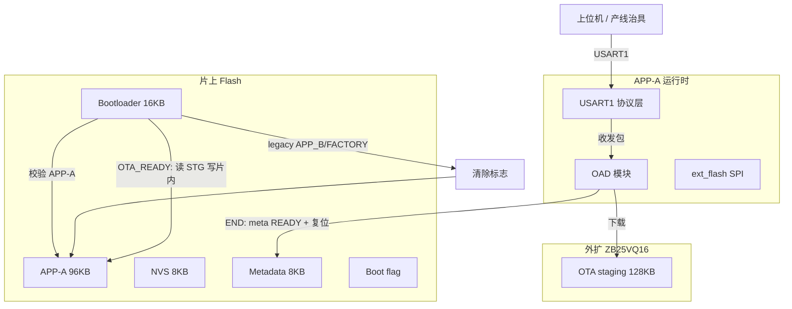
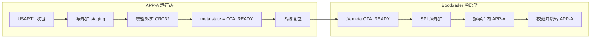
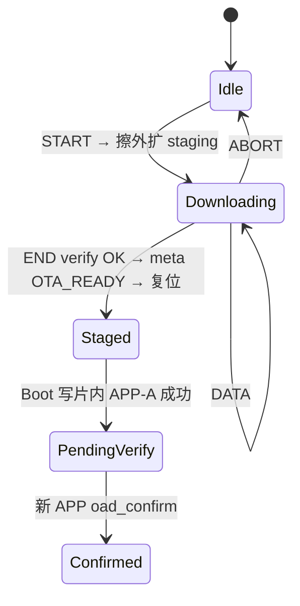

# STM32G431 Bootloader 与 OTA 开发计划

**依据文档**：[`STM32G431_ota_technical_spec.md`](STM32G431_ota_technical_spec.md)（**OTA 全流程规范**）、[`STM32G431_flash_partition.md`](STM32G431_flash_partition.md)、[`STM32G431_ota_uart_protocol.md`](STM32G431_ota_uart_protocol.md)  
**权威头文件**：[`Common/Inc/flash_partition.h`](../Common/Inc/flash_partition.h)、[`Common/Inc/boot_slot.h`](../Common/Inc/boot_slot.h)、[`Common/Inc/ota_meta.h`](../Common/Inc/ota_meta.h)  
**芯片约束**：128KB 片上 Flash、2KB 页、G4 **64 位双字**编程（8 字节对齐）  
**外扩**：ZB25VQ16（2MB，SPI2）— OTA **暂存**目标  
**OTA 传输**：**USART1**（PB6 TX / PB7 RX）— 协议层收发包，下载至外扩 NOR  
**编写日期**：2026-05-27；**分区 v2**：2026-05-28；**传输 v2.1**：2026-05-28  
**进度更新**：2026-05-28 — **v2.7：N3/N4/N5 后续验证**（30s DATA 空闲超时、回归脚本、产线 SOP）；T4/T7 脚本通过；T3b/T5/T6 见 SOP 手动项  

---

## 1. 目标与范围

### 1.1 业务目标（更新后）

| 能力 | 说明 |
|------|------|
| **安全启动** | Boot（16KB）校验 **片内 APP-A（96KB）** 后跳转；`VTOR = 0x08004000` |
| **OTA 升级** | USART1 下载至 **外扩 staging** → APP 校验 CRC → **复位** → **Bootloader** 写 **片内 APP-A** → 跳转新 APP |
| **参数持久化** | NVS（`0x0801C000`，8KB）与代码分离；换槽/升级默认 **不擦** NVS |
| **厂测** | 片内无独立厂测槽；**优先**在 **APP-A** 下用 `serial_cmd` / `ftmenter` 等产测命令；独立 `Factory/` Target 为 **遗留**，链接 `0x08010000` 会与 96KB APP-A **重叠**，须迁址或停用 |

### 1.2 不在首期范围（可二期）

- 非对称加密验签（可先 CRC32 + 可选 MAC）
- 无线 OTA 协议栈（BLE/Wi-Fi 等；首期仅 **USART1 有线**）
- ~~APP 在运行态直接写片内 APP-A~~（**不可行**，见 §5.1；已改为 **Bootloader 从外扩写片内**）
- 片内 A/B 乒乓（**已取消**）

### 1.3 当前情况（截至 2026-05-28，v2.6）

#### 已验证（全链路 OTA）

| 项 | 结果 |
|----|------|
| USART1 START / 全 DATA | **通过**（`tools/ota_uart/ota_uart_host.py`，CHUNK=256） |
| END 外扩 CRC 校验 + ACK | **通过**（`oad_finish_verify`） |
| END 后复位 | **通过**（`oad_finish_activate` → `NVIC_SystemReset`） |
| Boot 片内 **APP-A 擦除** | **通过**（`boot_ram_erase_app`，`.RamFunc`） |
| Boot 片内 **APP-A 编程** | **通过**（外扩 staging → `boot_ram_program`） |
| 新固件启动 | **通过**（Boot 校验后跳转 APP-A；`oad_confirm_running_image`） |
| **T3 整包 OTA** | **通过**（须 **Boot+App** 同发；ACK 后约 30–90 s 完成片内烧录并复位） |

#### 历史问题（已解决，勿回退）

| 现象 | 原因 | 现状 |
|------|------|------|
| ACK 后 **死机、无 USB** | APP 内擦写正在运行的 APP-A 区域 | 已改为 Boot 写片内；**禁止**在 END 路径调用 `oad_flash_program_app_a()` |
| 仅烧 APP、未更新 Boot | 旧 Boot 不处理 `OTA_STATE_READY` | 量产须 **Boot+App** 配对发布 |

#### 当前代码策略（v2.6）

| 角色 | 行为 |
|------|------|
| **APP**（`oad_finish_activate`） | 外扩 CRC 已由 `oad_finish_verify` 校验 → 写 `meta.state = OTA_STATE_READY` → **复位**（**不在 APP 内写片内**） |
| **Bootloader**（`boot_ota_apply_from_staging`） | 上电若 `meta.state == OTA_STATE_READY` → SPI 读外扩 → **擦除并编程 APP-A**（Boot 区执行，`.RamFunc` 擦写）→ `meta=PENDING_VERIFY` → 校验并跳转 APP-A |

#### 仓库模块状态

| 模块 | 状态 |
|------|------|
| `OAD/ota_proto`、`ota_uart`、`oad.c` | **已验证**：下载、外扩 staging、meta+复位 |
| `OAD/oad_flash.c` | **保留参考**；**不再**在 END 路径调用 |
| `Bootloader/boot_ota.c` | **已验证**：外扩 → 片内 APP-A 擦写 |
| `Bootloader` Keil 工程 | **可编译**；Code≈**6.4KB**（RO≈0.5KB），**≤ 16KB** |
| `tools/ota_uart/ota_uart_host.py` | 产线整包升级可用 |

#### 量产发布注意

1. OTA 产线包须含 **Bootloader + APP** 配对版本（含 `boot_ota.c`）。  
2. 救砖（曾跑 APP 内烧片内旧固件）：`.\scripts\flash.cmd -Image boot` 再 `-Image app`。  
3. 回归：`python tools/ota_uart/ota_regression.py COMx`（T4/ABORT/超时）；手动 T3b/T5/T6 见 [`STM32G431_ota_production_sop.md`](STM32G431_ota_production_sop.md)。

---

## 2. 分区策略 v2（片内 + 外扩）

### 2.1 片内（128KB）

```
0x08000000  Bootloader     16 KB
0x08004000  APP-A          96 KB   ← 唯一应用槽（运行 + 升级目标）
0x0801C000  NVS             8 KB
0x0801E000  Metadata        8 KB   （含 OTA 状态；Boot flag @ 0x0801FFFC）
```

### 2.2 外扩 ZB25VQ16（OTA 暂存，规划）

```
0x00100000  OTA staging    128 KB   （单包 ≤ 96 KB，见 FLASH_PART_OTA_IMAGE_MAX）
0x00040000  自检区         sector 64（ext_flash_self_test，勿与 OTA 重叠）
```

### 2.3 与旧「片内 APP-B」方案差异

| 项目 | 旧计划（v1） | 当前（v2） |
|------|-------------|------------|
| 升级包存放 | 片内 `0x08010000` 48KB | **外扩 NOR** |
| 升级后运行槽 | APP-A 或 APP-B 切换 | **始终 APP-A** |
| Boot 跳转 | A / B / Factory | **仅 APP-A** |
| `boot_slot_request_app_b()` | 下次启动 B | 写标志 **无效于跳转**（遗留兼容） |

---

## 3. 总体架构



**通道分工**（与 [`STM32G431_usb_console_plan.md`](STM32G431_usb_console_plan.md) 一致）：

| 通道 | 用途 | 协议形态 |
|------|------|----------|
| **USB CDC** | 日志、`serial_cmd` 产测 | 文本行 `cmd:val\r\n` |
| **USART1** | **OTA 专用** | 二进制帧（见 [`STM32G431_ota_uart_protocol.md`](STM32G431_ota_uart_protocol.md)） |
| USART2/3 | 保留 Cube 初始化；业务默认不参与 OTA | — |

---

## 4. Metadata 区（`0x0801E000`，8KB）

结构见 [`Common/Inc/ota_meta.h`](../Common/Inc/ota_meta.h)，首期前 256 字节：

| 偏移 | 字段 | 说明 |
|------|------|------|
| 0x00 | `magic` | `0x4F544131`（"OTA1"） |
| 0x04 | `struct_version` | 当前 `1` |
| 0x08 | `image_slot` | `NONE` / `APP_A` / `APP_B`（**APP_B 语义改为外扩暂存完成**，非片内槽） |
| 0x0C | `state` | `OTA_IDLE` … `OTA_ROLLBACK` |
| 0x10 | `image_size` | 字节数 |
| 0x14 | `image_crc32` | 整包 CRC32 |
| 0x18 | `version[16]` | 版本串 |
| 0x28 | `boot_attempts` | 启动失败计数（回滚用） |

**Boot flag**（`0x0801FFFC`）：轻量「下次启动意图」；v2 下 Boot **实际只进 APP-A**，`APP_B`/`FACTORY` 仅触发清标志。

---

## 5. Bootloader

### 5.1 为何必须由 Bootloader 写片内 APP-A

STM32G431 128KB 片内 Flash 为 **单 Bank**（`0x08000000`～`0x0801FFFF`），Boot（16KB）与 APP-A（96KB）同属一片：

| 尝试 | 结果 |
|------|------|
| APP 在 `0x08004000` 运行，END 后 **擦除/编程 APP-A 区域** | 当前执行的代码也在该片内 → 擦除后 **取指失败 / HardFault** → 表现为 **死机** |
| 仅把擦写函数放 `.RamFunc` | 仍会从 Flash 返回主流程、中断仍可能从 Flash 取指；**不能**可靠替代「离开 APP 区域再编程」 |
| **Boot 在 `0x08000000` 运行**，编程 **`0x08004000` 起** 的 APP 区 | Boot 自身代码不在被擦除范围内；擦写例程在 **SRAM（`.RamFunc`）** 执行 → **可行** |

因此 **OTA 闭环**定义为：



**实现文件**：

| 文件 | 说明 |
|------|------|
| [`Bootloader/Src/boot_main.c`](../Bootloader/Src/boot_main.c) | 上电检查 `OTA_STATE_READY`，调用 `boot_ota_apply_from_staging()` |
| [`Bootloader/Src/boot_ota.c`](../Bootloader/Src/boot_ota.c) | SPI2 初始化、`zb25vq16` 读 staging、片内擦写（`boot_ram_erase_app` / `boot_ram_program`） |
| [`OAD/Src/oad.c`](../OAD/Src/oad.c) | `oad_finish_activate()`：仅写 meta + 复位，**不**写片内 |

**`ota_meta.state` 在 OTA 中的含义（激活相关）**：

| 状态 | 设置者 | 含义 |
|------|--------|------|
| `OTA_DOWNLOADING` | APP `oad_start` | 正在 USART1 下载 |
| `OTA_READY` | APP `oad_finish_activate` | 外扩包完整且 CRC 正确，**待 Boot 写片内** |
| `OTA_PENDING_VERIFY` | Boot 烧录成功 | 新 APP-A 已写入，待首次运行确认 |
| `OTA_CONFIRMED` | APP `oad_confirm_running_image` | 新镜像运行正常 |

**注意**：§1.2 早期写法「Boot 不做外扩拷贝」已废止；**首期即由 Boot 从外扩激活**，APP 不做片内编程。

### 5.2 常规启动（无 OTA 待激活）

`boot_main_run()` 在 OTA 分支之后：

1. 读 flag；若为 `APP_B` / `FACTORY` → 擦标志页。  
2. `image_validate(APP_A)` → `image_jump(0x08004000)`。  
3. 校验失败 → 死循环（产线需 ST-Link 烧录）。

交付：`Bootloader/MDK-ARM/Bootloader.uvprojx`，`LR_IROM1 0x08000000 0x4000`，**≤ 16KB**。已链接 `boot_ota.c`、`zb25vq16.c`、`hal_spi`/`hal_dma`；**2026-05-28 编链**：Code≈6356 B + RO≈504 B，余量充足。

---

## 6. OAD（应用侧 OTA）— USART1 协议 + 外扩暂存

### 6.0 传输层：USART1

| 项 | 规划 |
|----|------|
| 外设 | `USART1`，`huart1`（`Core/Src/usart.c`） |
| 引脚 | **PB6** = TX，**PB7** = RX（AF7） |
| 波特率 | **115200** 8N1（`board_config.h` → `COMMON_OTA_UART_BAUD`；`usart.c` / `ota_uart_init` 已统一） |
| 驱动形态 | **已实现**：单字节 `HAL_UART_Receive_IT` + 1KB RX 环；TX `HAL_UART_Transmit` 阻塞。**未做** DMA+IDLE（二期可优化） |
| 与 USB 关系 | `log` / `serial_cmd` **不占用** USART1；避免 OTA 大包与调试口争用 |
| 模块划分 | `OAD/Src/ota_uart.c`（收发、组帧、超时）→ `oad.c`（状态机、写外扩、激活片内） |

**实现要点**：

1. `ota_uart_init()` 在 `app_init` 中于 `ext_flash` 就绪后调用。  
2. FreeRTOS 任务或 `defaultTask` 内轮询 `ota_uart_poll()`，解析完整帧后调用 `oad_*`。  
3. 升级进行中可 `serial_cmd` 返回 `busy`（可选），防止误触产测命令干扰 SPI NOR。

### 6.1 目标流程（v2）



**步骤（实现清单）**：

| 步骤 | 执行位置 | 当前 |
|------|----------|------|
| `oad_start()` | APP | **完成**：擦外扩 staging；`meta=DOWNLOADING` |
| `oad_write()` | APP | **完成**：`ext_flash_staging_write` |
| `oad_finish_verify()` | APP | **完成**：外扩 CRC32；END 立即 ACK |
| `oad_finish_activate()` | APP | **完成**：`meta=OTA_READY`；**不复位前不写片内**；`NVIC_SystemReset` |
| `boot_ota_apply_from_staging()` | **Bootloader** | **已验证**：外扩 CRC + 片内 APP-A 擦除/编程 + 跳转 |
| `oad_confirm_running_image()` | 新 APP 首次启动 | **完成** |

正式 OTA 路径：**仅 USART1**；USB `ota` 已改为提示，见 §6.2。

### 6.2 USART1 协议层（专文）

帧格式、CMD、CRC、会话时序、**字节级示例**、Python 上位机参考及固件 **P0–P4 构建计划** 见专文：

**[`STM32G431_ota_uart_protocol.md`](STM32G431_ota_uart_protocol.md)**

摘要：

- SOF `55 AA` + CMD + SEQ + LEN + PAYLOAD + **CRC-16/MODBUS**（覆盖 CMD…PAYLOAD）。  
- 命令：START / DATA / END / ABORT；应答 ACK / NACK。  
- DATA 顺序写外扩 staging；END 校验后 ACK；**复位后由 Bootloader 写片内 APP-A**。  

**与旧 `serial_cmd ota` 对照**（废弃，不写入产线 SOP）：`ota start`→START、`ota data`→DATA、`ota end`→END、`ota abort`→ABORT。

**上位机**：[`tools/ota_uart/ota_uart_host.py`](../tools/ota_uart/ota_uart_host.py)（支持 `.hex`/`.bin`，默认 `MDK-ARM/STM32G431CBT6/STM32G431CBT6.hex`）与专文 §7 一致。

### 6.3 与 NVS

- OTA **不擦** NVS；换分区或 key 布局变更时应用内 migration 或 `nvs_factory_reset()`。

---

## 7. Factory 厂测

| 项目 | 说明 |
|------|------|
| 链接 | `Factory/` @ **`0x08004000`，96KB**（与 APP-A 同槽） |
| 烧录 | `.\scripts\flash.cmd -Image factory`（HEX 范围校验与 `app` 相同） |
| 互斥 | 烧 Factory 覆盖量产固件；产测后须再烧 `flash.cmd -Image app` |
| 标志 | 无需 `BOOT_SLOT_FLAG_FACTORY`；Boot 固定校验并跳转 APP-A 槽 |

---

## 8. 镜像校验

`image_validate()`（`Common/Src/image_validate.c`）用于 Boot 与 OAD：

| 检查项 | 条件 |
|--------|------|
| 栈指针 | 位于 SRAM |
| Reset_Handler | Thumb，落在 **APP-A** 范围 |
| 可选 CRC | 与 `ota_meta.image_crc32` 一致 |
| 镜像大小 | ≤ **96 KB** |

---

## 9. 分阶段实施计划（更新）

### 已完成

- [x] 分区 v2：`flash_partition.h`、APP-A 96KB scatter  
- [x] 最小 Boot：仅 APP-A + 遗留标志清理  
- [x] `ota_meta`、`boot_slot`、`flash_hal`  
- [x] 外扩 SPI 驱动与上电 R/W 自检  
- [x] **N0 / 协议 P0–P2**：`ota_proto`、`ota_uart`、`ota_dispatch` → `oad_*`（见 [协议专文 §8.3](STM32G431_ota_uart_protocol.md#83-分阶段实施)）  
- [x] `ext_flash_partition.h`（地址常量）  
- [x] `board_config.h`：`COMMON_OTA_UART_BAUD`；USART1 **115200**  
- [x] `app_init` / `defaultTask` 集成 `ota_uart_init` / `ota_uart_poll`  
- [x] Keil OAD 组：`oad.c`、`ota_proto.c`、`ota_uart.c`  
- [x] **N5（部分）**：USB `ota` 改为 `use_usart1` 提示  
- [x] **N4（部分）**：`tools/ota_uart/ota_uart_host.py` 产线验证 START/DATA  
- [x] **N1**：`ext_flash_staging_*` @ `0x00100000` + `oad_write`  
- [x] **N2**：外扩 CRC + **Boot 写片内 APP-A**（擦除/编程）+ 跳转新 APP；**T3 通过**  
- [x] Boot 工程：`boot_ota.c`、`HAL_DMA`/`cbb/zb25vq16` 包含路径；编链 ≤16KB  

### 进行中 / 待完成

| # | 任务 | 状态 | 验收 |
|---|------|------|------|
| N3 | 掉电/ABORT/超时、meta 与 Boot 安全 | **完成**（掉电抽测可选） | ABORT、上电清 DOWNLOADING、30s 超时；`ota_regression.py` 板端通过 |
| N4 | 产线 SOP + 回归矩阵 | **完成** | SOP + 回归脚本板端通过 |
| N5 | 文档/SOP 仅 USART1 | **完成** | SOP、README、协议专文已同步 |

### 回归验证（2026-05-28）

| 用例 | 方式 | 结果 |
|------|------|------|
| T4 CRC 错 | `ota_regression.py COMx` | **通过**（板端验证） |
| T4 offset 错 | `ota_regression.py` | **通过** |
| ABORT 后重 START | `ota_regression.py` | **通过** |
| 30s 无 DATA 超时 | `ota_regression.py` + 含超时 APP | **通过** |
| T7 `app-b` 拒绝 | `ota_regression.py`（含 `--offline`） | **通过** |
| T3b / T5 / T6 | SOP §4.2 手动 | **待产线抽测** |

### 二期（详见专文）

完整范围、WBS、测试与验收见 **[`STM32G431_ota_phase2_plan.md`](STM32G431_ota_phase2_plan.md)**（外扩 backup、写后 CRC、`boot_attempts` 回滚、Boot 恢复模式等）。

**首期 OTA 闭环**：**已完成**（2026-05-28）。

---

## 10. 测试矩阵（v2）

| 用例 | 步骤 | 期望 |
|------|------|------|
| T1 冷启动 | Boot + APP-A | 正常进入应用 |
| T2 外扩自检 | 上电 `extFlashTask` / `flash test` | JEDEC + R/W OK |
| T3 OTA 成功 | USART1 下载 → END ACK → 复位 → Boot 擦/写片内 APP-A → 新 APP 运行 | **通过**（Boot+App 配对；旧版 APP 内烧片内会导致死机） |
| T4 OTA CRC 错 | END 前 CRC 不符或 DATA 越界 | **通过**（`ota_regression.py`：NACK CRC/PARAM，不复位） |
| T3b 通道隔离 | OTA 进行中 USB 发 `sn` | **手动**（SOP §4.2；USART1 非 DMA） |
| T5 遗留 APP_B 标志 | 写 `0xAAAAAAAA` 复位 | **手动**（SOP §4.2；Boot 清标志进 APP-A） |
| T6 NVS 保留 | OTA 前后读 SN | **手动**（SOP §4.2） |
| T7 片内 APP-B / 错址烧录 | `flash -Image app-b` | **通过**（`Assert-HexImageRange` 拒绝） |

---

## 11. 风险与对策

| 风险 | 对策 |
|------|------|
| 仍按旧文档烧 Factory @ B | 更新 README / 产线 SOP；`flash.ps1` 拒绝 `app-b` |
| OTA 与 `ext_flash_self_test` 区重叠 | staging 用 `0x00100000`；自检固定 sector 64 |
| 产线未用配对 Boot+App | OTA 闭环已通；SOP 须写明 **USART1** 治具口与 **Boot+App 版本绑定** |
| USART1 与调试口复用 | 硬件上 USART1 专接治具；勿与 USB 转串口混线 |
| 9600 过慢 | 已改 115200（§6.0） |
| DATA 单帧 >512B payload | 主机 `CHUNK≤508`；设备对超长 LEN 回 NACK |
| USB 口误作 OTA | 治具必须接 **USART1 PB6/PB7**；USB 仅日志/`serial_cmd` |
| APP-A > 96KB | 链接失败；须裁剪或再调分区 |
| 换分区后 NVS 异常 | `nvs_factory_reset()` |
| **APP 内擦写 APP-A** | **禁止**；END 仅 `OTA_READY`+复位；片内由 Boot 完成（§5.1） |
| OTA 后死机、无 USB | 多为旧固件在 APP 内烧片内；**ST-Link 救砖** + 烧新版 Boot+App |
| Boot 未更新 | 仅有 `OTA_READY` meta，Boot 不会写片内；**必须烧录含 `boot_ota.c` 的 Boot** |
| Boot 体积超 16KB | 编译后检查 map；必要时裁剪 HAL 或优化 `boot_ota.c` |

---

## 12. 须同步修改的文件清单

1. [`Common/Inc/flash_partition.h`](../Common/Inc/flash_partition.h)  
2. [`Common/Inc/board_config.h`](../Common/Inc/board_config.h) — `COMMON_OTA_UART` → `huart1`、波特率宏  
3. ~~`Common/Inc/ext_flash_partition.h`~~ — **已建**  
4. ~~`OAD/Inc/ota_proto.h`、`OAD/Src/ota_uart.c`~~ — **已建**（中断 RX，非 DMA）  
5. [`OAD/Src/oad.c`](../OAD/Src/oad.c) — APP 下载 + meta；**片内编程在 Boot**  
5b. [`Bootloader/Src/boot_ota.c`](../Bootloader/Src/boot_ota.c) — **Boot OTA 激活**  
6. `Core/Src/usart.c` — 115200 **已改**；`stm32g4xx_it.c` USART1 IRQ 已有；**DMA+IDLE 可选**  
7. `MDK-ARM/STM32G431CBT6.sct`、Boot scatter  
8. [`doc/STM32G431_flash_partition.md`](STM32G431_flash_partition.md)、[`doc/STM32G431_ota_uart_protocol.md`](STM32G431_ota_uart_protocol.md)、本文档、[`README.md`](../README.md)  
9. `scripts/_flash_common.ps1`（APP-A 范围已更新）  
10. ~~`tools/ota_uart/`~~ — **已有** `ota_uart_host.py`  

---

## 13. 建议的下一步

1. **产线抽测（可选）**：T3b（OTA 中 USB `sn`）、T5（遗留标志）、T6（NVS）、掉电 mid-OTA。  
2. **发版前**：`python tools/ota_uart/ota_regression.py COMx` + 一次整包 `ota_uart_host.py`。  
3. **二期（按需）**：USART1 DMA+IDLE、双缓冲 staging、签名验签。  

---

## 修订记录

| 日期 | 版本 | 说明 |
|------|------|------|
| 2026-05-27 | 1.0 | 初版：片内 APP-A/B 各 48KB |
| 2026-05-27 | 1.1 | Boot / OAD / ota_meta 骨架落地 |
| 2026-05-28 | **2.0** | **96KB APP-A**；取消片内 APP-B；OTA 暂存改外扩 ZB25VQ16；Boot 仅跳 APP-A；OAD 待实现 |
| 2026-05-28 | **2.1** | OTA **传输定为 USART1** 二进制协议层；USB `serial_cmd` 仅产测/日志；补充帧格式与 N0/N5 任务 |
| 2026-05-28 | **2.2** | 协议细节迁至 [`STM32G431_ota_uart_protocol.md`](STM32G431_ota_uart_protocol.md)；本文 §6.2 改为摘要与链接 |
| 2026-05-28 | **2.3** | **进度**：N0/P0–P2 完成；`ota_proto`/`ota_uart`/主机脚本落地；START/DATA 产线验证通过；END 待 N2；§1.3/§6/§9/§13 同步 |
| 2026-05-28 | **2.4** | **N1–N2**：`ext_flash_staging_*`、`oad_flash.c`（RamFunc 烧 APP-A）、`crc32_update`；`oad_finish` 闭环 |
| 2026-05-28 | **2.5** | **片内激活改 Bootloader**（§5.1）；记录 APP 内烧片致死机与救砖；`boot_ota.c`；`oad_finish_activate` 仅 meta+复位 |
| 2026-05-28 | **2.6** | **T3 整包 OTA 通过**；Boot 片内 APP-A 擦除/编程验证；Boot 工程编链；N2 关闭；§1.3/§6/§9/§10/§13 进度同步 |
| 2026-05-28 | **2.7** | N3：30s DATA 空闲超时；`ota_regression.py`；产线 SOP；T4/T7 脚本验证；README/协议 P4 同步 |
