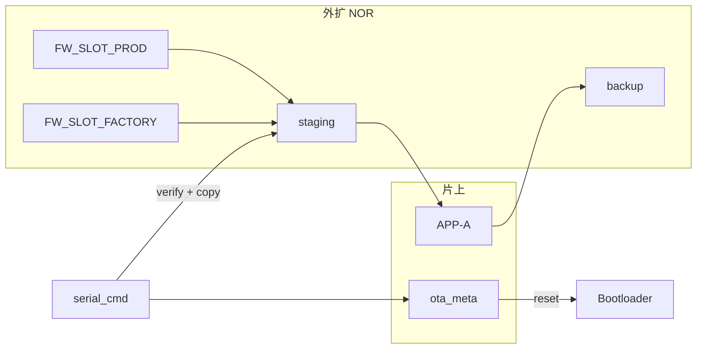

# STM32G431 外扩 Flash 多固件槽与切换实施计划

**文档类型**：开发计划 / 实施参考（**已定稿**）  
**适用产品**：STM32G431CBT6 + ZB25VQ16 外扩 NOR（2MB，SPI2）  
**编写日期**：2026-05-29  
**定稿日期**：2026-05-29（v2.0 专家评审后）  
**文档状态**：✅ **已定稿 — 按本文实施**  
**前置条件**：一期 OTA 闭环已验证；二期 backup/回滚/恢复模式已实现  

**关联文档**：

| 文档 | 用途 |
|------|------|
| [`STM32G431_flash_partition.md`](STM32G431_flash_partition.md) | 片上 + 外扩分区基线 |
| [`STM32G431_ota_technical_spec.md`](STM32G431_ota_technical_spec.md) | OTA 全流程与 `ota_meta` 状态机 |
| [`STM32G431_ota_phase2_plan.md`](STM32G431_ota_phase2_plan.md) | backup / 回滚 / 恢复模式 |
| [`STM32G431_ota_uart_protocol.md`](STM32G431_ota_uart_protocol.md) | USART1 二进制 OTA 帧 |
| [`Factory/README.md`](../Factory/README.md) | 厂测工程与 `ftmexit` |

**权威头文件（当前）**：[`Common/Inc/ext_flash_partition.h`](../Common/Inc/ext_flash_partition.h)、[`Common/Inc/ota_meta.h`](../Common/Inc/ota_meta.h)、[`Common/Inc/flash_partition.h`](../Common/Inc/flash_partition.h)

---

## 0. 专家评审结论（定稿决策）

> 评审视角：资深嵌入式工程师 / 量产可维护性 / 与现有 OTA 二期代码的耦合风险。  
> 初版 v1.0 方向正确；以下 **8 项决策** 作为实施准绳， supersede 初版中未标注的草案描述。

### 0.1 评审摘要

| 维度 | 初版评价 | 定稿调整 |
|------|----------|----------|
| 总体架构（外扩库 + staging 激活） | ✅ 正确，与 Boot 解耦 | **保留** |
| 槽元数据放 NVS | ⚠️ 产线 ST-Link 写外扩后 meta 易失配 | **改**：外扩槽头 **主存储**；NVS 仅可选缓存 |
| `fw write` USB 子协议 | ⚠️ 工作量大、收益低 | **P2 延后**；首期产线用 **脚本 + ST-Link / USART1 扩展** |
| `ftmenter` 放 `oad.c` | ❌ Factory 未链 OAD，无法复用 | **改**：迁至 `fw_slot.c` + `serial_cmd` |
| 仅 CRC 校验 | ⚠️ 不足以防砖 | **增加** `image_validate()` 向量表校验 |
| 三槽 MVP | 可裁剪 | **首期 P0：PROD + FACTORY**；ALT 宏保留、功能 P1 |
| slot→staging→片内 双读 | 已知开销 | **接受**（Boot 不改）；记录为 v3 优化项 |
| `oad_is_busy()` 互斥 | 方向对但不完整 | **扩展** 至全部 `ota_meta` 非 IDLE 态门禁 |

### 0.2 定稿决策表（必须遵守）

| # | 决策 | 理由 |
|---|------|------|
| **D1** | 槽元数据 **主存外扩槽头 512B**（`fw_slot_hdr_t`），镜像从 **+512B** 起 | ST-Link / 脚本一次写入即可自描述；避免 NVS 与镜像不一致 |
| **D2** | **Bootloader 首期零修改**；激活统一 slot → staging → `OTA_READY` → 现有 Boot | 已验证路径风险最低 |
| **D3** | **首期交付**：`fw list` / `fw info` / `fw apply` + `ftmenter`/`ftmexit`；**不含** 设备端 `fw write` | 控制范围；灌槽由产线工具完成 |
| **D4** | 产线灌槽工具 **`tools/fw_slot/fw_slot_program.py`**（HEX → 外扩槽 + 写槽头） | 与 Keil HEX 工作流一致 |
| **D5** | `ftmenter` = `fw apply factory`；**删除** `BOOT_SLOT_FLAG_FACTORY` 写入 | 与 Boot 遗留逻辑一致；标志已无槽位语义 |
| **D6** | `fw_slot_activate()` 前必须 **`fw_slot_verify()` + `image_validate()`** | CRC 正确但向量非法仍会砖 |
| **D7** | USART1 扩展 **`START.flags bit0 = TARGET_SLOT`** 列为 **P1**（`oad.c` 扩展）；不阻塞 P0 | P0 用脚本灌槽即可闭环 |
| **D8** | Factory 链 **`fw_slot.c` + `ext_flash.c`**，**不链** `OAD/`；`ftmenter` 由 `fw_slot` 注册 | 避免 Factory 体积膨胀与符号依赖 |

### 0.3 实施范围（P0 / P1 / P2）

| 优先级 | 内容 | 验收 |
|--------|------|------|
| **P0** | 分区宏、槽头、`fw_slot_verify/copy/activate`、`fw list/info/apply`、`ftmenter`、产线 `fw_slot_program.py` | T20–T24、T28 |
| **P1** | `FW_SLOT_ALT` 启用、同版本跳过激活、USART1 `START.flags` 灌槽、`fw apply` 进度 USB 提示 | T25–T27 |
| **P2** | USB `fw write`、Boot 直读 slot 跳过 staging、镜像签名 | 按需立项 |

**工期（P0）**：约 **2–2.5 周**（单人嵌入式 + 产线脚本联调）。

---

## 1. 背景与目标

### 1.1 业务诉求

在现有 OTA 能力之上，将外扩 NOR 划分为**固件库（多槽）**，支持：

1. **产线预烧**多份固件镜像到外扩（量产版、厂测版；试验版 P1）；
2. **APP-A** 通过 USB `serial_cmd` 选择槽位并激活到片内 APP-A；
3. **Factory 厂测** 同样可 `fw apply` / `ftmenter` 切换固件；
4. 与 **staging / backup / USART1 OTA** 兼容，**不破坏** NVS 与已验证 Boot 路径。

### 1.2 硬约束（不可违背）

| 约束 | 说明 |
|------|------|
| 片内单执行槽 | 128KB 片上 Flash 仅 **APP-A（96KB）** 可运行代码 |
| 外扩不可 XIP | 须 **Boot 拷贝到片内 APP-A** 后跳转 |
| 片内编程仅 Boot | 运行中 APP **禁止**擦写 APP-A；复用 `boot_ota_apply_from_staging()` |
| 镜像上限 | 单镜像 ≤ **96 KB**（`FLASH_PART_OTA_IMAGE_MAX`） |
| 自检区不可占 | sector 64 @ `0x00040000`，`ext_flash_self_test()` 专用 |
| NVS 不存大镜像 | NVS 共 8KB，仅存 key-value；**槽 meta 不得依赖 NVS 为唯一真相源** |

### 1.3 非目标

- 片内 A/B 乒乓、外扩 XIP、无线 OTA、Boot 自升级、ECDSA 验签（P2）。

### 1.4 与现有「厂测切换」的关系

| 机制 | 现状 | 定稿目标 |
|------|------|----------|
| ST-Link 烧 Factory.hex | 覆盖片内 APP-A | **保留**，救砖/首件兜底 |
| `ftmenter` | 写遗留 Factory 标志（Boot 忽略） | **`fw apply factory`**（外扩槽） |
| `ftmexit` | 清 Boot 标志 | **保留**；推荐 **`fw apply prod`** 回量产 |
| USART1 OTA | 下载 staging → 激活 | **保留**；与 `fw apply` 互斥 |

---

## 2. 总体方案

### 2.1 策略：外扩「固件库」+ 复用 OTA 激活链

```
选槽 (fw apply / ftmenter)
  → 校验槽头 + CRC + image_validate
  → 拷贝至 staging（整镜像 image_size 字节）
  → 写 ota_meta (OTA_READY)
  → 复位
  → Boot: boot_ota_apply_from_staging() → 片内 APP-A
  → 新 APP: oad_confirm_running_image() → CONFIRMED
```



**原则**：Boot **不修改**（D2）；逻辑集中在 **`Common/Src/fw_slot.c`**（APP + Factory 共用）。

### 2.2 与 staging / backup / OTA 的协调

| 场景 | staging | backup |
|------|---------|--------|
| USART1 OTA | 主机下载新包 | 二期策略：激活前/确认后维护 |
| `fw apply` | 从 FW Slot 拷贝 | **同上**（Boot 激活前备份片内） |
| 产线灌槽 | **不经过** staging | 不影响 |

**互斥门禁**（`fw_slot_can_activate()`）— 以下任一为真则拒绝并返回 `busy`：

- `oad_is_busy()`（APP-A 且链了 OAD）；
- `ota_meta.state` ∈ `{ DOWNLOADING, APPLYING, READY }`（**注意**：`READY` 表示已有待激活包，须先让 Boot 处理或 ABORT 清 meta）；
- 外扩未就绪（`ext_flash_ensure_ready()` 失败）。

**`fw apply` 前**：若 meta 为 `DOWNLOADING`，调用 `oad_abort()`（APP-A）或清 meta 为 IDLE（Factory）。

---

## 3. 外扩分区规划 v3（定稿）

### 3.1 地址表

| 区域 | 偏移 | 大小 | 宏 | 说明 |
|------|------|------|-----|------|
| 保留低区 | `0x00000000` | 256 KB | `EXT_FLASH_PART_RESERVE_LOW` | 日志/资源/FS |
| 自检 | `0x00040000` | 4 KB | sector 64 | **禁止重叠** |
| 中间保留 | `0x00041000` | ~764 KB | — | 产品数据 |
| OTA staging | `0x00100000` | 128 KB | `EXT_FLASH_PART_OTA_STAGING_*` | **已有** |
| OTA backup | `0x00120000` | 128 KB | `EXT_FLASH_PART_OTA_BACKUP_*` | **已有** |
| **FW PROD** | `0x00140000` | 128 KB | `EXT_FLASH_PART_FW_SLOT_PROD_*` | **P0** |
| **FW FACTORY** | `0x00160000` | 128 KB | `EXT_FLASH_PART_FW_SLOT_FACTORY_*` | **P0** |
| **FW ALT** | `0x00180000` | 128 KB | `EXT_FLASH_PART_FW_SLOT_APP1_*` | **P1**（三期宏名 **APP1**） |
| 保留高区 | `0x001A0000` | 384 KB | `EXT_FLASH_PART_RESERVE_HIGH` | 扩展 |

```
0x00100000  ┌──────────────────┐
            │  staging 128KB   │
0x0011FFFF  ├──────────────────┤
0x00120000  │  backup 128KB    │
0x0013FFFF  ├──────────────────┤
0x00140000  │  FW_SLOT_PROD    │  [512B hdr][镜像 ≤96KB][0xFF…]
0x0015FFFF  ├──────────────────┤
0x00160000  │  FW_SLOT_FACTORY │
0x0017FFFF  ├──────────────────┤
0x00180000  │  FW_SLOT_APP1    │  P1
0x0019FFFF  └──────────────────┘
```

**编译期检查**（写入 `ext_flash_partition.h`）：

```c
/* 槽区不得与 staging/backup/自检重叠；各槽 128KB 对齐 */
_Static_assert(EXT_FLASH_PART_FW_SLOT_PROD_ADDR >= EXT_FLASH_PART_OTA_BACKUP_ADDR + EXT_FLASH_PART_OTA_BACKUP_SIZE, "fw prod overlaps backup");
```

### 3.2 槽位 ID

```c
typedef enum {
    FW_SLOT_ID_PROD    = 0,
    FW_SLOT_ID_FACTORY = 1,
    FW_SLOT_ID_APP1    = 2,   /* P1 启用 */
    FW_SLOT_ID_COUNT
} fw_slot_id_t;
```

### 3.3 槽头格式 `fw_slot_hdr_t`（定稿 — D1）

**位置**：每槽起始 **512 字节**（`FW_SLOT_HEADER_SIZE`）；**镜像 payload** 从 `slot_base + 512` 开始。

| 偏移 | 字段 | 类型 | 说明 |
|------|------|------|------|
| 0x00 | `magic` | u32 | `0x46574844`（**"FWHD"**） |
| 0x04 | `struct_version` | u16 | 当前 **1** |
| 0x06 | `slot_id` | u8 | 与枚举一致（防错槽） |
| 0x07 | `flags` | u8 | bit0: valid；bit1: compressed（保留 0） |
| 0x08 | `image_size` | u32 | payload 字节数，≤ 96KB |
| 0x0C | `image_crc32` | u32 | **仅 payload** CRC32（`crc32.c` 同算法） |
| 0x10 | `version[16]` | char | 与 OTA START 一致，不足补 0 |
| 0x20 | `header_crc32` | u32 | 覆盖 `[0x00, 0x20)` |
| 0x24 | `reserved[476]` | — | 填 `0xFF` |

**校验顺序**：`header_crc32` → `magic/struct_version/slot_id` → payload `image_crc32` → **`image_validate(payload)`**。

**NVS 角色（可选）**：可缓存 `version` 供快速 `fw list`，但 **`fw apply` 只信外扩槽头**；NVS 缓存 miss 时回读外扩。

**产线写入**：`fw_slot_program.py` 解析 HEX/bin，写 payload @ `+512`，自动生成槽头。

---

## 4. 软件架构（定稿）

### 4.1 模块划分

| 模块 | 路径 | APP-A | Factory | 职责 |
|------|------|-------|---------|------|
| 分区 | `Common/Inc/ext_flash_partition.h` | ✓ | ✓ | 地址宏 + static_assert |
| 槽管理 | `Common/Src/fw_slot.c` | ✓ | ✓ | 校验、拷贝、激活、命令注册 |
| 外扩 HAL | `Core/Src/ext_flash.c` | ✓ | ✓ | **新增** `ext_flash_slot_*`（按槽 ID） |
| OTA | `OAD/Src/oad.c` | ✓ | — | 移除 `ftmenter`；保留 OTA 互斥 hook |
| 命令 | `serial_cmd.c` | ✓ | ✓ | 调用 `fw_slot_register_cmds()` |
| Boot | `Bootloader/` | — | — | **不改** |

**不新增** `ext_flash_region_*` 泛化 API（评审意见：YAGNI）。在 `ext_flash.c` 内按 `fw_slot_id_t → base_addr` 映射即可，与 staging/backup 对称。

### 4.2 核心 API（定稿）

```c
typedef struct {
    fw_slot_id_t id;
    bool         valid;
    uint32_t     image_size;
    uint32_t     image_crc32;
    char         version[16];
} fw_slot_info_t;

int  fw_slot_read_hdr(fw_slot_id_t id, fw_slot_hdr_t *hdr);
int  fw_slot_get_info(fw_slot_id_t id, fw_slot_info_t *out);
int  fw_slot_verify(fw_slot_id_t id);           /* hdr + payload crc + image_validate */
bool fw_slot_can_activate(void);                /* meta/oad 互斥 */
int  fw_slot_copy_to_staging(fw_slot_id_t id);
int  fw_slot_activate(fw_slot_id_t id);           /* verify + copy + meta + reset */
void fw_slot_register_serial_cmds(void);          /* fw *, ftmenter, ftmexit 可选 */
```

**错误码**（`fw_slot.h`）：`OK`、`ERR_NO_IMAGE`、`ERR_CRC`、`ERR_IMAGE`、`ERR_BUSY`、`ERR_FLASH`、`ERR_PARAM`。

### 4.3 USB 命令（定稿 — P0）

| 命令 | 语法 | 行为 |
|------|------|------|
| `fw` / `fw list` | — | 各槽 `id,name,valid,version,size` |
| `fw info` | `fw info prod\|factory\|0\|1` | 单槽 hdr CRC、payload CRC |
| `fw apply` | `fw apply prod\|factory\|0\|1` | verify → copy → READY → reset |
| `ftmenter` | — | 等同 `fw apply factory` |
| `ftmexit` | — | **不变**（清遗留标志）；文档建议再 `fw apply prod` |

**回复示例**：

```text
OK fw list prod,1,1.2.3,57872 factory,1,ft-1.0.0,45200
OK fw apply prod,reboot
OK ftmenter,no_image          ← FACTORY 槽无效
NG fw apply busy              ← OTA 进行中
```

**P0 不包含**：`fw write`（设备端接收镜像）→ **P2**。

### 4.4 产线灌槽（定稿 — D4）

**工具**：`tools/fw_slot/fw_slot_program.py`

```powershell
# 写量产槽（生成槽头 + payload，ST-Link 写外扩）
python tools/fw_slot/fw_slot_program.py --slot prod --hex MDK-ARM/STM32G431CBT6/STM32G431CBT6.hex --version 1.2.3
python tools/fw_slot/fw_slot_program.py --slot factory --hex Factory/MDK-ARM/Factory/Factory.hex --version ft-1.0.0
# 输出合并 HEX 或调用 STM32_Programmer_CLI 写 0x08140000（外扩映射地址按工具约定）
```

**P1**：扩展 `ota_uart_host.py --target-slot factory`（USART1 `START.flags` bit0）。

### 4.5 `ftmenter` / Factory 集成（定稿 — D5/D8）

| 步骤 | 行为 |
|------|------|
| 1 | `fw_slot_verify(FW_SLOT_ID_FACTORY)` |
| 2 | 失败 → `OK ftmenter,no_image`（**不复位**） |
| 3 | 成功 → `fw_slot_activate(FACTORY)` → `OK ftmenter,reboot` → reset |
| 4 | **禁止**写 `BOOT_SLOT_FLAG_FACTORY` |

Factory Keil：**添加** `fw_slot.c`、`ext_flash.c`、`crc32.c`、`image_validate.c`；**不添加** `OAD/`。

---

## 5. 激活流程（定稿）

### 5.1 `fw_slot_activate()` 顺序

1. `fw_slot_can_activate()` — 失败返回 `ERR_BUSY`；
2. `ext_flash_ensure_ready()`；
3. `fw_slot_verify(id)` — 槽头 + payload CRC + **`image_validate(slot_payload_addr)`**；
4. **P1 可选**：若 payload CRC == 当前片内镜像 CRC 且 version 相同 → 跳过，返回 `OK,same`；
5. `ext_flash_staging_erase()`；
6. 分块 `ext_flash_slot_read` → `ext_flash_staging_write`（长度 `image_size`）；
7. staging 全包 CRC 与槽头 `image_crc32` 二次比对；
8. `ota_meta_read` → 填 `image_size/crc32/version` → `state=OTA_READY` → `image_slot=APP_A` → `ota_meta_write`；
9. `NVIC_SystemReset()`。

**掉电安全**：步骤 8 **仅在** 步骤 6–7 成功后执行（与 OTA END 路径一致）。

### 5.2 Boot 侧

**无代码变更**。`boot_main_run()` 已有 READY/APPLYING/APPLY_FAILED 处理及 backup 回滚。

### 5.3 时序与耗时

| 阶段 | 耗时 |
|------|------|
| verify + copy 96KB | ~1–3 s |
| Boot 擦写片内 | ~30–90 s |
| **合计** | 与整包 OTA 同级 |

---

## 6. 分阶段实施计划（定稿）

### 6.1 里程碑

| 阶段 | 周期 | 交付 | 验收 |
|------|------|------|------|
| **M1** | 2 天 | 本文档 v2.0、`ext_flash_partition.h` v3、槽头结构 | ✅ 已定稿 |
| **M2** | 4–5 天 | `ext_flash_slot_*`、`fw_slot.c` verify/copy/activate | ✅ 已合入 |
| **M3** | 3–4 天 | `fw list/info/apply`、`ftmenter`；APP-A 集成 | ✅ 板测 T21–T24 |
| **M4** | 2–3 天 | Factory 集成、`fw_slot_program.py`、SOP 一节 | ✅ |
| **M5** | 2 天 | 更新 `flash_partition.md`、Factory README | ✅ 2026-05-29 |

**P0 合计**：约 **2–2.5 周**。

### 6.2 WBS（P0 必做）

| # | 任务 | 文件 | 状态 |
|---|------|------|------|
| 1.1 | FW Slot 分区宏 + assert | `ext_flash_partition.h` | ✅ |
| 1.2 | `ext_flash_slot_read/write/erase/crc32` | `ext_flash.c/h` | ✅ |
| 2.1 | `fw_slot_hdr_t` 读写与 verify | `fw_slot.c/h` | ✅ |
| 2.2 | `fw_slot_copy_to_staging` / `activate` | `fw_slot.c` | ✅ |
| 2.3 | `fw_slot_can_activate` + meta 清理 | `fw_slot.c` | ✅ |
| 3.1 | `fw_slot_register_serial_cmds` | `fw_slot.c` | ✅ |
| 3.2 | APP/Factory init 注册 | `app_init.c`, `factory_init.c` | ✅ |
| 3.3 | 从 `oad.c` **移除** `ftmenter` | `oad.c` | ✅ |
| 4.1 | `fw_slot_program.py` | `tools/fw_slot/` | ✅ |
| 4.2 | 文档同步 | `flash_partition.md`, `Factory/README.md` | ✅ |

### 6.3 配置宏（`board_config.h`）

```c
#define FW_SLOT_ENABLE                    1U   /* 总开关 */
#define FW_SLOT_APP1_ENABLE               0U   /* P1 再开 */
#define FW_SLOT_SKIP_SAME_IMAGE           0U   /* P1：同 CRC 跳过激活 */
#define FW_SLOT_USB_WRITE_ENABLE          0U   /* P2 */
```

---

## 7. 测试矩阵（定稿）

| ID | 用例 | 方法 | 期望 | 优先级 |
|----|------|------|------|--------|
| T20 | 空槽 apply | 未灌槽 `fw apply prod` | `ng` / `no_image`，不复位 | P0 |
| T21 | 产线灌 PROD | `fw_slot_program.py` + ST-Link | `fw list` valid=1 | P0 |
| T22 | apply prod | USB `fw apply prod` | 新版本运行；meta CONFIRMED | P0 |
| T23 | ftmenter | FACTORY 槽有效 | 厂测镜像运行 | P0 |
| T24 | factory ↔ prod | 往返 apply | 版本对；**NVS SN 不变** | P0 |
| T28 | 篡改 payload 1B | apply | 拒绝，不复位 | P0 |
| T25 | OTA 互斥 | DOWNLOADING 时 apply | `busy` | P1 |
| T26 | OTA 后槽完整 | OTA 升级后 `fw list` | 槽镜像未被擦 | P1 |
| T27 | backup 回滚 | 测试 hook 坏镜像 | 二期回滚仍有效 | P1 |
| T29 | 非法向量镜像 | 灌入 CRC 正确但 SP/PC 非法 HEX | verify 失败 | P0 |
| T30 | 槽头 slot_id 与地址不符 | 手工改 hdr | verify 失败 | P1 |

---

## 8. 风险与对策（评审补充）

| 风险 | 严重度 | 对策 |
|------|--------|------|
| ST-Link 只写 payload 不写槽头 | 高 | 产线 **强制** `fw_slot_program.py`；禁止裸写 bin |
| `fw apply` 与 OTA READY 竞态 | 高 | `fw_slot_can_activate()` 拒绝 READY；须复位或 ABORT |
| Factory 链 OAD 导致体积/依赖膨胀 | 中 | D8：仅 `fw_slot` + `ext_flash` |
| 双读 SPI 带宽 / 耗时 | 低 | P0 接受；v3 Boot 直读 slot（P2） |
| ALT 槽误用占 Flash | 低 | `FW_SLOT_ALT_ENABLE=0` 默认关闭 |
| 激活中 USB 断线 | 低 | 拷贝完成前不写 meta；与 OTA 相同 |
| NVS 8KB 被 fw meta 撑满 | 低 | **不把槽头仅存 NVS**（D1） |

---

## 9. 须修改文件清单

| 文件 | 变更 |
|------|------|
| `Common/Inc/ext_flash_partition.h` | FW Slot 宏 + assert |
| `Common/Inc/fw_slot.h` | **新建** |
| `Common/Src/fw_slot.c` | **新建**（含命令注册、ftmenter） |
| `Core/Inc/ext_flash.h` / `Core/Src/ext_flash.c` | `ext_flash_slot_*` |
| `Common/Inc/board_config.h` | `FW_SLOT_*` |
| `OAD/Src/oad.c` | **删除** `cmd_ftmenter` |
| `Core/Src/app_init.c` | `fw_slot_register_serial_cmds()` |
| Factory init + `Factory.uvprojx` | 链 `fw_slot` 相关源文件 |
| `MDK-ARM/STM32G431CBT6.uvprojx` | 链 `fw_slot.c` |
| `tools/fw_slot/fw_slot_program.py` | **新建** |
| `doc/STM32G431_flash_partition.md` | 外扩 v3 |
| `Factory/README.md` | ftmenter 新语义 |
| `Bootloader/` | **不改** |

---

## 10. 产线操作（定稿）

1. **首次量产**：`flash -Image all`（Boot + APP-A）。  
2. **灌槽（推荐）**：  
   `python tools/fw_slot/fw_slot_program.py --slot prod --hex ... --version x.y.z`  
   同法灌 `factory`。  
3. **现场切量产**：USB `fw apply prod`。  
4. **现场切厂测**：USB `ftmenter` 或 `fw apply factory`。  
5. **USART1 升级量产**：仍用 `ota_uart_host.py`（写 staging，**不自动更新 PROD 槽**）。  
6. **OTA 后同步 PROD 槽（可选 SOP）**：产线若要求槽与片内一致，OTA 成功后执行一次灌槽脚本或 P1 USART1 写 slot。

---

## 11. 后续优化（不在 P0）

| 项 | 说明 |
|----|------|
| Boot 直读 slot | meta 增 `source_addr`，省 staging 拷贝 ~1–3 s |
| `ota_uart_host.py --target-slot` | USART1 灌槽，免 ST-Link |
| USB `fw write` | 仅调试 |
| CONFIRMED 后自动刷新 PROD 槽 | 保持外扩与片内一致 |
| 镜像签名 | 安全 P2 |

---

## 12. 修订记录

| 日期 | 版本 | 说明 |
|------|------|------|
| 2026-05-29 | 1.0 | 初版计划 |
| 2026-05-29 | **2.0** | **专家评审定稿**：§0 决策表、槽头主存、P0 范围裁剪、ftmenter 迁移、image_validate、测试/风险/WBS 更新 |

---

**批准状态**：本文档 v2.0 作为 **外扩固件槽功能** 的唯一实施依据；开发按 **P0 → P1 → P2** 顺序推进，P0 未完成前不启动 P2。
