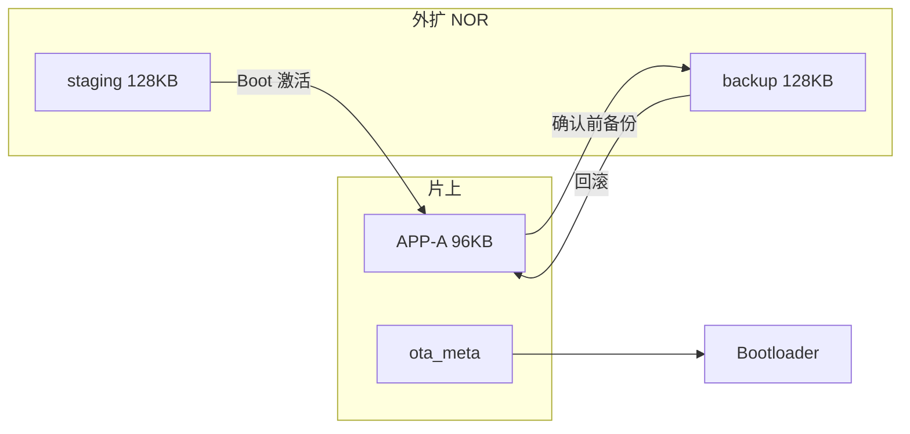
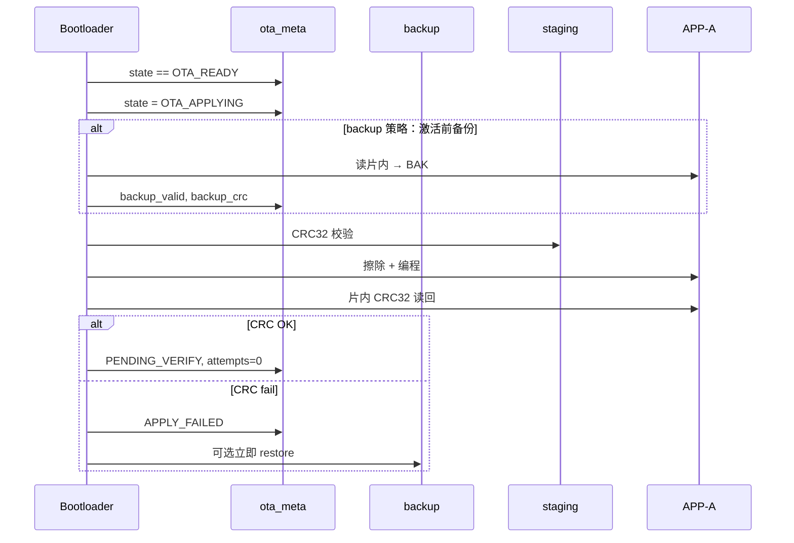

# STM32G431 OTA 二期开发计划

**文档类型**：开发计划 / 实施参考  
**适用产品**：STM32G431CBT6 + ZB25VQ16 外扩 NOR  
**前置条件**：一期 OTA 闭环已验证（USART1 → 外扩 staging → Boot 写片内 APP-A）  
**编写日期**：2026-05-28  
**关联文档**：

| 文档 | 用途 |
|------|------|
| [`STM32G431_ota_technical_spec.md`](STM32G431_ota_technical_spec.md) | 一期全流程规范（基线） |
| [`STM32G431_bootloader_ota_plan.md`](STM32G431_bootloader_ota_plan.md) | 一期 Boot/OAD 计划与进度 |
| [`STM32G431_flash_partition.md`](STM32G431_flash_partition.md) | 片上分区 |
| [`STM32G431_ota_uart_protocol.md`](STM32G431_ota_uart_protocol.md) | USART1 帧协议 |
| [`STM32G431_ota_production_sop.md`](STM32G431_ota_production_sop.md) | 产线 SOP（二期完成后须修订） |

**权威头文件（一期）**：[`Common/Inc/flash_partition.h`](../Common/Inc/flash_partition.h)、[`Common/Inc/ota_meta.h`](../Common/Inc/ota_meta.h)、[`Common/Inc/ext_flash_partition.h`](../Common/Inc/ext_flash_partition.h)

---

## 1. 背景与目标

### 1.1 一期成果（基线）

| 能力 | 状态 |
|------|------|
| USART1 二进制协议下载至外扩 staging | 已验证 |
| APP 外扩 CRC + `OTA_READY` + 复位 | 已验证 |
| Boot 外扩 CRC + 擦写片内 APP-A（`.RamFunc`） | 已验证 |
| `PENDING_VERIFY` → `oad_confirm_running_image` → `CONFIRMED` | 已实现（弱确认） |
| 回归脚本 T4 / ABORT / 30s 超时 | 已验证 |

### 1.2 一期缺口（二期要解决的）

| 缺口 | 风险 |
|------|------|
| 片内仅 **单槽** APP-A，Boot **先整片擦再写** | 擦除后写失败 / 掉电 → 旧固件不可恢复 |
| `boot_attempts`、`OTA_ROLLBACK` **仅预留未实现** | 坏镜像反复启动，无法自动回退 |
| Boot 烧录后 **未对片内做 CRC 读回** | 编程位错可能漏检 |
| 激活失败时 meta 清 `IDLE` 但 APP 已损坏 | 无法自动重试，仅 Boot 死循环 + ST-Link |
| `image_validate` 失败 → `while(1)` | 现场无调试口时等同软砖 |
| 无镜像签名 / 防降级 | 产线误刷、恶意包（CRC 碰撞） |

### 1.3 二期业务目标

| 目标 | 说明 |
|------|------|
| **可恢复升级** | 激活失败或新固件 N 次未确认时，自动恢复**上一已知良好**镜像 |
| **可重试激活** | 掉电 / SPI 瞬时失败时，上电可继续或重试，不误清状态 |
| **写后校验** | Boot 编程后对片内 APP-A 做 CRC/向量复核 |
| **可观测失败** | Boot 失败有 LED/状态字，减少「黑屏」误判 |
| **可选增强** | 签名验签、USART1 DMA、版本防降级（按产品需求裁剪） |

### 1.4 不在二期范围（三期或产品另立项）

- 无线 OTA（BLE/Wi-Fi）协议栈  
- Bootloader 自身 OTA（仍须 ST-Link 更新 Boot）  
- 片内 A/B 双槽（128KB Flash 无空间，除非缩 Boot 或缩 APP）  
- USB CDC 传大包 OTA（维持 USART1 主通道）

---

## 2. 总体方案概览

### 2.1 策略：外扩「上一版备份」+ 启动计数回滚

片内无法双槽时，在 **2MB 外扩 NOR** 增加 **backup 区**，在每次 **成功确认（CONFIRMED）** 或 **首次激活前** 维护一份「上一良好镜像」副本；新包在 staging 校验通过后由 Boot 写入片内，失败则从 backup 恢复。



### 2.2 状态机扩展（`ota_meta.state`）

在一期状态基础上增加/细化：

| 状态 | 值（建议） | 设置者 | 含义 |
|------|------------|--------|------|
| `OTA_IDLE` | 0 | 既有 | 无待处理升级 |
| `OTA_DOWNLOADING` | 1 | 既有 | USART1 下载中 |
| `OTA_READY` | 2 | 既有 | 外扩 staging 就绪，待 Boot 写片内 |
| `OTA_APPLYING` | **7**（新增） | Boot | 正在擦写片内（掉电可识别） |
| `OTA_PENDING_VERIFY` | 3 | 既有 | 片内已写入，待运行确认 |
| `OTA_CONFIRMED` | 4 | 既有 | 新镜像已确认 |
| `OTA_ROLLBACK` | 5 | Boot | 正在或即将从 backup 恢复 |
| `OTA_APPLY_FAILED` | **8**（新增） | Boot | 激活失败，staging 仍有效，可重试 |

**原则**：

- 进入擦除 APP-A **之前** 写 `OTA_APPLYING`。  
- 片内写完后 **CRC 读回通过** 再写 `PENDING_VERIFY`；失败写 `APPLY_FAILED` 且 **保持 staging**，不清 backup。  
- 仅当 `CONFIRMED` 后，用当前片内镜像刷新 backup（或在下一次 `OTA_READY` 激活前备份旧片内）。

### 2.3 `ota_meta` 结构 v2（建议）

| 偏移 | 字段 | 二期变更 |
|------|------|----------|
| 0x04 | `struct_version` | **2**（v1 读者兼容：magic 相同则按 version 分支） |
| 0x28 | `boot_attempts` | Boot/APP 递增；超阈值触发回滚 |
| 0x2C | `backup_valid` | `0` / `OTA_BACKUP_MAGIC` |
| 0x30 | `backup_size` | backup 区镜像字节数 |
| 0x34 | `backup_crc32` | backup 区 CRC32 |
| 0x38 | `confirmed_version[16]` | 上次 CONFIRMED 的版本号（防降级可选） |
| 0x48 | `apply_fail_count` | 连续激活失败次数（可选） |

`reserved[32]` 中拆出上述字段；**须保证** `sizeof(ota_meta_t)` 8 字节对齐且单页可编程。

---

## 3. 外扩分区 v2

### 3.1 地址规划（ZB25VQ16，2MB）

| 区域 | 偏移 | 大小 | 说明 |
|------|------|------|------|
| 自检区 | `0x00040000`（sector 64） | 4 KB 扇区 | **不变**，禁止重叠 |
| OTA staging | `0x00100000` | 128 KB | 新包下载区（一期） |
| OTA backup | **`0x00120000`** | **128 KB** | 上一良好镜像副本 |
| 保留 | `0x00140000` … | — | 产品资源 / 日志等 |

```
0x00100000  ┌──────────────────┐
            │  staging 128KB   │  新包
0x0011FFFF  ├──────────────────┤
0x00120000  │  backup 128KB    │  回滚源
0x0013FFFF  └──────────────────┘
```

### 3.2 头文件变更

扩展 [`Common/Inc/ext_flash_partition.h`](../Common/Inc/ext_flash_partition.h)：

```c
#define EXT_FLASH_PART_OTA_BACKUP_ADDR      0x00120000U
#define EXT_FLASH_PART_OTA_BACKUP_SIZE      (128U * 1024U)
```

新增 API（`Core/Src/ext_flash.c`）：

| API | 职责 |
|-----|------|
| `ext_flash_backup_erase()` | 擦 backup 区 |
| `ext_flash_backup_read/write` | 按 offset 读写 |
| `ext_flash_backup_crc32(len)` | 与 staging 对称 |
| `ext_flash_read_app_a_to_backup(size)` | Boot：从片内读回写入 backup（分块） |

---

## 4. 功能分解与优先级

### 4.1 P0 — 必须（防砖核心）

| ID | 功能 | 说明 |
|----|------|------|
| P0-1 | **片内写后 CRC** | `boot_ota_apply` 完成后 `crc32_compute_flash(APP_A, image_size)` 对比 meta |
| P0-2 | **meta 状态 `APPLYING` / `APPLY_FAILED`** | 掉电与失败可区分；失败保持 `OTA_READY` 或 `APPLY_FAILED` 可重试 |
| P0-3 | **激活前备份片内 → backup** | 仅当 backup 无效或版本变更策略要求时；备份 CRC 写入 meta |
| P0-4 | **`boot_attempts` + 独立看门狗** | `PENDING_VERIFY` 下每次 Boot 入口 `attempts++`；超 `OTA_BOOT_ATTEMPT_MAX`（建议 3）触发回滚 |
| P0-5 | **从 backup 恢复片内** | `boot_ota_restore_from_backup()`，成功后 `PENDING_VERIFY` 或 `CONFIRMED`（恢复旧版） |
| P0-6 | **确认逻辑加强** | 仅在 `app_init` 末尾、关键外设初始化成功后 `oad_confirm_running_image()`；失败路径不确认 |

### 4.2 P1 — 强烈建议（可维护性 / 产线）

| ID | 功能 | 说明 |
|----|------|------|
| P1-1 | **Boot 恢复模式** | `image_validate` 失败且 backup 无效：慢闪 LED + 可选 **仅 USART1 收包**（Mini-OAD，只写 staging，不跳 APP） |
| P1-2 | **激活失败可观测** | `meta` 增加 `last_error` 码；USB 未起时 LED 模式区分 |
| P1-3 | **回归用例 T8–T12** | 见 §9；扩展 `ota_regression.py` |
| P1-4 | **产线 SOP 更新** | 回滚验证步骤、失败码对照表 |
| P1-5 | **CONFIRMED 后刷新 backup** | 异步或下次 OTA 前：将当前片内镜像同步到 backup（耗时 ~数秒，可放 Boot 首次确认后） |

### 4.3 P2 — 可选（安全 / 性能）

| ID | 功能 | 说明 |
|----|------|------|
| P2-1 | **镜像签名** | ECDSA/P256 或 HMAC-SHA256；密钥产线烧录 NVS |
| P2-2 | **版本防降级** | `confirmed_version` 与 START 中 version 比较 |
| P2-3 | **USART1 DMA + IDLE** | 降低 CPU 占用、提高大包吞吐 |
| P2-4 | **波特率协商** | START 扩展字段或专用 CMD（与 v1 主机兼容模式） |

---

## 5. 详细设计

### 5.1 Boot 激活流程（`boot_ota_apply_from_staging` v2）



**实现要点**（[`Bootloader/Src/boot_ota.c`](../Bootloader/Src/boot_ota.c)）：

1. 擦除前 `ota_meta_write(APPLYING)`。  
2. 编程循环不变；结束后调用 `image_validate(slot, size, image_size, image_crc32)` **开启 CRC 参数**。  
3. 失败：**不**在 APP 已损坏时简单 `IDLE`；优先 `boot_ota_restore_from_backup()`，成功则 `PENDING_VERIFY` + 旧 version。  
4. 成功：`PENDING_VERIFY`，`boot_attempts = 0`。

### 5.2 启动确认与回滚（`boot_main.c` v2）

```c
/* 伪代码 — 供实现参考 */
if (meta.state == OTA_PENDING_VERIFY) {
    meta.boot_attempts++;
    ota_meta_write(&meta);
    if (meta.boot_attempts > OTA_BOOT_ATTEMPT_MAX) {
        boot_ota_restore_from_backup(&meta);
        meta.state = OTA_ROLLBACK; /* 或 CONFIRMED 若恢复的是旧版 */
        ota_meta_write(&meta);
    }
}
if (meta.state == OTA_READY || meta.state == OTA_APPLY_FAILED) {
    boot_ota_apply_from_staging(&meta); /* 可重试 */
}
if (image_validate(APP_A) != OK) {
    if (backup_valid) boot_ota_restore_from_backup();
    else boot_recovery_mode(); /* P1: LED + UART staging */
}
image_jump(APP_A);
```

**看门狗**：在 `PENDING_VERIFY` 且 `boot_attempts < MAX` 时，APP 应在早期 `app_init` 前喂狗；Boot 侧 IWDG 超时（建议 8–15 s）覆盖「APP 未确认即挂」场景。

### 5.3 APP 侧确认（`oad_confirm_running_image` v2）

| 规则 | 说明 |
|------|------|
| 调用时机 | `app_init()` **末尾**，`nvs_init`、外扩、`usb_console` 等关键步骤成功后 |
| 条件 | `state == OTA_PENDING_VERIFY` 且可选 `oad_self_test_ok()` |
| 动作 | `CONFIRMED`，`boot_attempts=0`；触发 **延迟备份** 任务或置 flag 由下次 Boot 写 backup |
| 禁止 | 在 `oad_init()` **开头**立即确认（一期现状，二期应后移） |

### 5.4 备份内容与时机

| 策略 | 优点 | 缺点 | 建议 |
|------|------|------|------|
| A. 每次 `OTA_READY` 激活前备份当前片内 | 回滚目标明确 | 激活前多 ~1–3 s | **默认采用** |
| B. 仅 `CONFIRMED` 后备份 | 平时不写 backup | 首次 OTA 无回滚源 | 与 A 组合：无 backup 时跳过回滚仅重试 staging |
| C. 双 staging 乒乓 | 两包可比对 | 占 256KB | P2 可选，非首期二期 |

**备份大小**：`min(image_size, FLASH_PART_APP_A_SIZE)`，与 staging 相同 CRC 算法。

### 5.5 Boot 恢复模式（P1）

当 **片内无效** 且 **backup 无效**：

1. GPIO LED **慢闪**（如 1 Hz）。  
2. 初始化 USART1 @ 115200，最小帧解析（可链现有 `ota_proto`，仅实现 START/DATA/END/ABORT）。  
3. 仅写 **staging**，完成后 `OTA_READY` 并复位再次走 Boot 激活。  
4. **不跳转 APP**（避免 HardFault）。

**体积评估**：恢复模式会增加 Boot 代码；须保持 **≤ 16KB**。若超限，将 `ota_proto` 精简版或仅 CRC 检查 + 固定块长收包。

### 5.6 协议与主机（兼容性）

| 项 | 二期策略 |
|----|----------|
| 帧格式 | **默认不变**（`OTA_PROTO_VERSION` v1） |
| 扩展 | 新增 `struct_version=2` meta；可选 START 增加 `flags` 字节（签名使能） |
| `ota_uart_host.py` | 增加 `--expect-rollback`、读 meta 调试命令（若增加 QUERY CMD） |
| `ota_regression.py` | T8–T12 自动化 |

可选 **CMD 0x05 QUERY_META**：返回 state、attempts、backup_valid、last_error（P1）。

---

## 6. 分阶段实施计划

### 6.1 里程碑

| 阶段 | 周期（建议） | 交付物 | 验收 |
|------|--------------|--------|------|
| **M1 设计与评审** | 3–5 天 | 本文档评审通过、`ota_meta` v2 定稿、分区表更新 | 评审签字 / issue 关闭 |
| **M2 P0 开发** | 2–3 周 | backup 区、写后 CRC、状态机、回滚 | T8–T10 通过 |
| **M2 P0 验收** | （进行中） | 板测 + B1–B3 缺陷修复 | **T11 当前未过**，见 §14.7 |
| **M3 P1 开发** | 1–2 周 | 恢复模式、LED、回归脚本、SOP | T11–T12 + 掉电抽测 |
| **M4 P2 裁剪** | 按需 | 签名或 DMA 其一 | 安全或性能指标达标 |

### 6.2 任务分解（WBS）

| # | 任务 | 模块 | 依赖 |
|---|------|------|------|
| 2.1 | `ext_flash_partition.h` + backup API | `ext_flash.c` | M1 |
| 2.2 | `ota_meta` v2 读写兼容 v1 | `ota_meta.c` | M1 |
| 2.3 | `boot_ota` 写后 CRC + APPLYING | `boot_ota.c` | 2.1, 2.2 |
| 2.4 | `boot_ota_backup` / `restore` | `boot_ota.c` | 2.1 |
| 2.5 | `boot_main` attempts + 回滚 | `boot_main.c` | 2.3, 2.4 |
| 2.6 | IWDG 配置与 APP 喂狗 | `app_init` / `iwdg` | 2.5 |
| 2.7 | `oad_confirm` 后移 + 自检门控 | `oad.c`, `app_init.c` | 2.5 |
| 2.8 | `ota_regression` T8–T12 | `tools/ota_uart/` | 2.5 |
| 2.9 | Boot 恢复模式 | `boot_recovery.c` | 2.4 |
| 2.10 | 文档：technical_spec § 二期、flash_partition、SOP | `doc/` | M3 |
| 2.11 | P2 签名或 DMA（二选一） | 多模块 | M4 |

### 6.3 Boot 体积预算

| 模块 | 预估增量 | 对策 |
|------|----------|------|
| backup 读/写/恢复 | +1.5–2.5 KB | 与 staging 共用缓冲 |
| 写后 CRC | +0.3 KB | 复用 `crc32_compute_flash` |
| 恢复模式 UART | +1–2 KB | 精简协议或条件编译 `BOOT_RECOVERY_MODE` |
| **合计** | ≤ 4 KB | 当前 Boot ~6.4KB Code，余量约 9KB |

---

## 7. 配置宏（建议加入 `board_config.h`）

```c
/** Max Boot→APP boots in PENDING_VERIFY before rollback */
#define OTA_BOOT_ATTEMPT_MAX              3U

/** IWDG timeout (ms) while pending verify — APP must confirm before expiry */
#define OTA_PENDING_VERIFY_WDG_MS         12000U

/** Backup current APP-A to ext NOR before applying staging */
#define OTA_BACKUP_BEFORE_APPLY           1

/** Refresh backup after CONFIRMED (may run on next Boot) */
#define OTA_BACKUP_AFTER_CONFIRM          1

/** Enable minimal USART1 recovery in Boot when no valid APP/backup */
#define OTA_BOOT_RECOVERY_UART            1
```

---

## 8. 须同步修改的文件

| 文件 | 变更 |
|------|------|
| `Common/Inc/ext_flash_partition.h` | backup 地址宏 |
| `Common/Inc/ota_meta.h` | v2 字段、新状态、`OTA_META_STRUCT_VERSION 2` |
| `Common/Src/ota_meta.c` | v1 迁移读 |
| `Common/Inc/board_config.h` | 二期配置宏 |
| `Core/Src/ext_flash.c` | backup API |
| `Bootloader/Src/boot_ota.c` | 写后 CRC、备份/恢复 |
| `Bootloader/Src/boot_main.c` | attempts、回滚、恢复模式入口 |
| `Bootloader/Src/boot_recovery.c` | **新建**（P1） |
| `OAD/Src/oad.c` | 确认时机、错误码 |
| `Core/Src/app_init.c` | 确认后移、IWDG |
| `tools/ota_uart/ota_regression.py` | T8–T12 |
| `doc/STM32G431_ota_technical_spec.md` | 增加「二期」引用章节 |
| `doc/STM32G431_flash_partition.md` | 外扩 backup 表 |
| `doc/STM32G431_ota_production_sop.md` | 回滚与失败处理 |

---

## 9. 测试矩阵（二期）

| ID | 用例 | 方法 | 期望 |
|----|------|------|------|
| T8 | 写后 CRC 失败注入 | 测试构建：编程后篡改 1 字节 | Boot 不报成功；`APPLY_FAILED` 或 restore；不跳坏 APP |
| T9 | 激活前掉电 | READY 后复位；擦除中掉电（治具控电） | 上电重试成功或 backup 恢复 |
| T10 | `boot_attempts` 回滚 | 故意让新 APP 不调用 confirm（测试固件） | 3 次后恢复 backup 旧版，USB/版本恢复 |
| T11 | backup 无效首次 OTA | 清空 backup 后整包 OTA | 成功；CONFIRMED 后 backup 有效 |
| T12 | 恢复模式 | 擦除片内 APP 头；无 backup | LED 闪；USART1 可重新 START 下载 |
| T13 | 回归兼容 v1 主机 | 旧 `ota_uart_host.py` 无改动 | 整包 OTA 仍成功 |
| T6 | NVS 保留 | OTA + 回滚后 | SN/校准不变（延续一期） |

**掉电抽测**：建议在 M3 用可编程电源做 ≥20 次随机掉电（DOWNLOADING / APPLYING / PENDING_VERIFY）。

---

## 10. 风险与对策

| 风险 | 对策 |
|------|------|
| Boot 超 16KB | 分 `BOOT_OTA_FULL` / `BOOT_OTA_MIN`；恢复模式可选编译 |
| 备份耗时增加产线节拍 | 仅激活前备份一次；128KB @ SPI 约 1–3 s，SOP 注明 |
| `struct_version` 升级误读旧 meta | magic 相同、version 分支；非法 state 清 IDLE |
| 看门狗误触发正常启动 | 仅在 `PENDING_VERIFY` 使能 IWDG；`CONFIRMED` 后关闭 |
| backup 与 staging 同时损坏 | 恢复模式 + ST-Link 救砖（文档保留） |
| 测试固件忘记 confirm 导致产线回滚 | 产线仅用 release 构建；回归区分 test hook |

---

## 11. 验收标准（二期关闭条件）

1. **P0 全部完成**且 T8、T9、T10、T11 通过。  
2. `ota_regression.py` 板端全绿（含一期 T4/T7 + 二期 T8–T12）。  
3. [`STM32G431_ota_technical_spec.md`](STM32G431_ota_technical_spec.md) 修订版发布（状态机、分区、异常表）。  
4. 产线 SOP 含「回滚验证」与「无 ST-Link 现场恢复」说明（恢复模式或明确治具要求）。  
5. Boot+App **配对版本号**写入 release note。

---

## 12. 建议排期（人天估算）

| 角色 | M1 | M2 | M3 | 合计 |
|------|----|----|-----|------|
| 嵌入式 | 2 | 10–12 | 5–6 | **17–20** |
| 测试/产线 | 1 | 3 | 3 | **7** |
| 文档 | 1 | 1 | 2 | **4** |

合计约 **4–5 周**（单人嵌入式 + 兼职测试）；P2 签名/DMA 另加 1–2 周。

---

## 13. 修订记录

| 日期 | 版本 | 说明 |
|------|------|------|
| 2026-05-28 | 1.0 | 初版：二期目标、外扩 backup、状态机、P0/P1/P2、WBS、测试与验收 |
| 2026-05-28 | 1.1 | 增加 §14 验证进度；记录 M2 编译/一期回归与工具链 |
| 2026-05-28 | 1.2 | §14 同步板测结果（T11 未过、ROLLBACK 缺陷）；§14.7 待办行动项 |
| 2026-05-28 | 1.3 | B1–B3 合入；Boot Code=7832 B；待 V1–V4 板测 |
| 2026-05-28 | 1.4 | **T11 PASS**；M2 P0 缺陷修复关闭；confirm 迁至后台任务；`ota_meta_dump` 修 `-u` |
| 2026-05-28 | 1.5 | M3：`boot_recovery.c`；回归 `--all`/`--t12`；`flash_partition` backup 表 |
| 2026-05-28 | 1.6 | V4 PASS；`--t10`/`prepare_t10_test.ps1`；`technical_spec`/SOP/release note |

---

## 14. 验证进度（实施同步）

> 每完成一阶段验证或遇到问题，在本节更新；WBS 与测试矩阵 §9 对齐。

### 14.1 里程碑状态

| 里程碑 | 状态 | 说明 |
|--------|------|------|
| M1 设计 | ✅ 完成 | 本文档 v1.0 定稿 |
| M2 P0 代码 | ✅ 已实现 | WBS 2.1–2.7 已合入 |
| **M2 P0 缺陷修复** | ✅ **完成** | B1–B3 + 救砖/confirm 后台化（2026-05-28） |
| M2 P0 验收 | 🔄 **进行中** | **T11 ✅**、**V4 ✅**；待 T10 + release note |
| M3 P1 | 🔄 **进行中** | 2.9 恢复模式已合入；待 T12 板测、2.10 文档、掉电抽测 |
| M4 P2 | ⬜ 未开始 | 签名或 DMA |

### 14.2 WBS 实施状态

| # | 任务 | 状态 | 备注 |
|---|------|------|------|
| 2.1 | backup 分区 + API | ✅ | `ext_flash_partition.h`、`ext_flash.c` |
| 2.2 | `ota_meta` v2 | ✅ | v1 读迁移 |
| 2.3 | 写后 CRC + APPLYING | ✅ | `boot_ota.c` |
| 2.4 | backup / restore | ✅ | `boot_ota_restore_from_backup` |
| 2.5 | attempts + 回滚 | ✅ | B1：无 backup 不 restore/不滞留 ROLLBACK |
| 2.6 | IWDG + APP 喂狗 | ✅ | `ota_wdt.c`、`app_init.c` |
| 2.7 | confirm 后移 | ✅ | `StartExtFlashTask` 内 confirm+backup；先写 CONFIRMED 再 backup；`OTA_TEST_SKIP_CONFIRM` 预留 T10 |
| 2.7b | END：activate 后再 ACK | ✅ | `ota_uart.c`（2026-05-28） |
| 2.8 | 回归 T8–T12 | 🔄 | `--all`/`--t10`/`--t12`；T10/T12 板测待做 |
| 2.9 | Boot 恢复模式 | ✅ | `boot_recovery.c`：LED 慢闪 + USART1 仅写 staging |
| 2.10 | 文档/SOP | ✅ | `technical_spec` §6.2、SOP、`ota_release_notes.md` |
| 2.11 | P2 | ⬜ | |

### 14.3 测试矩阵执行记录

| ID | 用例 | 状态 | 日期 / 结果 |
|----|------|------|-------------|
| T4 | CRC 错误 END | ✅ PASS | 2026-05-28，`ota_regression.py COM3` |
| T7 | flash 拒绝 APP-B | ✅ PASS | 2026-05-28，offline |
| — | ABORT / 30s 超时 | ✅ PASS | 2026-05-28，一期回归 |
| **T11** | 首次 OTA + backup 有效 | ✅ **PASS** | 2026-05-28：`reg-t11-v2` 57872B END ACK；meta `state=4 backup=0x4241434B` |
| T10 | boot_attempts 回滚 | ⬜ 待验 | T11 已过；按 §14.8 + V5 |
| T8 | 写后 CRC 失败注入 | ⬜ 待验 | 需 Boot 测试 hook |
| T9 | 激活/擦写中掉电 | ⬜ 待验 | 需可编程电源 |
| T12 | Boot 恢复模式 | ⬜ 待验 | 依赖 2.9 |
| T13 | v1 主机兼容 | ⬜ 待验 | 二期稳定后复测 |
| T6 | NVS 保留 | ⬜ 待验 | 回滚后抽测 |

**T11 通过记录（2026-05-28，`ota_meta_dump.py`）**：

```text
state=4 (CONFIRMED)  version='reg-t11-v2'  confirmed_version='reg-t11-v2'
backup_valid=0x4241434B  backup_size=57872  backup_crc32=0x7BBF5F9F
image_size=57872  image_crc32=0x7BBF5F9F  boot_attempts=0
```

**历史失败（已修复）**：初版板测 `state=5 ROLLBACK`、`backup=0`（B1–B3）；中期 `PENDING_VERIFY` 滞留（confirm 在 `app_init` 阻塞 scheduler）；`flash -Image all` 未清 meta 导致误激活。

### 14.4 构建与烧录记录

> **二期起：仅烧 App 不够。** OTA 激活、backup/restore、写后 CRC、`ota_meta` v2 均在 **Bootloader**；App 负责下载 + meta + 复位。须 **配对烧录**：`flash.cmd -Image all`。

| 项 | 结果 | 日期 |
|----|------|------|
| Boot 编译 | ✅ Code≈12774 B（≤16 KB） | 2026-05-28（含 `boot_recovery` + `ota_proto`） |
| Boot + App 配对烧录 | ✅ verify OK | 2026-05-28；`flash -Image all` 自动清 meta 页 |
| 仅烧 App | ❌ 不足 | 首次上二期或改 Boot 后必须 `all` |
| App 编译 | ✅ Code≈56260 B | confirm 后台任务版（T11 验证） |

### 14.5 问题与修复记录

| 日期 | 问题 | 处理 |
|------|------|------|
| 2026-05-28 | Boot 编 `ota_wdt.c`：`bool` 未定义 | ✅ `ota_wdt.h` 增加 `#include <stdbool.h>` |
| 2026-05-28 | 无 ST-Link 读 meta | ✅ 新增 `tools/ota_uart/ota_meta_dump.py` |
| 2026-05-28 | END 先 ACK 再 activate | ✅ `ota_uart.c`：activate 成功后再 ACK + reset |
| 2026-05-28 | 刷同一 HEX 不易察觉复位 | 文档说明；看 USB `OTA meta state=…` |
| 2026-05-28 | 仅烧 App 导致行为异常 | 文档强调 `flash -Image all` |
| 2026-05-28 | T11：`ROLLBACK` + `backup=0` | ✅ B1–B3 修复后复测 PASS |
| 2026-05-28 | B1–B3：`boot_main`/`boot_ota`/`oad` | ✅ 无 backup 不回滚；restore 失败恢复 meta；激活前/START 快照 |
| 2026-05-28 | `flash -Image all` 后卡死 | ✅ meta 残留 READY → `flash.ps1` 清 meta；Boot staging CRC 门禁 |
| 2026-05-28 | `ota_meta_dump` 读 0 字节 | ✅ 改用 CLI `-u` 写文件（非 `-r32`） |
| 2026-05-28 | OTA 后无 LED/USB | ✅ `oad_confirm` 迁至 `StartExtFlashTask`；先写 CONFIRMED 再 backup |
| 2026-05-28 | Boot 片内无效砖死 | ✅ `boot_try_reapply_staging` + 故障 LED 慢闪 |

### 14.6 验证命令速查

```powershell
# 编译 + 配对烧录（改 Boot/App 后）
.\scripts\build.cmd -Target all
.\scripts\flash.cmd -Image all

# 一期回归（~35 s）
python tools/ota_uart/ota_regression.py COM3

# V4：一期 + 二期 T11（~3 min，需 ST-Link 读 meta）
python tools/ota_uart/ota_regression.py COM3 --all

# 清 OTA 状态（重测 T11 前建议）
python -c "import sys; sys.path.insert(0,'tools/ota_uart'); from ota_uart_host import ota_abort_session; import serial; s=serial.Serial('COM3',115200,timeout=2); ota_abort_session(s); s.close(); print('ABORT OK')"

# T11：整包 OTA（带版本号，便于观察）
python tools/ota_uart/ota_uart_host.py COM3 STM32G431CBT6.hex reg-t11-v2

# T11 / V4
python tools/ota_uart/ota_regression.py COM3 --phase2
python tools/ota_uart/ota_regression.py COM3 --all

# T10 回滚（须 prepare_t10_test.ps1 + 仅烧 app）
python tools/ota_uart/ota_regression.py COM3 --t10

# 读 meta（ST-Link）
python tools/ota_uart/ota_meta_dump.py
```

**T11 通过判据（USB 或 meta dump）**：

| 字段 | 期望值 |
|------|--------|
| `state` | `4`（CONFIRMED） |
| `struct_version` | `2` |
| `backup_valid` | `0x4241434B` |
| `version` | 与 OTA START 一致（如 `reg-t11-v2`） |

---

### 14.7 待办行动项（当前优先级）

> **T11 / V4 已关闭。** 下一步：**V5/T10 回滚** → **T12** → **M3 文档/SOP**。

#### A. 代码修复（M2）— 已关闭

| ID | 任务 | 状态 |
|----|------|------|
| B1–B3 | 回滚 / restore / 首次 OTA | ✅ |
| — | confirm 后台化、`flash` 清 meta、`ota_meta_dump -u` | ✅ |

#### B. 板测验收（M2 关闭条件）

| ID | 任务 | 状态 | 说明 |
|----|------|------|------|
| V1 | 清 meta / ABORT | ✅ | |
| V2 | T11 整包 OTA | ✅ | `reg-t11-v2` 57872B |
| V3 | ST-Link meta | ✅ | 见 §14.3 T11 通过记录 |
| **V4** | 一期回归 | ✅ | `ota_regression.py COM3 --all`（2026-05-28 全绿） |
| **V5** | T10 回滚 | ⬜ | §14.8 |
| V6 | T8 / T9 | ⬜ | M3 可并行 |

#### C. M3 P1（T11/T10 关闭后）

| ID | 任务 | WBS | 说明 |
|----|------|-----|------|
| **C1** | `boot_recovery.c` | 2.9 | ✅ 已合入；板测 T12 见 `--t12` |
| **C2** | 回归 T8–T12 脚本化 | 2.8 | ✅ `--all`/`--t10`/`--t12`；T10/T12 板测待做 |
| **C3** | 文档 | 2.10 | ✅ 见 `technical_spec` §6.2、SOP §4、`ota_release_notes.md` |
| **C4** | 掉电抽测 | §9 | ≥20 次随机掉电 |

#### D. M4 P2（按需）

| ID | 任务 | 说明 |
|----|------|------|
| D1 | 镜像签名 **或** USART1 DMA | 二选一 |

---

### 14.8 T10 流程（V5）

**自动化（推荐，须 ST-Link）**：

```powershell
# 前置：T11 通过且 backup_valid 有效
.\scripts\prepare_t10_test.cmd
.\scripts\build.cmd -Target app
.\scripts\flash.cmd -Image app
python tools\ota_uart\ota_regression.py COM3 --t10
.\scripts\restore_t10_test.cmd
.\scripts\build.cmd -Target all
.\scripts\flash.cmd -Image all
```

**手动**：与上相同，步骤 3 改为人工复位 4 次后 `ota_meta_dump.py` 检查 `version` 回旧版、`state=4`。

---

### 14.9 M2 关闭检查清单

- [x] B1–B3 合入 + `flash -Image all` 板测  
- [x] **T11 PASS**（`CONFIRMED` + `backup_valid=0x4241434B`）  
- [ ] T10 PASS（有 backup 回滚）  
- [x] 一期回归 T4/T7/ABORT/30s 仍 PASS（V4）  
- [x] §14.3 / §14.5 已同步  
- [x] release note 记录 Boot+App 配对版本号（`doc/STM32G431_ota_release_notes.md`）  

**M2 完全关闭**仅剩 **T10（V5）** + release note；M3 并行：T12 板测、2.10 文档/SOP。
