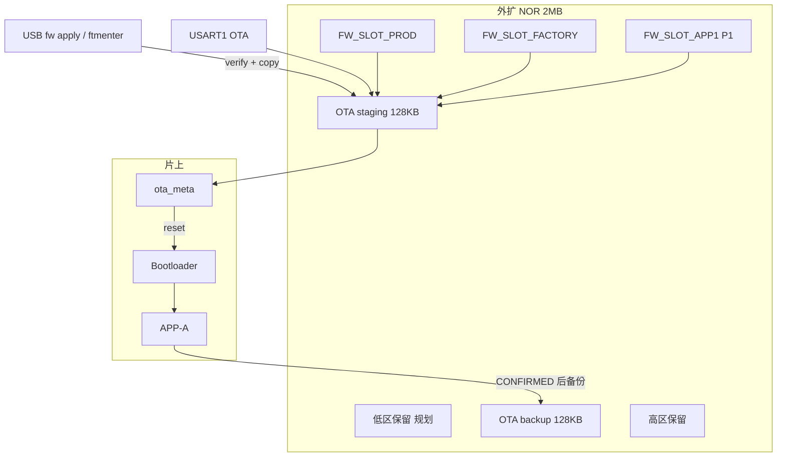

# STM32G431 OTA 三期开发计划

**文档类型**：开发计划 / 实施参考  
**适用产品**：STM32G431CBT6 + ZB25VQ16 外扩 NOR（2MB，SPI2）  
**编写日期**：2026-05-29  
**定稿日期**：2026-05-29（v1.1 技术评审后）  
**文档状态**：🚧 **P0 主体已合入 — T20–T24、T28–T29 USB 回归已通过（2026-05-29）；T32 手动 / T33 待补**  
**前置条件**：一期 OTA 闭环已验证；二期 backup / 回滚 / 恢复模式 **主体完成**（T11、V4 已通过）

**关联文档**：

| 文档 | 用途 |
|------|------|
| [`STM32G431_ota_phase2_plan.md`](STM32G431_ota_phase2_plan.md) | 二期 backup / 回滚 / 恢复模式（收尾项见 §1.2） |
| [`STM32G431_ext_flash_fw_slots_plan.md`](STM32G431_ext_flash_fw_slots_plan.md) | 槽头格式、API 签名、命令回复、实现 WBS 细化 |
| [`STM32G431_flash_partition.md`](STM32G431_flash_partition.md) | 片上 + 外扩分区基线 |
| [`STM32G431_ota_technical_spec.md`](STM32G431_ota_technical_spec.md) | OTA 全流程与 `ota_meta` 状态机 |
| [`STM32G431_ota_uart_protocol.md`](STM32G431_ota_uart_protocol.md) | USART1 二进制 OTA 帧 |
| [`Factory/README.md`](../Factory/README.md) | 厂测工程与 `ftmenter` |

**权威头文件（当前）**：[`Common/Inc/flash_partition.h`](../Common/Inc/flash_partition.h)、[`Common/Inc/ota_meta.h`](../Common/Inc/ota_meta.h)、[`Common/Inc/ext_flash_partition.h`](../Common/Inc/ext_flash_partition.h)

---

## 0. 专家评审结论（定稿决策）

> 评审视角：资深嵌入式工程师 / 技术经理 — 量产可维护性、与二期 OTA 耦合风险、产线可操作性。  
> 初版 v1.0 方向正确；以下 **10 项决策** 作为实施准绳， supersede 初版中未标注的草案描述。

### 0.1 评审摘要

| 维度 | 初版评价 | 定稿调整 |
|------|----------|----------|
| 外扩库 + staging 激活 | ✅ 架构正确，Boot 解耦 | **保留** |
| 分区地址（staging/backup 冻结 + 槽区追加） | ✅ 合理 | **保留**；补充扇区对齐与 `_Static_assert` 全表 |
| `fw_slot_can_activate()` 互斥 | ⚠️ 仅列 3 个 state，与 ext_flash 文档「全非 IDLE」不一致 | **改**：见 §2.3 状态门禁表；**禁止**仅依赖 `oad_is_busy()` |
| `ftmenter` 行为变更 | ⚠️ 未写清现场影响 | **改**：§7 双路径并存；旧行为（写 Boot 标志）**废弃** |
| APP1 命名 vs `FW_SLOT_ALT` | ⚠️ 两文档不一致 | **改**：三期统一 **`APP1`**；实施时同步修订 ext_flash 文档 §3.2 |
| 低区/中间保留区 | ⚠️ 易被误认为已落地宏 | **改**：标注为 **产品规划区**，三期代码 **不实现** 读写 API |
| 掉电 / IWDG | ⚠️ 未覆盖 | **增**：拷贝 staging 期间喂狗；新增 T32 掉电用例 |
| 已出货设备升级路径 | ⚠️ 缺失 | **增**：§7.4 存量机策略 |
| USB 命令无鉴权 | ⚠️ 风险未记录 | **增**：§9 风险表；P2 可选产测模式门禁 |
| 工期 | 偏乐观 | **改**：P0 按 **2.5–3 周** 排期（含 Factory 体积验证） |

### 0.2 定稿决策表（必须遵守）

| # | 决策 | 理由 |
|---|------|------|
| **D1** | 槽元数据 **主存外扩槽头 512B**；NVS **不得**为唯一真相源 | 与 ext_flash 文档 D1 一致；产线 ST-Link 一次写入自描述 |
| **D2** | **Bootloader 三期零修改**；激活路径 slot → staging → `OTA_READY` → 现有 Boot | 二期路径已验证；降低回归面 |
| **D3** | **P0 交付**：PROD + FACTORY 双槽 + `fw list/info/apply` + `ftmenter`；**不含**设备端 `fw write` | 控制范围 |
| **D4** | 产线灌槽 **强制** `tools/fw_slot/fw_slot_program.py`；禁止裸写 bin 到槽区 | 无槽头 = `valid=0`，现场无法 `fw apply` |
| **D5** | `ftmenter` = `fw apply factory`；**删除** `boot_slot_request_factory()` 调用 | 当前 `oad.c` 写遗留标志，Boot 已忽略，无实际切镜像能力 |
| **D6** | `fw_slot_activate()` 前 **`fw_slot_verify()` + `image_validate()`** | 仅 CRC 不足以防砖 |
| **D7** | `fw_slot_can_activate()` **读 `ota_meta.state`**，不仅 `oad_is_busy()` | `oad_is_busy()` 仅反映 USART1 会话 `s_oad.active` |
| **D8** | Factory **只链** `fw_slot` + `ext_flash` + 公共模块，**不链** `OAD/` | 控制 Flash 体积与符号依赖 |
| **D9** | **APP1 槽 P1 启用**；分区宏三期一并写入，默认 `FW_SLOT_APP1_ENABLE=0` | 预留地址，避免日后改分区伤已出货机 |
| **D10** | `scripts/flash.cmd -Image all` **仅编程片上**；外扩槽 **不被** 该脚本擦除 | 灌槽与片内烧录解耦；产线须单独灌槽步骤 |

### 0.3 实施范围（P0 / P1 / P2）

| 优先级 | 内容 | 验收 |
|--------|------|------|
| **P0** | 分区宏、槽 HAL、`fw_slot` 核心、USB 命令、`ftmenter` 迁移、产线脚本、Factory 集成 | T20–T24、T28–T29、T32 |
| **P1** | APP1 槽、`fw apply app1`、同版本跳过、USART1 灌槽、OTA/回滚共存回归 | T25–T27、T30–T31 |
| **P2** | Boot 直读 slot、USB `fw write`、镜像签名、命令鉴权 | 按需立项 |

**工期（P0）**：约 **2.5–3 周**（单人嵌入式 + 产线脚本联调 + Factory 体积确认）。

---

## 1. 背景与目标

### 1.1 一期 / 二期成果（基线）

| 能力 | 状态 |
|------|------|
| USART1 下载 → 外扩 staging → Boot 写片内 APP-A | ✅ 已验证 |
| `ota_meta` v2、写后 CRC、`APPLYING` / `APPLY_FAILED` | ✅ 已实现 |
| 外扩 backup + `boot_attempts` 回滚 | ✅ 已实现（T11 通过） |
| Boot 恢复模式（USART1 仅写 staging） | ✅ 已合入（T12 板测待关闭） |
| 外扩分区 | staging + backup **已落地**；**固件库槽 PROD/FACTORY 已落地**（`fw_slot`） |
| `ftmenter` | ✅ `fw_slot.c`：`fw apply factory`（外扩槽 → staging → Boot）；**已废弃** `BOOT_SLOT_FLAG_FACTORY` |

### 1.2 二期遗留（三期 M0 门禁）

| 级别 | ID | 项 | 说明 |
|------|-----|-----|------|
| **阻断** | V5 / T10 | `boot_attempts` 回滚 | M3 板测前须 PASS；可与 M1 并行 |
| **阻断** | T12 | Boot 恢复模式板测 | `ota_regression.py --t12` |
| **建议** | T8 / T9 | 写后 CRC 注入、掉电抽测 | P0 发布前完成；≥20 次随机掉电 |
| **不阻断** | M4 P2 | 签名或 USART1 DMA | 纳入三期 P2 |

> **经理门禁**：M2（`fw_slot` 核心）启动前，T10/T12 至少有一人签字 **通过** 或 **已知风险接受** 记录在 release note。

### 1.3 三期业务目标

在 **不改变 Boot 写片内路径** 的前提下，将外扩 NOR 从「OTA 暂存区」扩展为 **固件库（Firmware Library）**：

| 目标 | 说明 |
|------|------|
| **多固件预存** | 外扩同时保存量产、厂测、应用固件 1 等 **完整镜像副本** |
| **运行时切换** | APP-A / Factory 经 USB `fw apply` 或 `ftmenter` 激活到片内 APP-A |
| **产线灌槽** | ST-Link + 脚本写槽头 + 镜像，减少反复覆盖片内 |
| **与 OTA 共存** | USART1 OTA 写 staging；固件槽区 **独立地址**，互斥由软件门禁保证 |
| **可维护命名** | 对外：`prod` / `factory` / `app1`；对内：`FW_SLOT_ID_*` 枚举稳定 |

### 1.4 硬约束（不可违背）

| 约束 | 说明 |
|------|------|
| 片内单执行槽 | 仅 **APP-A（96KB）** 可运行代码 |
| 外扩不可 XIP | 须 Boot 拷贝到片内后跳转 |
| 片内编程仅 Boot | 运行中 APP **禁止**擦写 APP-A |
| 镜像上限 | 单镜像 ≤ **96 KB**（`FLASH_PART_OTA_IMAGE_MAX`） |
| 自检区不可占 | sector 64 @ `0x00040000`，`ext_flash_self_test()` 专用 |
| 扇区对齐 | ZB25VQ16 扇区 **4KB**；每槽 128KB = **32 扇区**，起址须 `0x1000` 对齐 |
| staging/backup 地址冻结 | 已出货机 OTA 依赖 `0x00100000` / `0x00120000`，**不得改动** |

### 1.5 非目标（三期不做）

- 片内 A/B 乒乓、外扩 XIP、无线 OTA、Boot 自升级  
- 设备端 USB 大包灌槽（P2）  
- 低区/中间保留区的文件系统实现（仅地址规划）  
- USB 命令加密鉴权（P2 可选）

---

## 2. 总体方案

### 2.1 策略：外扩「固件库」+ 复用二期激活链

片内仍 **仅 APP-A 一个执行槽**。切换任意固件槽时，走与 OTA 相同的 **slot → staging → `OTA_READY` → Boot → 片内** 路径。



### 2.2 固件槽与 OTA / backup 的关系

| 场景 | staging | backup | 固件槽 |
|------|---------|--------|--------|
| USART1 OTA | 主机下载新包 | 二期策略维护 | **不修改** |
| `fw apply prod/factory/app1` | 从槽拷贝 payload | Boot 激活前备份片内 | 只读 |
| 产线灌槽 | 不经过 | 不影响 | 脚本写槽头+payload |
| `fw apply` 拷贝中掉电 | 可能半写 | 不变 | 不变 |

**与 backup 回滚的关系**：`fw apply` 激活的新镜像若未通过 `CONFIRMED`，二期 `boot_attempts` 回滚恢复的是 **backup 中的上一片内镜像**，**不会**自动回退到外扩槽内容。现场若需回到量产槽版本，须显式 `fw apply prod`。

### 2.3 `ota_meta` 状态门禁（定稿 — D7）

`fw_slot_can_activate()` **必须读取 `ota_meta.state`**，不可仅调用 `oad_is_busy()`（后者只表示 USART1 会话 `s_oad.active`）。

| `ota_meta.state` | 允许 `fw apply` | 说明 |
|------------------|-----------------|------|
| `OTA_IDLE` | ✅ | 常态 |
| `OTA_CONFIRMED` | ✅ | 常态；当前运行镜像已确认 |
| `OTA_DOWNLOADING` | ❌ `busy` | 须 `oad_abort()` 或等会话结束 |
| `OTA_READY` | ❌ `busy` | staging 已有待激活包；须复位让 Boot 处理或 ABORT 清 meta |
| `OTA_APPLYING` | ❌ `busy` | Boot 正在写片内 |
| `OTA_APPLY_FAILED` | ❌ `busy` | Boot 将重试 staging；须等 Boot 周期结束 |
| `OTA_PENDING_VERIFY` | ❌ `busy` | 新镜像试运行中；**禁止**中途切槽（避免回滚语义混乱） |
| `OTA_ROLLBACK` | ❌ `busy` | Boot 正在恢复 backup |

**`fw apply` 前清理**：若 `DOWNLOADING`，APP-A 调 `oad_abort()`；Factory 将 meta 置 `IDLE`（Factory 无 OAD）。

**拷贝过程**：`fw_slot_copy_to_staging()` 循环内调用 `ota_wdt_feed()`（或等价喂狗），避免 IWDG 在 ~1–3 s SPI 拷贝期间超时。

---

## 3. 外扩分区规划 v3（三期定稿）

### 3.1 全图（ZB25VQ16，2MB）

| 区域 | 偏移 | 大小 | 扇区（4KB） | 宏 | 三期代码 |
|------|------|------|-------------|-----|----------|
| 低区保留 | `0x00000000` | 256 KB | 0–63 | `EXT_FLASH_PART_RESERVE_LOW` | **仅规划**，无 API |
| **自检区** | `0x00040000` | 4 KB | **64** | sector 64 | **已有** `ext_flash_self_test()` |
| 中间保留 | `0x00041000` | ~764 KB | 65–255 | — | **仅规划** |
| OTA staging | `0x00100000` | 128 KB | 256–287 | `EXT_FLASH_PART_OTA_STAGING_*` | **二期已有** |
| OTA backup | `0x00120000` | 128 KB | 288–319 | `EXT_FLASH_PART_OTA_BACKUP_*` | **二期已有** |
| **量产槽 PROD** | `0x00140000` | 128 KB | 320–351 | `EXT_FLASH_PART_FW_SLOT_PROD_*` | **P0** |
| **厂测槽 FACTORY** | `0x00160000` | 128 KB | 352–383 | `EXT_FLASH_PART_FW_SLOT_FACTORY_*` | **P0** |
| **应用固件 1 APP1** | `0x00180000` | 128 KB | 384–415 | `EXT_FLASH_PART_FW_SLOT_APP1_*` | **P1 宏门控** |
| 高区保留 | `0x001A0000` | 384 KB | 416–511 | `EXT_FLASH_PART_RESERVE_HIGH` | **仅规划** |

```
0x00100000  ┌──────────────────┐
            │  staging  128KB  │  sector 256–287
0x0011FFFF  ├──────────────────┤
0x00120000  │  backup   128KB  │  sector 288–319
0x0013FFFF  ├──────────────────┤
0x00140000  │  PROD     128KB  │  [512B hdr][镜像≤96KB][0xFF…]
0x0015FFFF  ├──────────────────┤
0x00160000  │  FACTORY  128KB  │
0x0017FFFF  ├──────────────────┤
0x00180000  │  APP1     128KB  │  FW_SLOT_APP1_ENABLE
0x0019FFFF  ├──────────────────┤
0x001A0000  │  保留高区 384KB   │  未来 APP2 等
0x001FFFFF  └──────────────────┘
```

**容量核算**：OTA 256KB + 固件库 3×128KB = 640KB（`0x00100000`–`0x0019FFFF`）；余量充足。

### 3.2 槽位语义与命名

| `fw_slot_id_t` | 命令别名 | 典型用途 | 优先级 |
|----------------|----------|----------|--------|
| `FW_SLOT_ID_PROD` (0) | `prod`, `0` | 产线正式版；现场恢复量产 | **P0** |
| `FW_SLOT_ID_FACTORY` (1) | `factory`, `1` | 厂测镜像；`ftmenter` | **P0** |
| `FW_SLOT_ID_APP1` (2) | `app1`, `2` | 定制版 / 试验版 / 区域版 | **P1** |

> **文档同步**：[`STM32G431_ext_flash_fw_slots_plan.md`](STM32G431_ext_flash_fw_slots_plan.md) 中 `FW_SLOT_ALT` / `EXT_FLASH_PART_FW_SLOT_ALT_*` 在实施 **M1** 时统一改为 **APP1**；**地址不变**（`0x00180000`）。

### 3.3 单槽内部布局

| 区间 | 大小 | 内容 |
|------|------|------|
| `[0, 512)` | 512 B | `fw_slot_hdr_t`（`magic=0x46574844` "FWHD"） |
| `[512, 512+image_size)` | ≤ 96 KB | payload，与片内 APP-A 镜像格式一致 |
| 余下 | `0xFF` | 未使用 |

校验顺序：`header_crc32` → `magic/struct_version/slot_id` → payload `image_crc32` → **`image_validate(payload)`**。

完整字段定义见 ext_flash 文档 §3.3。

### 3.4 头文件与编译期检查

```c
#define EXT_FLASH_PART_FW_SLOT_PROD_ADDR      0x00140000U
#define EXT_FLASH_PART_FW_SLOT_PROD_SIZE      (128U * 1024U)
#define EXT_FLASH_PART_FW_SLOT_FACTORY_ADDR   0x00160000U
#define EXT_FLASH_PART_FW_SLOT_FACTORY_SIZE   (128U * 1024U)
#define EXT_FLASH_PART_FW_SLOT_APP1_ADDR      0x00180000U
#define EXT_FLASH_PART_FW_SLOT_APP1_SIZE      (128U * 1024U)
#define EXT_FLASH_PART_RESERVE_HIGH_ADDR      0x001A0000U
#define EXT_FLASH_PART_RESERVE_HIGH_SIZE      (384U * 1024U)

#define FW_SLOT_HEADER_SIZE                   512U
#define FW_SLOT_PAYLOAD_MAX                   FLASH_PART_OTA_IMAGE_MAX

/* 与 staging/backup/自检无重叠；槽区连续 */
_Static_assert(EXT_FLASH_PART_FW_SLOT_PROD_ADDR >=
    EXT_FLASH_PART_OTA_BACKUP_ADDR + EXT_FLASH_PART_OTA_BACKUP_SIZE, "prod overlaps backup");
_Static_assert(EXT_FLASH_PART_FW_SLOT_FACTORY_ADDR ==
    EXT_FLASH_PART_FW_SLOT_PROD_ADDR + EXT_FLASH_PART_FW_SLOT_PROD_SIZE, "factory not contiguous");
_Static_assert(EXT_FLASH_PART_FW_SLOT_APP1_ADDR ==
    EXT_FLASH_PART_FW_SLOT_FACTORY_ADDR + EXT_FLASH_PART_FW_SLOT_FACTORY_SIZE, "app1 not contiguous");
_Static_assert(EXT_FLASH_PART_FW_SLOT_APP1_ADDR + EXT_FLASH_PART_FW_SLOT_APP1_SIZE <=
    EXT_FLASH_PART_RESERVE_HIGH_ADDR, "slots overlap reserve high");
_Static_assert((EXT_FLASH_PART_FW_SLOT_PROD_ADDR % 4096U) == 0U, "prod not sector aligned");
```

### 3.5 未来扩展

| 扩展 | 建议地址 | 条件 |
|------|----------|------|
| `FW_SLOT_APP2` | `0x001A0000` | 占用高区前 128KB；须缩减 `RESERVE_HIGH` |
| 日志环形缓冲 | 低区 `0x00000000` | 与固件库擦除单元独立规划 |

**规则**：新槽 **只追加** 在高区；**禁止**改动 staging/backup 起址。

---

## 4. 功能分解与优先级

### 4.1 P0 — 三期必交付

| ID | 功能 | 说明 |
|----|------|------|
| P0-1 | 分区宏 v3 + 全量 `_Static_assert` | §3.4 |
| P0-2 | `ext_flash_slot_*` | 按 `fw_slot_id_t` 映射基址；擦除按 32 扇区 |
| P0-3 | `fw_slot.c` 核心 | verify / copy_to_staging / activate |
| P0-4 | **完整 meta 状态门禁** | §2.3；含 `fw_apply` 前 meta 清理 |
| P0-5 | USB 命令 | `fw list` / `fw info` / `fw apply prod\|factory` |
| P0-6 | `ftmenter` 迁移 | 从 `oad.c` 移除；`fw_slot.c` 注册 |
| P0-7 | 产线 `fw_slot_program.py` | HEX → 槽头 + payload；ST-Link 写外扩 |
| P0-8 | Factory 集成 + **体积验证** | 链 `fw_slot`；**Factory Code ≤ 90KB** 留余量 |
| P0-9 | 回归 `--phase3` | `ota_regression.py` 扩展 T20–T24、T28–T29、T32 |
| P0-10 | 文档 | `flash_partition.md` v3、SOP、Factory README、`technical_spec` §三期 |

### 4.2 P1 — 强烈建议

| ID | 功能 | 说明 |
|----|------|------|
| P1-1 | APP1 槽 | `FW_SLOT_APP1_ENABLE=1`；`fw apply app1` |
| P1-2 | 同版本跳过 | payload CRC == 片内 CRC 且 version 相同 → `OK,same` |
| P1-3 | USART1 灌槽 | `ota_uart_host.py --target-slot`（`START.flags`） |
| P1-4 | `fw apply` USB 进度 | 长拷贝时周期性 `OK fw apply,progress=N` |
| P1-5 | CONFIRMED 后刷新 PROD 槽 | `FW_SLOT_AUTO_REFRESH_PROD`；保持外扩与片内一致 |
| P1-6 | 共存回归 | T25–T27、T30–T31 |

### 4.3 P2 — 按需

| ID | 功能 | 说明 |
|----|------|------|
| P2-1 | Boot 直读 slot | 省 staging 拷贝 ~1–3 s |
| P2-2 | USB `fw write` | 研发调试灌槽 |
| P2-3 | 镜像签名 | 与二期 M4 P2 合并 |
| P2-4 | USB 命令鉴权 | 如 NVS `factory_mode` 门控 `fw apply` |

---

## 5. 软件架构

### 5.1 模块划分

| 模块 | 路径 | APP-A | Factory | Boot |
|------|------|:-----:|:-------:|:----:|
| 分区宏 | `ext_flash_partition.h` | ✓ | ✓ | — |
| 槽管理 | `fw_slot.c` / `fw_slot.h` | ✓ | ✓ | — |
| 外扩 HAL | `ext_flash.c` | ✓ | ✓ | — |
| OTA | `oad.c` | ✓ | — | — |
| OTA 激活 | `boot_ota.c` | — | — | **不改** |

### 5.2 代码 / 体积预算

| 目标 | 预估增量 | 上限 / 对策 |
|------|----------|-------------|
| APP-A `fw_slot.c` 等 | +2.5–4 KB Code | 与 `ext_flash` 共用 256B 拷贝缓冲 |
| Factory 同上 | +2.5–4 KB Code | **发布前检查 map**：Factory ≤ 90KB |
| RAM | +<512 B | 槽头缓冲栈或静态 |
| Boot | **0** | D2 |

### 5.3 `fw_slot_activate()` 流程

1. `fw_slot_can_activate()` — §2.3 全状态检查  
2. `ext_flash_ensure_ready()`  
3. `fw_slot_verify(id)`  
4. （P1）同镜像跳过  
5. `ext_flash_staging_erase()` — **会销毁** 当前 staging 中未激活的 OTA 包  
6. 分块 `ext_flash_slot_read` → `ext_flash_staging_write`（期间 `ota_wdt_feed()`）  
7. staging CRC 与槽头 `image_crc32` 比对  
8. `ota_meta`：`state=OTA_READY`，`image_size/crc32/version`，`image_slot=OTA_META_IMAGE_SLOT_APP_A`  
9. `NVIC_SystemReset()`

### 5.4 USB 命令（P0）

| 命令 | 行为 |
|------|------|
| `fw` / `fw list` | `prod,factory`（+ P1 `app1`）：`name,valid,version,size` |
| `fw info prod\|factory\|0\|1` | 单槽 hdr / payload CRC |
| `fw apply prod\|factory` | verify → copy → READY → reset |
| `ftmenter` | 等同 `fw apply factory`；失败 `OK ftmenter,no_image` **不复位** |
| `ftmexit` | 清遗留 Boot 标志；**不**自动恢复量产镜像 |

```text
OK fw list prod,1,1.2.3,57872 factory,1,ft-1.0.0,45200
OK fw apply prod,reboot
NG fw apply busy
OK ftmenter,no_image
```

---

## 6. 分阶段实施计划

### 6.1 里程碑

| 阶段 | 周期 | 交付 | 验收 |
|------|------|------|------|
| **M0** | 3–5 天 | T10、T12；二期 `--all` 全绿 | V5 关闭 |
| **M1** | 2 天 | 本文档 v1.1、`ext_flash_partition.h` v3；同步 ext_flash 文档 APP1 命名 | ✅ 已合入 |
| **M2** | 5–6 天 | `ext_flash_slot_*`、`fw_slot` verify/copy/activate、IWDG 喂狗 | ✅ 已合入 |
| **M3** | 3–4 天 | USB 命令、`ftmenter` 迁移、APP 集成 | ✅ 板测 T21–T24 |
| **M4** | 2–3 天 | `fw_slot_program.py`、Factory、SOP | ✅ 脚本 + Factory 集成；SOP 已补 §6 |
| **M5** | 1 周 | P1：APP1、USART1 灌槽 | **进行中**（USART1 `--target-slot` 已合入） |
| **M6** | 2 天 | 文档、`release_notes`、`--phase3` 纳入 `--all` | ✅ |

### 6.2 WBS（P0）

| # | 任务 | 文件 | 状态 |
|---|------|------|------|
| 3.1 | 分区宏 + assert | `ext_flash_partition.h` | ✅ |
| 3.2 | `ext_flash_slot_*` | `ext_flash.c/h` | ✅ |
| 3.3 | `fw_slot_hdr_t` + `verify` | `fw_slot.c/h` | ✅ |
| 3.4 | copy / activate + 喂狗 | `fw_slot.c` | ✅ |
| 3.5 | meta 全状态门禁 + 清理 | `fw_slot.c` | ✅（含 `prepare_meta_gate`、busy 原因回复） |
| 3.6 | serial 命令 + `ftmenter` | `fw_slot.c` | ✅ |
| 3.7 | APP / Factory 注册 | `app_init.c`, Factory | ✅ |
| 3.8 | 移除 `oad.c` 中 `ftmenter` | `oad.c` | ✅ |
| 3.9 | `fw_slot_program.py` | `tools/fw_slot/` | ✅ USB 灌槽已板测 |
| 3.10 | `ota_regression.py --phase3` | `tools/ota_uart/` | ✅ 离线 + USB T20/T28/T29 PASS；T33 用 `--skip-t33` 或待补 |
| 3.11 | 文档 + ext_flash 文档 APP1 同步 | `doc/` | ✅ 2026-05-29 |

### 6.3 配置宏（`board_config.h`）

```c
#define FW_SLOT_ENABLE                    1U
#define FW_SLOT_APP1_ENABLE               0U   /* P1 */
#define FW_SLOT_SKIP_SAME_IMAGE           0U   /* P1 */
#define FW_SLOT_USB_WRITE_ENABLE          0U   /* P2 */
#define FW_SLOT_AUTO_REFRESH_PROD         0U   /* P1 */
```

---

## 7. 产线操作与存量设备

### 7.1 推荐产线流程（三期后）

1. `flash.cmd -Image all` — Boot + APP-A 片上烧录（**不写外扩槽**）。  
2. 灌槽（**必做**，若需 `fw apply` / `ftmenter`）：

```powershell
python tools/fw_slot/fw_slot_program.py --slot prod    --hex MDK-ARM/STM32G431CBT6/STM32G431CBT6.hex --version 1.2.3
python tools/fw_slot/fw_slot_program.py --slot factory --hex Factory/MDK-ARM/Factory/Factory.hex --version ft-1.0.0
```

3. 首件验证：`fw list` 两槽 `valid=1`；`ftmenter` 往返 + `fw apply prod`。

### 7.2 厂测双路径（评审强调）

| 路径 | 适用 | 说明 |
|------|------|------|
| **A. `ftmenter` / `fw apply factory`** | 已灌 FACTORY 槽的量产机 | **推荐**；不 ST-Link 覆盖片内 |
| **B. ST-Link 烧 Factory.hex** | 未灌槽 / 救砖 / 首件 | **保留**；覆盖片内 APP-A |

`ftmexit` **仅清标志**，不恢复镜像；退出厂测须 **`fw apply prod`** 或 ST-Link 烧量产 HEX。

### 7.3 OTA 与槽一致性

USART1 OTA **默认不更新** PROD 槽。若 SOP 要求外扩量产槽与片内一致：

- **手动**：OTA 成功后产线/售后执行 `fw_slot_program.py --slot prod`  
- **自动（P1）**：`FW_SLOT_AUTO_REFRESH_PROD=1`，`CONFIRMED` 后后台写回 PROD 槽（耗时数秒，须喂狗）

### 7.4 存量设备（二期已出货、未灌槽）

| 场景 | 行为 |
|------|------|
| 仅升级 APP/Boot（`flash -Image all`） | 外扩槽为空；`fw apply` → `no_image`；**USART1 OTA 不受影响** |
| 首次启用固件库 | 售后 USB 连机执行灌槽脚本（或 P1 USART1 灌槽） |
| 旧版 `ftmenter` 用户 | 升级三期后 `ftmenter` 行为变更；**发布说明必须醒目** |

---

## 8. 测试矩阵

### 8.1 三期新增

| ID | 用例 | 方法 | 期望 | 优先级 | 板测 |
|----|------|------|------|--------|------|
| T20 | 空槽 apply | 未灌槽 `fw apply prod` | `no_image`，不复位 | P0 | ✅ 2026-05-29（`--phase3 --usb-port`） |
| T21 | 产线灌槽 | `fw_slot_program.py` | `fw list` valid=1 | P0 | ✅ 2026-05-29 |
| T22 | apply prod | `fw apply prod` | 新版本运行 | P0 | ✅ |
| T23 | ftmenter | FACTORY 槽有效 | 厂测镜像运行 | P0 | ✅ |
| T24 | factory ↔ prod | `ftmenter` / `fw apply prod` 往返 | 版本对；NVS SN 不变 | P0 | ✅ |
| T28 | 篡改 payload 1B | apply | 拒绝，不复位 | P0 | ✅ 2026-05-29（离线 + USB） |
| T29 | 非法向量镜像 | CRC 正确、向量非法 | verify 失败 | P0 | ✅ 2026-05-29（离线 + USB） |
| **T32** | 拷贝 staging 掉电 | `fw apply` 拷贝中断电 | 槽完整；可重试 | P0 | ⬜ 手动 |
| T33 | meta=READY | 残留 READY | gate 清理或 `busy,ready` | P0 | ⏭️ 跳过待补（ST-Link 写 meta 后 USB CDC 易断；`--skip-t33`） |
| T25 | OTA 互斥 | DOWNLOADING 时 apply | `busy` | P1 | — |
| T26 | OTA 后槽完整 | OTA 后 `fw list` | 槽未被擦 | P1 | — |
| T27 | backup 回滚 | 坏镜像 hook | 二期回滚仍有效 | P1 | — |
| T30 | slot_id 不符 | 改 hdr | verify 失败 | P1 | — |
| T31 | apply app1 | P1 灌 APP1 | 定制版运行 | P1 | — |

### 8.2 二期门禁（M0）

| ID | 期望 |
|----|------|
| T10 | 3 次未确认 → backup 恢复 |
| T12 | 无有效 APP/backup → 恢复模式 |
| T4/T7/T11 | `--all` 仍 PASS |

---

## 9. 风险与对策

| 风险 | 严重度 | 对策 |
|------|--------|------|
| ST-Link 只写 payload 无槽头 | 高 | D4：产线强制脚本；SOP 检查 `fw list` |
| `fw apply` 与 OTA READY 竞态 | 高 | §2.3 全状态门禁；T33（自动化待补，门禁逻辑已板测于 T20–T24） |
| `fw apply` 擦 staging 丢未激活 OTA 包 | 中 | 文档 + `busy`；须 ABORT/等 Boot 后再切槽 |
| `ftmenter` 行为变更误导现场 | 中 | release note + Factory README；保留 ST-Link 路径 B |
| 槽与片内版本长期不一致 | 中 | SOP；P1 自动刷新 PROD |
| Factory Flash 超限 | 中 | P0-8 map 检查；必要时 `FW_SLOT_ENABLE` 条件编译精简字符串 |
| USB 无鉴权任意切固件 | 中 | 接受（内网产测）；P2 鉴权 |
| 双读 SPI 耗时 | 低 | P0 接受；P2 Boot 直读 |
| 分区地址漂移伤已出货机 | 高 | staging/backup 冻结；D10 |
| APP1 误用覆盖产线流程 | 中 | P1 才启用；命令与 SOP 隔离 |

---

## 10. 须同步修改的文件

| 文件 | 变更 |
|------|------|
| `Common/Inc/ext_flash_partition.h` | FW Slot 宏 + assert |
| `Common/Inc/fw_slot.h` | **新建** |
| `Common/Src/fw_slot.c` | **新建** |
| `Core/Src/ext_flash.c` | `ext_flash_slot_*` |
| `Common/Inc/board_config.h` | `FW_SLOT_*` |
| `OAD/Src/oad.c` | **删除** `cmd_ftmenter` |
| `Core/Src/app_init.c` | `fw_slot_register_serial_cmds()` |
| Factory 工程 | 链 `fw_slot` 相关源文件 |
| `tools/fw_slot/fw_slot_program.py` | **新建** |
| `tools/ota_uart/ota_regression.py` | `--phase3` |
| `doc/STM32G431_ext_flash_fw_slots_plan.md` | ALT → APP1 命名同步 |
| `doc/STM32G431_flash_partition.md` | 外扩 v3 |
| `doc/STM32G431_ota_technical_spec.md` | §三期 |
| `doc/STM32G431_ota_production_sop.md` | 灌槽与双路径厂测 |
| `Factory/README.md` | `ftmenter` 新语义 |
| `Bootloader/` | **不改** |

---

## 11. 验收标准（三期 P0 关闭）

1. **M0**：T10、T12 PASS（或书面风险接受）。  
2. **P0 全部完成**；T20–T24、T28–T29 PASS；**T32** 手动掉电抽测；**T33** PASS 或 `--skip-t33` 书面记录。  
3. `ota_regression.py --phase3 --usb-port COMx` 绿（T33 可 `--skip-t33`）；`--all` 含一期/二期仍绿。  
4. Factory 编译 map **≤ 90KB Code**（或记录豁免理由）。  
5. 产线 SOP 含灌槽、双路径厂测、存量机首次灌槽。  
6. `flash_partition.md` v3 发布；Boot 无变更。  
7. release note 含 **`ftmenter` 行为变更** 与 App + Factory 版本号。

---

## 12. 建议排期（人天）

| 角色 | M0 | M1–M4 (P0) | M5 (P1) | 合计 |
|------|-----|------------|---------|------|
| 嵌入式 | 2 | 12–14 | 4–5 | **18–21** |
| 测试 / 产线 | 2 | 4 | 2 | **8** |
| 文档 | 0.5 | 2 | 1 | **3.5** |

合计约 **4–5 周**（含 M0 + P0）；P1 再加 **1 周**。

---

## 13. 文档分工

| 文档 | 职责 |
|------|------|
| **本文档** | 三期范围、**全分区 v3**、meta 门禁、产线/存量策略、里程碑、验收 |
| [`STM32G431_ext_flash_fw_slots_plan.md`](STM32G431_ext_flash_fw_slots_plan.md) | 槽头二进制、API 签名、命令细节、专家评审 D1–D8 |

冲突时：以 **本文档 §3 分区地址**、**§2.3 状态门禁**、**§0 决策表** 为准；槽头字段以 ext_flash 文档 §3.3 为准。

---

## 14. 修订记录

| 日期 | 版本 | 说明 |
|------|------|------|
| 2026-05-29 | 1.0 | 初版：三期目标、外扩 v3、P0/P1/P2 |
| 2026-05-29 | **1.1** | **技术评审定稿**：§0 决策表、meta 全状态门禁、扇区对齐、IWDG/掉电、存量机策略、厂测双路径、体积预算、T32/T33、工期调整 |
| 2026-05-29 | **1.2** | **P0 实施**：M1–M4 合入；板测 T21–T24 PASS；`fw_slot_program.py` USB 灌槽；meta gate 修复 |
| 2026-05-29 | **1.3** | **`--phase3` 回归**；P1 USART1 `--target-slot`；`FW_SLOT_SKIP_SAME_IMAGE` 代码路径 |
| 2026-05-29 | **1.4** | **板测**：`--phase3 --usb-port` T20/T28/T29 PASS；T33 跳过（`--skip-t33`）；T32 仍手动 |

---

**批准状态**：v1.4 — P0 软件开发完成；`--phase3` USB 回归 T20/T28/T29 已通过；**T32** 手动掉电待做；**T33** 跳过待补（或 `--skip-t33` 验收）。  
**下一步**：T32 掉电抽测；M0 **T10/T12**；P1 `FW_SLOT_APP1_ENABLE=1` 与 T25–T27 共存回归。

**回归命令（三期 USB，T33 可选跳过）**：

```powershell
python tools\ota_uart\ota_regression.py --phase3 --usb-port COM19 --skip-t33
```
