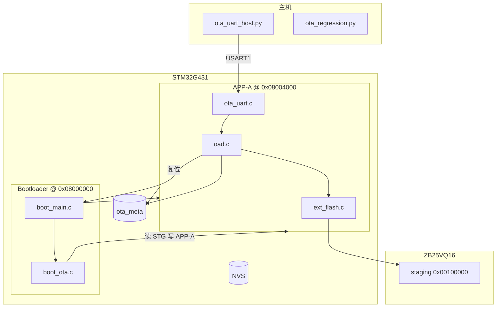
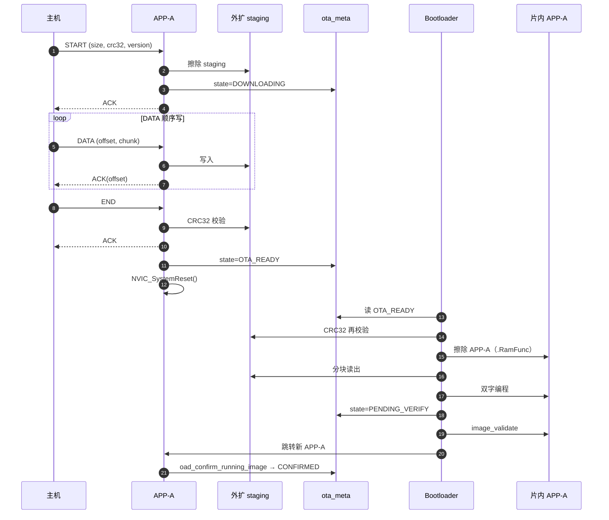
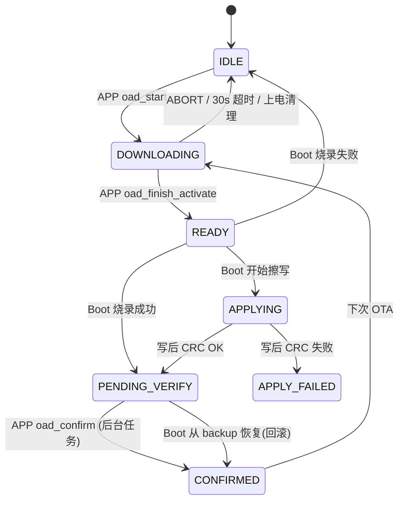

# STM32G431 OTA 技术规范（全流程）

**文档类型**：技术规范 / 实施参考  
**适用产品**：STM32G431CBT6 + ZB25VQ16 外扩 NOR  
**协议版本**：USART1 OTA v1（`OTA_PROTO_VERSION`）  
**固件进度**：整包 OTA 闭环已验证（2026-05-28）  
**关联文档**：

| 文档 | 用途 |
|------|------|
| [`STM32G431_flash_partition.md`](STM32G431_flash_partition.md) | 分区地址表 |
| [`STM32G431_ota_uart_protocol.md`](STM32G431_ota_uart_protocol.md) | 帧格式、CRC、字节级示例 |
| [`STM32G431_bootloader_ota_plan.md`](STM32G431_bootloader_ota_plan.md) | 开发计划与排期 |
| [`STM32G431_ota_production_sop.md`](STM32G431_ota_production_sop.md) | 产线操作步骤 |
| [`STM32G431_ota_phase2_plan.md`](STM32G431_ota_phase2_plan.md) | **二期**：回滚、写后校验、恢复模式 |

**权威头文件**：[`Common/Inc/flash_partition.h`](../Common/Inc/flash_partition.h)、[`Common/Inc/ota_meta.h`](../Common/Inc/ota_meta.h)、[`Common/Inc/ext_flash_partition.h`](../Common/Inc/ext_flash_partition.h)

---

## 1. 概述

### 1.1 目标

在量产设备上，通过 **USART1 有线链路** 将新固件下载至 **外扩 NOR 暂存区**，校验通过后由 **Bootloader** 写入 **片内 APP-A（96KB）** 并启动新应用，同时：

- **不擦除** NVS（`0x0801C000`，8KB）中的产测/配置数据；
- **不在运行中的 APP 内** 擦写片内 APP-A（避免单 Bank 自毁）；
- 升级通道与 **USB CDC 日志/产测** 分离，互不占用。

### 1.2 设计原则

| 原则 | 说明 |
|------|------|
| 单应用槽 | 片内仅 **APP-A**；无片内 APP-B 乒乓 |
| 外扩暂存 | 升级包先落外扩 `0x00100000`，再激活片内 |
| Boot 写片内 | APP 只负责下载 + meta + 复位；片内编程在 **Boot 区** 执行 |
| 元数据驱动 | `ota_meta` 记录状态、大小、CRC、版本；Boot 上电读 meta 决策 |
| CRC 校验 | 外扩整包 CRC32；Boot 烧录前再次校验外扩 |

### 1.3 术语

| 术语 | 含义 |
|------|------|
| **APP-A** | 主应用固件，链接 `0x08004000`，≤ 96KB |
| **staging** | 外扩 OTA 暂存区，128KB @ `0x00100000` |
| **激活** | Boot 将 staging 内容写入片内 APP-A |
| **会话** | 一次 START…END（或 ABORT/超时中断）的 USART1 传输过程 |

---

## 2. 存储布局

### 2.1 片上 Flash（128KB）

```
0x08000000  ┌─────────────────┐
            │   Bootloader    │  16 KB   永不被 OTA 覆盖（须 ST-Link 更新）
0x08003FFF  ├─────────────────┤
0x08004000  │     APP-A       │  96 KB   OTA 升级目标
0x0801BFFF  ├─────────────────┤
0x0801C000  │      NVS        │   8 KB   OTA 默认不擦
0x0801DFFF  ├─────────────────┤
0x0801E000  │    Metadata     │   8 KB   ota_meta + 保留
0x0801FFFC  │  Boot flag(u32) │
0x0801FFFF  └─────────────────┘
```

| 宏（`flash_partition.h`） | 地址 | 大小 |
|---------------------------|------|------|
| `FLASH_PART_BOOT_START` | `0x08000000` | 16 KB |
| `FLASH_PART_APP_A_START` | `0x08004000` | 96 KB |
| `FLASH_PART_NVS_START` | `0x0801C000` | 8 KB |
| `FLASH_PART_META_START` | `0x0801E000` | 8 KB |
| `BOOT_SLOT_FLAG_ADDR` | `0x0801FFFC` | 4 B |

**镜像上限**：`FLASH_PART_OTA_IMAGE_MAX` = 96 KB。

### 2.2 外扩 NOR（ZB25VQ16，2MB，SPI2）

| 区域 | 偏移 | 大小 | 说明 |
|------|------|------|------|
| OTA staging | `0x00100000` | 128 KB | 下载缓冲（`EXT_FLASH_PART_OTA_STAGING_*`） |
| OTA backup | `0x00120000` | 128 KB | 上一良好镜像（`EXT_FLASH_PART_OTA_BACKUP_*`） |
| 自检区 | sector 64 → `0x00040000` | 4 KB 扇区 | `ext_flash_self_test()`，**禁止**与 staging/backup 重叠 |

硬件：SPI2，CS = PB12；驱动 `Core/Src/ext_flash.c`、`cbb/zb25vq16/`。

---

## 3. 系统架构



### 3.1 通道分工

| 接口 | 引脚/外设 | 用途 | OTA |
|------|-----------|------|-----|
| **USART1** | PB6 TX / PB7 RX | 二进制 OTA 帧 | **是** |
| **USB CDC** | — | `log`、`serial_cmd` | **否**（`ota` 命令仅提示 `use_usart1`） |
| USART2/3 | Cube 初始化 | 业务默认不参与 OTA | 否 |

波特率：**115200** 8N1（`COMMON_OTA_UART_BAUD`）。

---

## 4. 端到端流程

### 4.1 阶段总览

| 阶段 | 执行位置 | 输入 | 输出 |
|------|----------|------|------|
| ① 冷启动/正常运行 | Boot → APP-A | — | 应用业务 |
| ② OTA 下载 | APP-A | USART1 固件包 | 外扩 staging 满 + meta `DOWNLOADING` |
| ③ END 校验 | APP-A | staging | meta `OTA_READY` + **系统复位** |
| ④ 片内激活 | Bootloader | meta `OTA_READY` + staging | 片内 APP-A 已擦写 |
| ⑤ 待确认启动 | Boot → 新 APP-A | 向量表合法 | meta `PENDING_VERIFY` |
| ⑥ 运行确认 | 新 APP-A | `StartExtFlashTask` 后台 | meta `CONFIRMED` + 可选 backup 刷新 |

### 4.2 时序（正常升级）



**二期**：Boot 烧录前可备份片内 → backup；烧录后片内 CRC 读回；`boot_attempts` 超阈值从 backup 恢复；详见 §6.2。

### 4.3 主机侧时间预期

| 节点 | 典型耗时 | 说明 |
|------|----------|------|
| START…DATA | 取决于镜像大小与波特率 | 256B/帧 @ 115200 约数秒～数十秒 |
| END 等 ACK | ≤ 30 s（建议主机超时） | 外扩 CRC 计算 |
| ACK 后 | 立即复位 | 串口可能断开 |
| Boot 烧片内 | **30～90 s** | 擦 96KB + 编程；主机可关串口 |
| 新 APP 启动 | 复位后数秒内 | USB 心跳/版本可查 |

---

## 5. 为何必须由 Bootloader 写片内

STM32G431 128KB 为 **单 Bank**：Boot（`0x08000000`）与 APP-A（`0x08004000`）同属一片 Flash。

| 方案 | 结果 |
|------|------|
| APP 在 APP-A 运行并擦写 APP-A | 取指失败 / HardFault，表现为 **死机** |
| 仅把擦写函数放 `.RamFunc` | 中断与返回路径仍可能从 Flash 取指，**不可靠** |
| **Boot 运行 + 编程 APP-A 区域** | Boot 代码不在被擦除范围；擦写例程在 SRAM（`.RamFunc`）执行 → **可行** |

**禁止**：在 `oad_finish` / END 路径调用 `oad_flash_program_app_a()`（`OAD/oad_flash.c` 仅作参考）。

---

## 6. 元数据（ota_meta）

**地址**：`FLASH_PART_META_START`（`0x0801E000`）  
**实现**：`Common/Src/ota_meta.c`  
**结构**：[`Common/Inc/ota_meta.h`](../Common/Inc/ota_meta.h)

| 偏移 | 字段 | 说明 |
|------|------|------|
| 0x00 | `magic` | `0x4F544131`（"OTA1"） |
| 0x04 | `struct_version` | 当前 **`2`**（v1 读时迁移） |
| 0x08 | `image_slot` | `NONE` / `APP_A` / `APP_B`（**APP_B 表示外扩暂存完成**，非片内第二槽） |
| 0x0C | `state` | 见 §6.1 |
| 0x10 | `image_size` | 镜像字节数 |
| 0x14 | `image_crc32` | 整包 CRC32 |
| 0x18 | `version[16]` | 版本字符串 |
| 0x28 | `boot_attempts` | `PENDING_VERIFY` 下 Boot 递增；`> OTA_BOOT_ATTEMPT_MAX` 触发回滚 |
| 0x2C | `backup_valid` | `0` 或 `OTA_BACKUP_MAGIC`（`0x4241434B`） |
| 0x30 | `backup_size` / `0x34` `backup_crc32` | backup 区镜像 |
| 0x38 | `confirmed_version[16]` | 上次 CONFIRMED 版本 |
| 0x48 | `apply_fail_count` | 连续激活失败（可选统计） |

**Boot flag**（`0x0801FFFC`）：遗留 `APP_B` / `FACTORY` 标志由 Boot 擦除后仍跳 APP-A。

### 6.1 状态机（`ota_state_t`）



| 状态 | 设置者 | 含义 |
|------|--------|------|
| `OTA_IDLE` | 默认 / ABORT / 超时 / Boot 失败 | 无待激活包 |
| `OTA_DOWNLOADING` | `oad_start` / Boot recovery | USART1 下载中 |
| `OTA_READY` | `oad_finish_activate` / recovery END | 外扩 CRC 正确，**待 Boot 写片内** |
| `OTA_APPLYING` | Boot | 正在擦写片内（掉电可识别） |
| `OTA_APPLY_FAILED` | Boot | 激活失败，staging 仍有效可重试 |
| `OTA_PENDING_VERIFY` | Boot 烧录成功 | 新 APP-A 已写入，待运行确认 |
| `OTA_CONFIRMED` | `oad_confirm_running_image` | 新镜像运行正常 |
| `OTA_ROLLBACK` | Boot（历史） | 无有效 backup 时不应滞留 |

**上电安全**：`oad_init()` 若发现 `DOWNLOADING`（掉电残留），清为 `IDLE`。

### 6.2 二期扩展（backup / 回滚 / 恢复）

配置宏见 [`Common/Inc/board_config.h`](../Common/Inc/board_config.h)（`OTA_BOOT_ATTEMPT_MAX`、`OTA_BACKUP_BEFORE_APPLY` 等）。

| 能力 | 实现 |
|------|------|
| 激活前备份 | `boot_ota_apply_from_staging` → `boot_backup_running_app` |
| 写后 CRC | 编程后 `image_validate(..., image_size, image_crc32)` |
| 启动回滚 | `boot_main.c`：`PENDING_VERIFY` 且 `boot_attempts > 3` → `boot_ota_restore_from_backup` |
| 无 backup 首次 OTA | 不回滚，仅重试 staging / 清 meta |
| CONFIRMED 后 backup | `oad_confirm_running_image` → `ext_flash_backup_from_app_a` |
| Boot 恢复模式 | 片内无效且无 backup：`boot_recovery.c` USART1 仅写 staging |

**确认时机**：`oad_confirm_running_image()` 在 `StartExtFlashTask`（`app_freertos.c`）中执行，**不在** `app_init` 阻塞路径。

**烧录**：修改 Boot 后必须 `flash -Image all`（`flash.ps1` 可清残留 meta）。

---

## 7. USART1 OTA 协议（摘要）

完整字节定义、CRC 示例、Python 片段见 **[`STM32G431_ota_uart_protocol.md`](STM32G431_ota_uart_protocol.md)**。

### 7.1 帧结构

```
| SOF 55 AA | CMD | SEQ | LEN(u16) | PAYLOAD | CRC16-Modbus |
```

- CRC 覆盖：`CMD` … `PAYLOAD` 末字节（**不含** SOF）。
- PAYLOAD ≤ 512 B；DATA 中 `offset`(4) + `data[N]`，`N ≤ 508`。

### 7.2 命令

| CMD | 名称 | 方向 | 说明 |
|-----|------|------|------|
| `0x01` | START | H→D | `size`, `crc32`, `version[16]` |
| `0x02` | DATA | H→D | `offset`, `data[]`，顺序写 |
| `0x03` | END | H→D | 触发外扩 CRC 校验 |
| `0x04` | ABORT | H→D | 放弃会话，`meta→IDLE` |
| `0x80` | ACK | D→H | `status`, `offset` |
| `0x81` | NACK | D→H | `status`, `err` |

### 7.3 会话规则

1. 空闲仅接受 **START**；START 后接受 **DATA / END / ABORT**。
2. `offset` 必须等于已收字节数，否则 **NACK** `OAD_ERR_PARAM(2)`。
3. **END**：校验通过 → **ACK** → `OTA_READY` → **复位**（不在 APP 写片内）。
4. **30 s 无 DATA**（`COMMON_OTA_DATA_IDLE_TIMEOUT_MS`）→ `oad_abort()`，`OTA_IDLE`。
5. END 处理中（`s_finishing`）拒绝新帧，回 **BUSY**。

### 7.4 CRC32（镜像）

- 算法：与 `Common/Src/crc32.c` 一致（`CRC32_INIT_VALUE` / `crc32_update` / `crc32_finalize`）。
- 主机：Python `zlib.crc32(data) & 0xFFFFFFFF`。
- 校验点：APP `oad_finish_verify`；Boot `boot_staging_crc32` 烧录前再次校验。

---

## 8. 软件模块与职责

### 8.1 模块映射

| 模块 | 路径 | 职责 |
|------|------|------|
| 协议编解码 | `OAD/Src/ota_proto.c` | CRC16、组帧/解帧 |
| USART1 传输 | `OAD/Src/ota_uart.c` | RX 环、轮询、`ota_uart_poll`、超时 |
| OTA 状态机 | `OAD/Src/oad.c` | START/DATA/END/ABORT、写 staging、meta |
| 外扩抽象 | `Core/Src/ext_flash.c` | `ext_flash_staging_*`、`ext_flash_slot_*`、JEDEC、自检 |
| 固件库槽 | `Common/Src/fw_slot.c` | verify、copy、activate、`fw`/`ftmenter` 命令 |
| NOR 驱动 | `cbb/zb25vq16/` | 底层 SPI 读写擦 |
| 元数据 | `Common/Src/ota_meta.c` | 读写 Metadata 区 |
| 片内 HAL | `Common/Src/flash_hal.c` | 解锁/擦页/编程 |
| Boot 入口 | `Bootloader/Src/boot_main.c` | 读 meta、跳 APP-A |
| Boot OTA | `Bootloader/Src/boot_ota.c` | 外扩→片内 APP-A |
| 镜像校验 | `Common/Src/image_validate.c` | 向量表、Thumb 范围 |
| 启动标志 | `Common/Src/boot_slot.c` | `0x0801FFFC` 读写 |

### 8.2 APP 集成点

| 位置 | 调用 |
|------|------|
| `Core/Src/app_init.c` | `oad_init()`、`ota_uart_init(&huart1)`、`fw_slot_register_serial_cmds()` |
| `Core/Src/app_freertos.c` | `ota_uart_poll()`；`StartExtFlashTask` 内 `oad_confirm_running_image()` |
| `Bootloader/Src/boot_recovery.c` | 救砖：USART1 → staging，`OTA_READY` + 复位 |
| `OAD/Src/oad.c` | `oad_register_serial_cmds()`（`ota` 提示；**`ftmenter` 已迁至 `fw_slot.c`**） |
| `Factory/Src/factory_init.c` | `fw_slot_register_serial_cmds()`（无 OAD） |

### 8.3 Boot 激活（`boot_ota_apply_from_staging`）

1. 校验 `meta->image_size`（非 0，≤ 96KB）。
2. `boot_spi_init()` + `zb25vq16_init()`。
3. 外扩 staging 全包 CRC32，与 `meta->image_crc32` 比对。
4. `__disable_irq()`；`boot_ram_erase_app()` 按页擦 APP-A（`.RamFunc`）。
5. 256B 块：外扩读 → 8 字节对齐填充 `0xFF` → `boot_ram_program()` 双字写。
6. `flash_hal_lock()`；`__enable_irq()`；返回 0。

**Scatter**：`Bootloader.sct` 将 `*(.RamFunc)` 链入 SRAM。

---

## 9. 工具与命令

### 9.1 编译与烧录

```powershell
.\scripts\build.cmd -Target all      # Boot + APP-A
.\scripts\flash.cmd -Image all       # 首次或救砖
```

**量产发布**：Boot 与 App **必须配对**（Boot 含 `boot_ota.c`）。

### 9.2 OTA 升级（产线）

```powershell
python tools\ota_uart\ota_uart_host.py COM3 STM32G431CBT6.hex 1.2.3
```

- 默认固件：`MDK-ARM/STM32G431CBT6/STM32G431CBT6.hex`
- DATA 块大小：256 B（`CHUNK`）
- END 后等待 **30～90 s** 再判定新版本

### 9.3 回归测试

```powershell
python tools\ota_uart\ota_regression.py COM3          # 一期
python tools\ota_uart\ota_regression.py COM3 --all  # 一期 + T11
python tools\ota_uart\ota_regression.py COM3 --phase2
python tools\ota_uart\ota_regression.py COM3 --t10  # 回滚（须 prepare_t10_test.ps1）
python tools\ota_uart\ota_regression.py --offline    # T7
python tools\ota_uart\ota_meta_dump.py              # ST-Link 读 meta
```

| 自动化项 | 验证内容 |
|----------|----------|
| T4 CRC | 错误 CRC 的 END → NACK(4)，不复位 |
| T4 offset | 乱序 offset → NACK(2) |
| ABORT | 中断后可重新 START |
| N3 超时 | 30s 无 DATA 后会话释放 |
| T7 | `flash -Image app-b` 被脚本拒绝 |
| T11 / `--all` | 整包 OTA（可选 ST-Link meta + backup） |
| T10 / `--t10` | 无 confirm + 4 次复位 → 版本回退 |

产线 SOP：[`STM32G431_ota_production_sop.md`](STM32G431_ota_production_sop.md)。

---

## 10. 测试矩阵

| ID | 用例 | 方法 | 期望 |
|----|------|------|------|
| T1 | 冷启动 | Boot + APP | 正常进应用 |
| T2 | 外扩自检 | `extFlashTask` / `flash test` | JEDEC + R/W OK |
| **T3** | **整包 OTA** | `ota_uart_host.py` | END ACK → 复位 → 新版本运行 |
| T4 | CRC/参数错误 | `ota_regression.py` | NACK，不烧片内/不复位 |
| T3b | 通道隔离 | OTA 中 USB `sn` | 产测可用（手动） |
| T5 | 遗留 APP_B 标志 | 写 `0xAAAAAAAA` 复位 | Boot 清标志，进 APP-A（手动） |
| T6 | NVS 保留 | OTA 前后读 SN | 不变（手动） |
| T7 | 片内 APP-B 烧录 | `flash -Image app-b` | 脚本拒绝 |

---

## 11. 异常与恢复

| 现象 | 可能原因 | 处理 |
|------|----------|------|
| END 后死机、无 USB | 旧 APP 在片内自烧 APP-A | ST-Link：`flash -Image boot` + `app` |
| ACK 后无新版本 | Boot 未更新 | 烧含 `boot_ota.c` 的 Boot |
| NACK BUSY(1) | 上次会话未结束 | 发 ABORT 或复位；脚本已先发 ABORT |
| NACK PARAM(2) | offset/len/START 载荷错误 | 查 CHUNK≤508、version 16 字节 |
| NACK CRC(4) | 镜像 CRC 不符 | 重传；核对主机 `zlib.crc32` |
| END 超时 | 外扩慢/栈不足 | 增大超时；确认 `defaultTask` 栈、CHUNK=256 |
| 30s 后无法 START | 未烧含超时逻辑 APP | 重新编译烧录 APP |
| `meta` 卡在 READY | Boot 烧录失败 | Boot 清为 IDLE；查外扩/SPI |
| 无 USB、LED 慢闪 | 片内坏且无 backup | Boot recovery：USART1 重下 staging；或 ST-Link `flash -Image all` |
| `ROLLBACK` + `backup=0` | 旧 Boot / 无 backup | 烧新 Boot；首次 OTA 建立 backup |

---

## 12. 约束与禁止事项

| 项 | 要求 |
|----|------|
| 镜像大小 | ≤ 96 KB |
| OTA 接口 | 仅 USART1，不用 USB `serial_cmd ota` 传包 |
| 片内编程 | **仅 Bootloader** |
| 外扩地址 | staging `0x00100000`；勿占 sector 64 自检区 |
| 厂测 Factory | 与 APP-A 同槽；**三期**可用外扩 `ftmenter`，或 ST-Link 烧 factory |
| 外扩固件库 | PROD/FACTORY @ `0x00140000`/`0x00160000`；灌槽见 `tools/fw_slot/fw_slot_program.py` |
| NVS | OTA 不擦；换 key 布局需 migration 或 `nvs_factory_reset()` |
| Boot 体积 | ≤ 16 KB（二期含 recovery 约 **12.8KB** Code） |

---

## 13. 修订记录

| 日期 | 版本 | 说明 |
|------|------|------|
| 2026-05-28 | 1.0 | 初版：汇总分区、全流程、协议摘要、模块、测试与产线要求 |
| 2026-05-28 | 1.1 | 二期：§6.2 backup/回滚/恢复、meta v2、工具与异常表 |
| 2026-05-29 | 1.2 | 三期：`fw_slot`、外扩槽、`ftmenter`/`fw apply`；Boot **无变更** |
