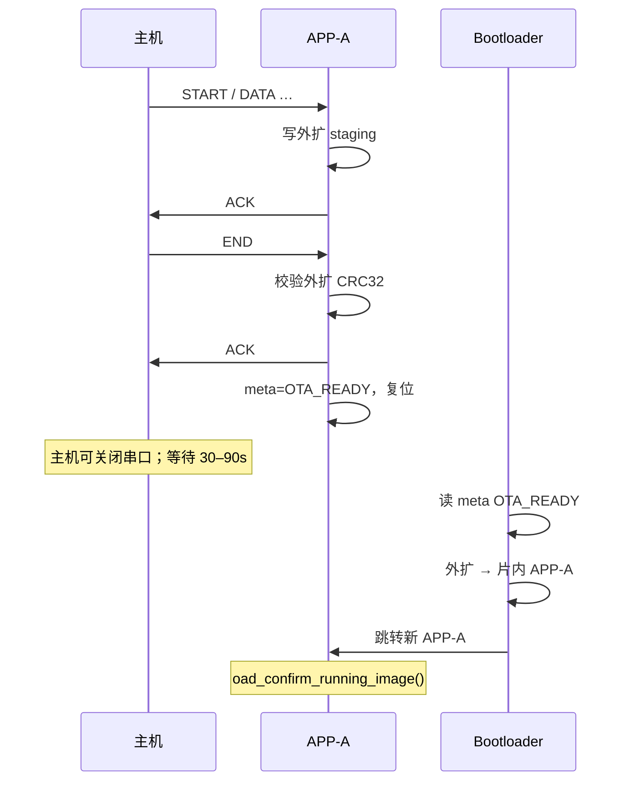
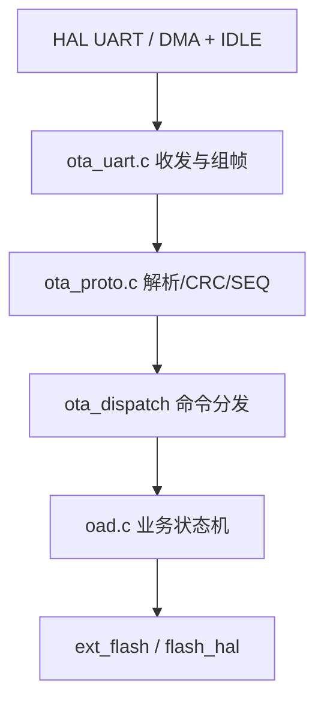

# STM32G431 OTA USART1 协议说明

**协议版本**：`1`（`OTA_PROTO_VERSION`）  
**物理接口**：USART1，PB6=TX / PB7=RX，**115200** 8N1  
**关联文档**：[`STM32G431_bootloader_ota_plan.md`](STM32G431_bootloader_ota_plan.md)（分区、OAD 状态机、实施排期）  
**固件实现**：`OAD/Inc/ota_proto.h`、`OAD/Src/ota_proto.c`、`OAD/Inc/ota_uart.h`、`OAD/Src/ota_uart.c`、`OAD/Src/oad.c`  
**主机工具**：[`tools/ota_uart/ota_uart_host.py`](../tools/ota_uart/ota_uart_host.py)  
**镜像上限**：96 KB（`FLASH_PART_OTA_IMAGE_MAX`）；外扩暂存 `0x00100000`（见 [`STM32G431_flash_partition.md`](STM32G431_flash_partition.md)）  
**进度（2026-05-28）**：USART1 下载与 Boot 片内激活 **已完成**；**P4** 30s 空闲超时、ABORT、回归脚本 **已完成**（见 `tools/ota_uart/ota_regression.py`）

---

## 1. 角色与通道

| 角色 | 说明 |
|------|------|
| **主机** | 产线 PC、治具 MCU 或 `tools/ota_uart` 脚本 |
| **设备** | 运行 APP-A 的 STM32G431，USART1 专用于 OTA |

| 通道 | 用途 | 本协议 |
|------|------|--------|
| **USART1** | OTA 二进制帧 | **是** |
| USB CDC | 日志、`serial_cmd` 产测 | **否** |

---

## 2. 帧格式

所有多字节整型均为 **小端（Little-Endian）**。

```
 0      1      2      3      4      5      6 … 5+LEN   6+LEN  7+LEN
+------+------+------+------+------+------------------+--------+--------+
| 0x55 | 0xAA | CMD  | SEQ  | LEN (u16) |  PAYLOAD (LEN 字节)  | CRC16 |
+------+------+------+------+------+------------------+--------+--------+
  SOF (2B)              ^--- CRC 自此处起算，至 PAYLOAD 末字节 ---^
```

| 字段 | 长度 | 说明 |
|------|------|------|
| SOF | 2 | 固定 `0x55 0xAA`；**不参与** CRC |
| CMD | 1 | 命令字，见 §3 |
| SEQ | 1 | 序号；主机每发一帧 +1（从 1 起）；设备应答可回显主机 SEQ |
| LEN | 2 | PAYLOAD 长度；`0` 表示无载荷 |
| PAYLOAD | LEN | 命令相关数据 |
| CRC16 | 2 | **CRC-16/MODBUS**，见 §4 |

**约束**：

- 单帧 PAYLOAD 建议 ≤ **512** 字节（DATA 中固件段 ≤ 508，因前 4 字节为 `offset`）。
- 帧总长度上限建议 **520** 字节（含头尾），便于设备侧静态缓冲。
- 连续多帧之间无额外间隔要求；设备以 SOF 同步。

---

## 3. 命令字与载荷

### 3.1 主机 → 设备

| CMD | 名称 | LEN | PAYLOAD 布局 |
|-----|------|-----|----------------|
| `0x01` | START | 24 | `image_size:u32` `image_crc32:u32` `version:char[16]` |
| `0x02` | DATA | 4+N | `offset:u32` `data[N]`，`N = LEN - 4` |
| `0x03` | END | 0 | — |
| `0x04` | ABORT | 0 | — |
| `0x05` | APPLY_SLOT | 1 | `slot_id:u8`（`0`=prod，`1`=factory，`2`=app1） |

- `image_size`：固件总字节数，≤ 98304（96 KB）。
- `image_crc32`：对**完整固件镜像**按字节计算的 CRC32（与设备 `crc32.c` 一致，初值/多项式以实现为准，上下位机共用同一工具校验）。
- `version`：以 `'\0'` 结尾的 ASCII，不足 16 字节用 `0x00` 填充。
- `offset`：本次 `data` 在镜像中的起始偏移；首期 **必须** 满足 `offset == 已收字节数`（顺序写，不支持乱序）。

### 3.2 设备 → 主机

| CMD | 名称 | LEN | PAYLOAD 布局 |
|-----|------|-----|----------------|
| `0x80` | ACK | 5 | `status:u8` `offset:u32` |
| `0x81` | NACK | 3 | `status:u8` `err:u16` |

| `status` | 含义 |
|----------|------|
| `0` | 成功 |
| 非 0 | 与 [`oad_status_t`](../OAD/Inc/oad.h) 枚举值一致 |

| `offset`（ACK） | 含义 |
|-----------------|------|
| START 后 | 固定 `0` |
| DATA 后 | 已累计写入外扩的字节数（= 下一帧期望 offset） |

| `err`（NACK） | 含义 |
|---------------|------|
| 低 16 位 | 可选子错误码；无则 `0` |

**`oad_status_t` 映射（与固件一致）**：

| 值 | 枚举 | 典型场景 |
|----|------|----------|
| 0 | `OAD_OK` | —（仅用于 ACK `status`） |
| 1 | `OAD_ERR_BUSY` | 会话未 START 或正在写片内 |
| 2 | `OAD_ERR_PARAM` | `size`/`offset`/LEN 非法 |
| 3 | `OAD_ERR_FLASH` | 外扩/片内 Flash 失败 |
| 4 | `OAD_ERR_CRC` | 镜像 CRC 不符 |
| 5 | `OAD_ERR_STATE` | 状态机不允许该 CMD |
| 6 | `OAD_ERR_FACTORY` | 厂测模式拒绝 OTA |
| 7 | `OAD_ERR_UNSUPPORTED` | 功能未实现 |

---

## 4. CRC-16/MODBUS

- 多项式：`0x8005`（反射 `0xA001`）
- 初值：`0xFFFF`
- 输入范围：**CMD ∥ SEQ ∥ LEN ∥ PAYLOAD**（共 `4 + LEN` 字节）
- 结果：16 位，**小端**附加在帧尾

与 Modbus RTU 帧 CRC 相同，便于用标准库/在线工具核对。

---

## 5. 会话流程



**规则摘要**：

1. 空闲态仅接受 **START**；START 成功后仅 **DATA / END / ABORT**。
2. **DATA** 的 `offset` 必须等于当前已收长度；否则 **NACK** `OAD_ERR_PARAM`。
3. **END**：APP 校验外扩 CRC → **立即 ACK** → `meta=OTA_STATE_READY` → **复位**；**不在 APP 内写片内**（见下 §5.1）。
4. 主机 END 超时 **≥ 30 s**（仅等 ACK）；ACK 后设备复位，**片内烧录在 Bootloader 中约 30–90 s**。
5. **ABORT** 或超时（建议 30 s 无 DATA）→ `ota_meta` 回 `OTA_IDLE`。
6. 设备在 **END 处理中** 不应再解析新帧。

### 5.1 片内烧录不在 USART1 会话内完成

| 阶段 | 执行者 | 说明 |
|------|--------|------|
| USART1 下载 | APP-A | 本协议覆盖范围 |
| 片内激活 | **Bootloader** | 复位后 `boot_ota_apply_from_staging()`；详见 [`STM32G431_bootloader_ota_plan.md` §5.1](STM32G431_bootloader_ota_plan.md#51-为何必须由-bootloader-写片内-app-a) |

**为何不能在 APP 里写 APP-A**：单 Bank Flash 下，运行中的 APP 不能擦除自身所在区域；曾尝试 END 后在 APP 内烧片内会导致 **ACK 后死机**，须 ST-Link 救砖。

**产线注意**：OTA 升级包须与 **含 `boot_ota.c` 的 Bootloader HEX** 配套发布；仅更新 APP 无法完成片内激活。

---

## 6. 通信示例（字节级）

下列十六进制均为 **主机 → 设备** 或 **设备 → 主机** 的完整帧（空格分隔）。

### 6.1 START

参数：`image_size = 4096`，`image_crc32 = 0xDEADBEEF`，`version = "2.0.0-build01"`。

```
55 AA 01 01 18 00
    00 10 00 00          ; size = 4096
    EF BE AD DE          ; crc32
    32 2E 30 2E 30 2D 62 75 69 6C 64 30 31 00 00 00   ; "2.0.0-build01" + pad
    E7 2D                ; CRC16
```

### 6.2 DATA（首包 4 字节）

`offset = 0`，数据 `DE AD BE EF`：

```
55 AA 02 02 08 00
    00 00 00 00          ; offset
    DE AD BE EF
    8C 72                ; CRC16
```

### 6.3 ACK（设备，DATA 成功后）

`status = 0`，`offset = 4`（已收 4 字节）：

```
55 AA 80 02 05 00
    00
    04 00 00 00
    BE DF                ; CRC16
```

### 6.4 END

```
55 AA 03 03 00 00 F0 60
```

### 6.4.1 APPLY_SLOT（切外扩槽到片内，APP-A）

`slot_id = 0`（prod），SEQ=1：

```
55 AA 05 01 01 00 00  CRC16
```

设备：外扩槽 → staging → `meta=OTA_READY` → **ACK** → 复位；Boot 写片内 APP-A（与 USB `fw apply` 相同）。  
未实现或 `FW_SLOT_USART1_APPLY_ENABLE=0` 时 **NACK** `OAD_ERR_UNSUPPORTED`（7）。  
与 OTA 下载 **互斥**（进行中则 `OAD_ERR_BUSY`）。Factory 片内无 OAD，不可用。

主机：

```bash
python tools/ota_uart/ota_uart_host.py COM6 --apply-slot prod
```

### 6.5 NACK（CRC 错误示例）

`status = 4`（`OAD_ERR_CRC`），`err = 0`：

```
55 AA 81 03 03 00
    04 00 00
    8F FA                ; CRC16
```

---

## 7. 上位机参考（Python 3）

依赖：`pip install pyserial`。将 `COMx` 换成实际 USART1 口（经 USB-UART 接 PB6/PB7）。

```python
#!/usr/bin/env python3
"""Minimal OTA host — see doc/STM32G431_ota_uart_protocol.md"""
import struct
import serial
import zlib

SOF = b"\x55\xAA"
CHUNK = 508   # DATA payload = 4 + CHUNK ≤ 512

def crc16_modbus(data: bytes) -> int:
    crc = 0xFFFF
    for b in data:
        crc ^= b
        for _ in range(8):
            crc = (crc >> 1) ^ 0xA001 if (crc & 1) else crc >> 1
    return crc

def build_frame(cmd: int, seq: int, payload: bytes) -> bytes:
    body = bytes([cmd, seq]) + struct.pack("<H", len(payload)) + payload
    return SOF + body + struct.pack("<H", crc16_modbus(body))

def send_and_wait_ack(ser: serial.Serial, frame: bytes, timeout=5.0) -> tuple[int, int]:
    ser.write(frame)
    ser.flush()
    # 简化：按 SOF 同步读一帧（产线工具应实现完整解析器）
    buf = ser.read(64)
    if len(buf) < 9 or buf[0:2] != SOF:
        raise RuntimeError("no response")
    cmd, seq, ln = buf[2], buf[3], struct.unpack_from("<H", buf, 4)[0]
    pl = buf[6 : 6 + ln]
    if cmd == 0x81:
        st, err = struct.unpack_from("<BH", pl, 0)
        raise RuntimeError(f"NACK status={st} err={err}")
    if cmd != 0x80:
        raise RuntimeError(f"unexpected cmd 0x{cmd:02X}")
    return struct.unpack_from("<BI", pl, 0)

def ota_upload(port: str, fw_path: str, version: str, baud=115200):
    fw = open(fw_path, "rb").read()
    size = len(fw)
    if size > 96 * 1024:
        raise ValueError("image > 96KB")
    crc32 = zlib.crc32(fw) & 0xFFFFFFFF
    ver = version.encode("ascii")[:15]
    ver = ver + b"\x00" * (16 - len(ver))

    ser = serial.Serial(port, baudrate=baud, timeout=2)
    seq = 1
    pl = struct.pack("<II", size, crc32) + ver
    send_and_wait_ack(ser, build_frame(0x01, seq, pl))
    seq += 1

    off = 0
    while off < size:
        chunk = fw[off : off + CHUNK]
        pl = struct.pack("<I", off) + chunk
        _, ack_off = send_and_wait_ack(ser, build_frame(0x02, seq, pl))
        assert ack_off == off + len(chunk), (ack_off, off, len(chunk))
        off += len(chunk)
        seq += 1

    send_and_wait_ack(ser, build_frame(0x03, seq, b""), timeout=60.0)
    ser.close()
    print("OTA done, device should reset")

if __name__ == "__main__":
    import sys
    ota_upload(sys.argv[1], sys.argv[2], sys.argv[3] if len(sys.argv) > 3 else "host-1.0")
```

**用法**：

```bash
# 默认固件：MDK-ARM/STM32G431CBT6/STM32G431CBT6.hex（支持 .hex / .bin）
python tools/ota_uart/ota_uart_host.py COM7
python tools/ota_uart/ota_uart_host.py COM7 MDK-ARM/STM32G431CBT6/STM32G431CBT6.hex 2.0.0-build01
```

> 注：`zlib.crc32` 须与设备 `Common/Src/crc32.c` 结果一致；若不一致，在集成时用同一份测试向量对齐后再产线启用。

---

## 8. 固件协议层构建计划

与 OTA 总计划中的 **N0** 对应；仅描述 **USART1 帧 ↔ `oad_*`**，不含外扩擦写细节。

### 8.1 分层



### 8.2 文件与 API

| 文件 | 职责 | 状态 |
|------|------|------|
| `OAD/Inc/ota_proto.h` | 常量、CMD、`ota_frame_t`、CRC/组帧 API | **已实现** |
| `OAD/Src/ota_proto.c` | `ota_proto_crc16()`、`ota_proto_build()`、`ota_proto_parse()` | **已实现**（§6 CRC 向量已对齐） |
| `OAD/Inc/ota_uart.h` | `ota_uart_init()`、`ota_uart_poll()`、`ota_uart_send_frame()` | **已实现** |
| `OAD/Src/ota_uart.c` | 1KB RX 环、`Receive_IT` 单字节、`ota_uart_dispatch`、ACK/NACK | **已实现**（TX 阻塞；**无 DMA**） |
| `OAD/Src/oad.c` | `oad_start/write/finish/abort` 业务状态机 | **已实现** |
| `OAD/Src/oad_flash.c` | （遗留）APP 内烧片内方案 | **不再使用** |
| `Bootloader/Src/boot_ota.c` | 复位后外扩 → 片内 APP-A | **已实现** |

**`ota_proto.h` 核心接口（示意）**：

```c
#define OTA_PROTO_SOF0           0x55U
#define OTA_PROTO_SOF1           0xAAU
#define OTA_PROTO_VERSION        1U
#define OTA_PROTO_MAX_PAYLOAD    512U

typedef struct {
    uint8_t  cmd;
    uint8_t  seq;
    uint16_t len;
    uint8_t  payload[OTA_PROTO_MAX_PAYLOAD];
} ota_frame_t;

uint16_t ota_proto_crc16(const uint8_t *data, uint16_t len);
int      ota_proto_build(const ota_frame_t *f, uint8_t *out, uint16_t out_max);
int      ota_proto_parse(const uint8_t *buf, uint16_t buf_len, ota_frame_t *f);
```

### 8.3 分阶段实施

| 阶段 | 内容 | 验收 | 状态（2026-05-28） |
|------|------|------|-------------------|
| **P0** | `ota_proto.c` CRC、组帧/解帧 | 与 §6 十六进制一致 | **完成** |
| **P1** | `ota_uart.c` 收发、合法帧 ACK/NACK | 串口/脚本可见 `55 AA 80/81 …` | **完成** |
| **P2** | `ota_dispatch` → `oad_*` | START/DATA **ACK** | **完成** |
| **P3** | 外扩 staging + Boot 片内激活 | END **ACK** + 复位 + Boot 烧录 | **完成**（T3） |
| **P4** | 30s 超时、ABORT、busy 互斥 | T4 / 回归脚本 | **完成**（T3b 手动） |

### 8.4 集成要点

| 项 | 说明 | 状态 |
|----|------|------|
| `app_init` | `ota_uart_init(&huart1)`（`ext_flash` 仍在 `extFlashTask` 初始化，OTA 写外扩前须 `ext_flash_is_ready()`） | **已接** |
| `defaultTask` | 每周期 `ota_uart_poll()` | **已接** |
| Keil OAD 组 | `oad.c`、`ota_proto.c`、`ota_uart.c` | **已加入** |
| `board_config.h` | `COMMON_OTA_UART_BAUD` = 115200 | **已加** |
| USB `ota` | 仅 `ota:use_usart1` 提示 | **已弱化** |
| USART1 DMA+IDLE | 可选性能优化 | **未做** |

### 8.5 联调备忘（产线/开发）

| 现象 | 原因 | 处理 |
|------|------|------|
| `NACK status=1` (BUSY) | 上次会话未 ABORT | 脚本先 ABORT；固件 START 前自动 abort；上电清 meta DOWNLOADING |
| `timeout waiting for SOF`（DATA） | ① payload>512B ② **栈溢出**（`ota_frame_t`+解析缓冲在 1.5KB 任务栈）③ 外扩写阻塞过久 | ① **`CHUNK≤508`**（脚本默认 **256** 更稳）② 固件已改静态缓冲+加大 `defaultTask` 栈 ③ 重编译烧录 |
| END 超时 | 等 ACK | 主机 **30 s**；ACK 后复位，**烧片内在 Boot** |
| ACK 后死机 | APP 内擦 APP-A | 换 **Boot 激活** 方案；ST-Link 救砖 |
| USB 虚拟串口抓不到 OTA | OTA 在 **USART1**，非 USB CDC | 治具接 PB6/PB7，或逻辑分析仪 |

---


## 9. 修订记录

| 日期 | 版本 | 说明 |
|------|------|------|
| 2026-05-28 | 1.0 | 初版：帧格式、CMD、CRC、示例、Python 主机、固件分层与 P0–P4 |
| 2026-05-28 | 1.1 | 进度：P0–P2 完成；集成/文件表/主机 CHUNK=508；§8.5 联调备忘；END NACK(7) 说明 |
| 2026-05-28 | 1.2 | P3/N1–N2：`ext_flash_staging_*`、`oad_flash.c`；END 烧录 APP-A |
| 2026-05-28 | 1.3 | **片内改 Bootloader 激活**；§5.1；时序图含 Boot；当前情况与救砖说明 |
| 2026-05-28 | 1.4 | P3/P4 完成；30s `COMMON_OTA_DATA_IDLE_TIMEOUT_MS`；`ota_regression.py` |
